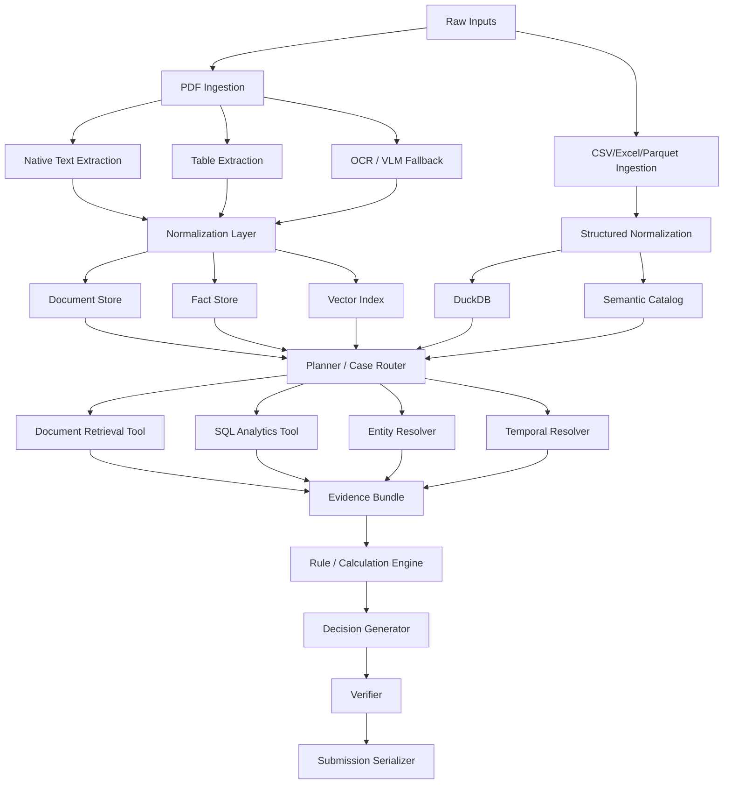

# Halyk Agentic Challenge — MVP Architecture

> Implementation-ready architecture for Codex.
>
> Goal: build a reliable, debuggable MVP for a banking document + transactions decision pipeline before the public hackathon dataset is released.

---

## 0. Executive summary

The system must combine:

1. **PDF documents**
   - native text;
   - scanned text;
   - tables;
   - images/forms/charts;
   - documents about one or many clients;
   - multiple document versions over time.

2. **Structured data**
   - CSV / Excel / Parquet;
   - primarily transaction registries and potentially client/account/reference tables.

3. **LLM reasoning**
   - route a case;
   - decide which tools/data sources are needed;
   - extract ambiguous facts;
   - produce structured decisions.

4. **Deterministic execution**
   - SQL;
   - aggregations;
   - entity filtering;
   - date/version resolution;
   - business-rule evaluation;
   - evidence verification.

### Core principle

```text
LLM decides WHAT to inspect or calculate.
Code decides HOW to retrieve and calculate it.
Fact Store records WHAT IS KNOWN.
Verifier checks that conclusions are traceable to evidence.
```

The LLM is **not** the database, calculator, or source of truth.

---

# 1. MVP goals

The MVP must be able to:

- ingest PDFs, CSV, Excel and optionally Parquet;
- distinguish native PDF text from OCR-required pages;
- extract text, tables and image-derived information;
- preserve document/page/bounding-box provenance;
- identify entities such as client, account, contract and counterparty;
- normalize dates, amounts, currencies and identifiers;
- index document content for semantic retrieval;
- load structured data into DuckDB;
- create a semantic catalog describing structured tables;
- retrieve evidence by entity, date, document type and semantic similarity;
- run read-only analytical queries against DuckDB;
- resolve document versions valid at a requested point in time;
- accumulate normalized facts in a Fact Store;
- execute deterministic calculations/business rules;
- generate a structured answer;
- verify that every important conclusion has evidence.

---

# 2. Non-goals for the first MVP

Do **not** build initially:

- autonomous multi-agent swarms;
- Kubernetes;
- Airflow;
- distributed processing;
- production authentication;
- complex web UI;
- real-time ingestion;
- custom fine-tuned models;
- a general-purpose natural-language SQL agent with unrestricted database access;
- a graph database unless the public dataset proves that one is necessary.

The architecture should make these additions possible later without requiring them now.

---

# 3. Recommended MVP stack

| Layer | MVP choice | Reason |
|---|---|---|
| Language | Python 3.12+ | ecosystem, speed of development |
| Models / validation | Pydantic | strict structured outputs |
| Structured analytics | DuckDB | no database server, excellent local analytics |
| Dataframes | Polars or Pandas | transformation/debugging |
| PDF base parser | PyMuPDF | fast native text/page access |
| Layout/table parser | adapter interface; Docling preferred candidate | tables/layout |
| OCR | adapter interface | replaceable OCR implementation |
| VLM | provider adapter | complex visual pages/tables/forms |
| Vector storage | Qdrant local by default | metadata filters + persistent vector search |
| Vector fallback | FAISS | simple in-process fallback |
| Lexical retrieval | optional BM25 | enable only if evaluation improves |
| Embeddings | provider adapter | easy model swap |
| LLM | provider adapter | easy model swap |
| Logging | stdlib logging / structlog | traceability |
| Testing | pytest | fast regression loop |
| Config | YAML + Pydantic Settings | experiment control |

### Why Qdrant + DuckDB instead of putting everything into one system

**DuckDB**
- canonical structured data;
- SQL;
- transactions;
- extracted tables;
- deterministic calculations.

**Qdrant**
- semantic retrieval;
- chunk/page/table-summary embeddings;
- metadata filtering.

Do not use vector storage as the canonical data store.

---

# 4. High-level architecture



---

# 5. Repository structure

```text
agentic-mvp/
├── README.md
├── ARCHITECTURE.md
├── pyproject.toml
├── .env.example
├── configs/
│   ├── default.yaml
│   ├── local.yaml
│   └── experiments/
│
├── data/
│   ├── raw/
│   ├── processed/
│   ├── duckdb/
│   └── vector/
│
├── src/
│   └── agentic_mvp/
│       ├── config.py
│       ├── cli.py
│       │
│       ├── domain/
│       │   ├── models.py
│       │   ├── enums.py
│       │   └── ids.py
│       │
│       ├── ingestion/
│       │   ├── pdf.py
│       │   ├── structured.py
│       │   ├── tables.py
│       │   ├── images.py
│       │   └── quality.py
│       │
│       ├── normalization/
│       │   ├── entities.py
│       │   ├── dates.py
│       │   ├── amounts.py
│       │   ├── documents.py
│       │   └── tables.py
│       │
│       ├── storage/
│       │   ├── duckdb_store.py
│       │   ├── vector_store.py
│       │   ├── document_store.py
│       │   └── fact_store.py
│       │
│       ├── retrieval/
│       │   ├── query.py
│       │   ├── semantic.py
│       │   ├── lexical.py
│       │   ├── reranker.py
│       │   └── parent_expansion.py
│       │
│       ├── resolvers/
│       │   ├── entity.py
│       │   ├── temporal.py
│       │   └── document_version.py
│       │
│       ├── tools/
│       │   ├── retrieve_documents.py
│       │   ├── query_duckdb.py
│       │   ├── calculate.py
│       │   └── resolve_fact.py
│       │
│       ├── planning/
│       │   ├── planner.py
│       │   └── schemas.py
│       │
│       ├── decision/
│       │   ├── rules.py
│       │   ├── engine.py
│       │   └── schemas.py
│       │
│       ├── verification/
│       │   ├── evidence.py
│       │   ├── calculations.py
│       │   └── final.py
│       │
│       ├── llm/
│       │   ├── client.py
│       │   ├── embeddings.py
│       │   ├── structured_output.py
│       │   └── prompts/
│       │
│       ├── evaluation/
│       │   ├── metrics.py
│       │   ├── runner.py
│       │   └── cases.py
│       │
│       └── pipeline/
│           ├── ingest.py
│           └── solve.py
│
├── tests/
│   ├── unit/
│   ├── integration/
│   └── fixtures/
│
└── scripts/
    ├── ingest.py
    ├── solve.py
    ├── evaluate.py
    └── inspect_db.py
```

---

# 6. Canonical domain model

All stages must communicate using typed domain objects, not arbitrary dictionaries.

## 6.1 Source reference

```python
class SourceRef(BaseModel):
    document_id: str
    page: int | None = None
    bbox: tuple[float, float, float, float] | None = None
    table_id: str | None = None
    row_id: str | None = None
    transaction_id: str | None = None
```

---

## 6.2 Entity

```python
class Entity(BaseModel):
    entity_id: str
    entity_type: Literal[
        "client",
        "account",
        "contract",
        "counterparty",
        "document",
        "unknown",
    ]

    canonical_name: str | None = None

    identifiers: dict[str, str] = {}
    aliases: list[str] = []
```

Possible identifiers:

```text
bin
iin
account_id
iban
contract_id
customer_id
transaction_id
```

Exact identifiers always have higher confidence than fuzzy names.

---

## 6.3 Document

```python
class DocumentRecord(BaseModel):
    document_id: str
    filename: str

    document_type: str | None = None

    entity_ids: list[str] = []

    created_at: date | None = None
    effective_from: date | None = None
    effective_to: date | None = None

    parent_document_id: str | None = None
    version: str | None = None

    summary: str | None = None
```

---

## 6.4 Document block

```python
class DocumentBlock(BaseModel):
    block_id: str
    document_id: str
    page: int

    block_type: Literal[
        "text",
        "table",
        "image",
        "header",
        "footer",
    ]

    text: str

    bbox: tuple[float, float, float, float] | None = None

    entity_ids: list[str] = []

    source: SourceRef
```

---

## 6.5 Fact

Fact is the most important canonical object.

```python
class Fact(BaseModel):
    fact_id: str

    entity_id: str | None = None

    key: str
    value: str | int | float | bool | date

    unit: str | None = None
    currency: str | None = None

    valid_from: date | None = None
    valid_to: date | None = None

    confidence: float

    source: SourceRef

    extraction_method: Literal[
        "native_text",
        "ocr",
        "vlm",
        "table_parser",
        "sql",
        "derived",
    ]
```

Examples:

```text
client=C52
key=monthly_limit
value=15000000
currency=KZT
valid_from=2026-03-15
source=amendment.pdf page 3
```

---

## 6.6 Calculation

```python
class Calculation(BaseModel):
    calculation_id: str
    metric: str

    inputs: dict[str, object]
    operation: str
    result: object

    transaction_ids: list[str] = []
    fact_ids: list[str] = []
```

The calculation result must be produced by Python/SQL, not free-form LLM arithmetic.

---

## 6.7 Evidence bundle

```python
class EvidenceBundle(BaseModel):
    facts: list[Fact]
    calculations: list[Calculation]
    source_refs: list[SourceRef]
```

---

## 6.8 Decision

```python
class Decision(BaseModel):
    decision: str

    reason_summary: str

    supporting_fact_ids: list[str]
    supporting_calculation_ids: list[str]

    confidence: float
```

---

# 7. PDF ingestion pipeline

## 7.1 Page classification

For every page:

```text
PDF page
   |
   +-- usable native text?
   |       |
   |       +-- yes -> native parser
   |
   +-- table/layout detected?
   |       |
   |       +-- yes -> table/layout parser
   |
   +-- image/scanned/low quality?
           |
           +-- OCR or VLM
```

Do **not** OCR every PDF page.

Native extraction is preferred when reliable because OCR introduces recognition errors.

---

# 8. Extraction quality model

Each page receives quality metadata:

```python
class ExtractionQuality(BaseModel):
    native_text_chars: int
    text_density: float

    table_count: int
    image_count: int

    ocr_required: bool
    vlm_required: bool

    confidence: float
```

Heuristic examples:

```text
large native text density       -> no OCR
very low native text density    -> OCR candidate
large raster image              -> OCR/VLM candidate
complex visual table            -> VLM fallback
```

Thresholds belong in configuration and must be evaluated on the public dataset.

---

# 9. Table architecture

A table must exist in **three representations**.

```text
                    TABLE
          +-----------+-----------+
          |           |           |
       RAW IMAGE   STRUCTURED   SEMANTIC
          |           |           |
       Evidence    DuckDB       Vector DB
                              summary/index
```

## 9.1 Raw representation

Store:

```text
document_id
page
bbox
image/path
```

Purpose: evidence and debugging.

## 9.2 Structured representation

Extract:

```text
columns
rows
types
units
```

Load into DuckDB.

Example internal table:

```sql
CREATE TABLE extracted_table_rows (
    table_id VARCHAR,
    document_id VARCHAR,
    page INTEGER,
    row_no INTEGER,
    payload JSON
);
```

Prefer typed dedicated tables when schema can be inferred safely.

## 9.3 Semantic representation

Generate a short **table description**, for example:

```text
Table T17 contains corporate client limits by client,
currency and effective date.
```

Embed the description for retrieval.

Important:

```text
Summary is used to FIND the table.
Structured rows are used to ANSWER or CALCULATE.
```

Never treat the LLM table summary as the canonical numeric source.

---

# 10. Image architecture

Not every image is OCR.

Classify image/page content into:

```text
text scan         -> OCR
form              -> OCR + layout/VLM
complex table     -> table parser + VLM fallback
chart             -> VLM
diagram           -> VLM
stamp/signature   -> metadata only unless task requires interpretation
```

For image-derived information, preserve:

```text
document_id
page
bbox
extracted_text
semantic_description
extraction_method
confidence
```

---

# 11. Structured-data ingestion

Supported inputs:

```text
.csv
.xlsx
.xls
.parquet
```

Pipeline:

```text
file
  |
  v
schema inference
  |
  v
type normalization
  |
  +-- dates
  +-- numbers
  +-- currencies
  +-- IDs as strings
  |
  v
DuckDB
  |
  v
data profiling
  |
  v
semantic catalog
```

Never convert identifiers such as account numbers to numeric values if leading zeros may matter.

---

# 12. DuckDB data model

At minimum create system tables:

```sql
documents
document_blocks
document_entities
facts
entities
entity_aliases
tables_metadata
extracted_table_rows
calculations
```

Hackathon-provided structured tables should be loaded with minimal transformation first, for example:

```text
raw_transactions
raw_clients
raw_accounts
raw_contracts
```

Then create canonical views:

```text
transactions
clients
accounts
contracts
```

This separation makes debugging source data easier.

---

# 13. Semantic catalog

The LLM should not repeatedly inspect random database rows to discover the schema.

Build catalog metadata deterministically.

Example:

```yaml
tables:
  transactions:
    description: >
      Canonical transaction registry.

    primary_key:
      - transaction_id

    joins:
      client_id:
        target: clients.client_id
      account_id:
        target: accounts.account_id

    columns:
      transaction_id:
        type: string
        description: Unique transaction identifier

      client_id:
        type: string
        description: Canonical client identifier

      transaction_date:
        type: date
        description: Transaction/posting date

      amount:
        type: decimal
        description: Transaction amount

      currency:
        type: string
        description: ISO-like currency code

      purpose:
        type: string
        description: Original payment purpose
```

Generation process:

```text
DuckDB schema
   +
deterministic profile
   +
small row sample
   |
   v
LLM semantic description
   |
   v
catalog.yaml
```

The catalog is context for planning/Text-to-SQL.

---

# 14. Database profiling

For every structured table collect:

```text
row count
column types
null rate
unique count
min/max for numeric/date columns
top categorical values
small representative sample
```

This is deterministic.

Only then allow the LLM to describe what the table likely represents.

---

# 15. Entity resolution

This layer is mandatory.

Possible mismatch:

```text
PDF:
ТОО "Альфа Трейд"

CSV:
ALFA TRADE LLP

Payment purpose:
TOO ALPHA / DOG 523
```

Resolution precedence:

```text
1. exact BIN/IIN/customer ID
2. exact account/IBAN
3. exact contract identifier
4. normalized exact name
5. alias table
6. fuzzy string match
7. LLM adjudication only when ambiguous
```

Output:

```python
class EntityMatch(BaseModel):
    source_value: str
    entity_id: str | None

    method: str
    confidence: float

    evidence: list[SourceRef]
```

Low-confidence matches must not silently become facts.

---

# 16. Temporal/version resolution

This is also mandatory.

Documents may modify earlier documents.

Example:

```text
contract_v1
limit=5M
valid from Jan 1

amendment_v2
limit=8M
valid from Mar 15
```

A transaction on February 20 must use `5M`, not the newest value.

Resolver interface:

```python
resolve_fact(
    entity_id="C123",
    key="transaction_limit",
    at_date=date(2026, 2, 20),
) -> Fact
```

Resolution rules:

```text
filter by entity
filter by fact key
valid_from <= target_date
valid_to is NULL OR target_date <= valid_to
choose highest-priority/current document version
```

Conflicting valid facts should trigger an ambiguity state, not silent guessing.

---

# 17. Document retrieval architecture

Do not perform pure semantic search over every chunk.

Pipeline:

```text
Case query
   |
   v
Query analysis
   |
   +-- entity IDs
   +-- date
   +-- document type
   +-- requested fact
   |
   v
Metadata filtering
   |
   v
Candidate retrieval
   |
   +-- vector
   +-- optional BM25
   |
   v
Reranking
   |
   v
Parent-page expansion
   |
   v
Evidence pages
```

---

# 18. Vector records

A vector record should include payload metadata:

```json
{
  "chunk_id": "chunk-123",
  "document_id": "doc-42",
  "page": 7,
  "block_type": "text",
  "entity_ids": ["client-17"],
  "document_type": "contract_amendment",
  "effective_from": "2026-04-01",
  "effective_to": null,
  "text": "..."
}
```

Use metadata filtering before semantic ranking whenever possible.

---

# 19. Parent-page retrieval

Index relatively small semantic chunks, but return richer parent context for reasoning.

```text
small chunk
    |
 vector search
    |
matched chunk
    |
page/document expansion
    |
full relevant page/block group
```

This gives high retrieval precision without starving the reasoning stage of context.

---

# 20. Retrieval configuration

All major settings must be configurable.

Example:

```yaml
retrieval:
  semantic_enabled: true
  lexical_enabled: false

  candidate_k: 30
  rerank_k: 10
  final_k: 5

  parent_page_expansion: true

  metadata_filtering:
    entity: true
    document_type: true
    temporal: true
```

Do not assume BM25/hybrid search improves results. Measure it.

---

# 21. SQL analytics tool

The LLM must never receive unrestricted database execution.

Recommended execution:

```text
Planner
   |
   v
Structured analytical request
   |
   v
SQL builder / validator
   |
   v
read-only DuckDB
   |
   v
typed result
```

Example tool request:

```python
class AggregateRequest(BaseModel):
    table: str

    metric: Literal[
        "sum",
        "count",
        "avg",
        "min",
        "max",
    ]

    column: str | None

    filters: list[FilterSpec]

    group_by: list[str] = []
```

Code builds parameterized SQL.

---

# 22. Text-to-SQL fallback

Some public-dataset questions may be too flexible for a fixed analytics schema.

A restricted Text-to-SQL fallback is allowed.

Mandatory guardrails:

```text
SELECT only
single statement
allowed tables only
allowed columns only
query timeout
maximum returned rows
no external filesystem access
no ATTACH
no COPY
no INSTALL/LOAD
no INSERT
no UPDATE
no DELETE
no DROP
```

Workflow:

```text
LLM SQL
  |
SQL AST validation
  |
EXPLAIN / dry validation
  |
execute
```

Never expose arbitrary DuckDB execution directly to the model.

---

# 23. Planner

The planner should decide which capabilities are required.

It should output structured data, not prose.

Example:

```python
class CasePlan(BaseModel):
    entity_hints: list[str]
    target_date: date | None

    document_queries: list[str]

    requires_document_retrieval: bool
    requires_sql: bool
    requires_temporal_resolution: bool
    requires_entity_resolution: bool

    requested_metrics: list[str]
    requested_facts: list[str]
```

Planner responsibilities:

```text
understand case
decompose tasks
choose tools
identify required facts
identify required calculations
```

Planner must not perform calculations itself.

---

# 24. Fact Store

The Fact Store sits between extraction/retrieval and decision-making.

```text
Documents -------+
                 |
SQL results -----+----> FACT STORE ----> Decision
                 |
OCR/VLM ---------+
```

The Fact Store can be implemented initially in DuckDB.

Suggested columns:

```sql
CREATE TABLE facts (
    fact_id VARCHAR PRIMARY KEY,
    entity_id VARCHAR,
    fact_key VARCHAR,
    value_json JSON,
    unit VARCHAR,
    currency VARCHAR,
    valid_from DATE,
    valid_to DATE,
    confidence DOUBLE,
    extraction_method VARCHAR,
    source_json JSON
);
```

This enables:

```text
traceability
temporal resolution
conflict detection
deduplication
debugging
verification
```

---

# 25. Derived facts

Derived facts must reference their inputs.

Example:

```text
Fact:
monthly_transaction_volume = 17.3M

derived from:
TX001
TX002
TX003
```

Do not store derived facts as if they came directly from a PDF.

---

# 26. Rule / calculation engine

Prefer deterministic business rules.

Example:

```python
def exceeds_limit(
    actual: Decimal,
    limit: Decimal,
) -> bool:
    return actual > limit
```

Potential rule DSL can come later.

MVP accepts Python functions registered by name.

The LLM may choose the relevant rule, but code executes it.

---

# 27. Decision pipeline

```text
Case
 |
 v
Planner
 |
 +------ Document Retrieval
 |
 +------ SQL Analytics
 |
 +------ Entity Resolver
 |
 +------ Temporal Resolver
 |
 v
Evidence Bundle
 |
 v
Deterministic Calculations / Rules
 |
 v
Decision Generator
 |
 v
Verifier
 |
 v
Submission
```

---

# 28. Decision generator

Input must be compact and evidence-backed:

```text
facts
calculations
applicable rules
source references
```

The model should not receive an uncontrolled dump of every document and table.

Output:

```python
class DecisionDraft(BaseModel):
    decision: str
    reason_summary: str

    supporting_fact_ids: list[str]
    supporting_calculation_ids: list[str]

    unresolved_questions: list[str] = []
```

If required evidence is missing, prefer:

```text
insufficient_evidence
```

over hallucinating.

---

# 29. Verifier

The verifier must run before final output.

Checks:

### Evidence

```text
Does every supporting_fact_id exist?
Does every source document/page exist?
Does a fact actually reference evidence?
```

### Calculations

```text
Do all referenced Calculation objects exist?
Can the calculation be reproduced?
Were the correct transactions selected?
```

### Temporal consistency

```text
Were facts valid on the target date?
Was a superseded document used?
```

### Entity consistency

```text
Do facts/calculations belong to the target client/entity?
```

### Final consistency

```text
Does the final decision follow from the facts/rules?
```

The verifier should be mostly deterministic.

Optional LLM verifier may be added as a secondary check.

---

# 30. Provenance requirements

Every extracted or derived value should be traceable.

For document facts:

```text
document_id
page
bbox when possible
table_id when applicable
extraction method
```

For structured data:

```text
table
primary key / transaction IDs
query/calculation ID
```

A value without provenance is not trusted evidence.

---

# 31. Document summary strategy

Generate summaries at two levels.

## Document summary

```text
document type
entities involved
dates
contracts/accounts mentioned
what the document changes/defines
```

Purpose:

```text
routing
document discovery
debugging
```

## Table summary

```text
what table contains
column semantics
time grain
entity grain
```

Purpose:

```text
table discovery
planning
```

Do not use summaries as numeric truth.

---

# 32. LLM usage policy

LLM is appropriate for:

```text
case decomposition
document classification
ambiguous entity extraction
semantic table/document summaries
fact extraction from difficult prose
reranking
final concise explanation
ambiguous entity adjudication
```

LLM is **not** appropriate for:

```text
arithmetic over many transactions
aggregations
date filtering
database storage
canonical IDs
validity interval resolution when explicit
unrestricted SQL execution
provenance generation without source references
```

---

# 33. Model abstraction

All providers should implement:

```python
class LLMClient(Protocol):
    def structured(
        self,
        prompt: str,
        output_model: type[BaseModel],
    ) -> BaseModel:
        ...
```

Embeddings:

```python
class EmbeddingClient(Protocol):
    def embed_documents(self, texts: list[str]) -> list[list[float]]:
        ...

    def embed_query(self, text: str) -> list[float]:
        ...
```

This makes model replacement an experiment, not a rewrite.

---

# 34. Failure handling

Every pipeline stage must fail explicitly.

Examples:

```text
OCR confidence too low
entity ambiguous
document version conflict
invalid SQL plan
missing source page
calculation cannot reproduce
LLM schema validation failure
```

Represent these failures as typed errors.

Never silently substitute guessed values.

---

# 35. Idempotent ingestion

Every input artifact must have a stable content hash.

Example:

```text
sha256(file bytes)
```

Use it to avoid duplicate ingestion.

Store:

```text
source_hash
parser_version
embedding_model
ingestion_timestamp
```

This makes reprocessing controlled and reproducible.

---

# 36. Configuration

Example `configs/default.yaml`:

```yaml
storage:
  duckdb_path: data/duckdb/hackathon.duckdb

vector:
  backend: qdrant
  path: data/vector
  collection: document_blocks

pdf:
  native_text_min_chars: 80
  enable_ocr: true
  enable_vlm: true

tables:
  generate_summary: true
  persist_structured_rows: true

retrieval:
  candidate_k: 30
  rerank_k: 10
  final_k: 5
  lexical_enabled: false
  parent_page_expansion: true

planner:
  max_steps: 8

sql:
  max_rows: 1000
  timeout_seconds: 10
  text_to_sql_fallback: true

verification:
  require_provenance: true
  require_reproducible_calculations: true
```

---

# 37. Observability

Every solved case receives a `run_id`.

Log:

```text
run_id
case_id
planner output
retrieval queries
retrieved chunk IDs
reranking scores
resolved entities
resolved temporal facts
SQL queries
SQL row counts
calculation IDs
decision
verification result
latency by stage
token usage by stage
```

Do not log hidden chain-of-thought.

Log structured intermediate artifacts instead:

```text
plans
facts
queries
calculations
evidence
decisions
```

---

# 38. Evaluation harness

Evaluation must exist before optimization.

Track separate metrics.

## Retrieval

```text
Recall@K
MRR
evidence page recall
```

## Extraction

```text
entity accuracy
fact extraction accuracy
table extraction accuracy
```

## Resolution

```text
entity resolution accuracy
document version accuracy
temporal fact accuracy
```

## Analytics

```text
SQL execution success
calculation accuracy
```

## End-to-end

```text
final decision accuracy
evidence correctness
submission schema validity
latency
token/cost usage
```

---

# 39. Experiment flags

Everything likely to be tuned should be configurable:

```yaml
features:
  table_summaries: true
  document_summaries: true
  lexical_retrieval: false
  reranking: true
  temporal_filtering: true
  entity_filtering: true
  llm_entity_adjudication: true
  llm_verifier: false
```

Evaluation workflow:

```text
baseline
  |
change ONE component
  |
evaluate
  |
keep or rollback
```

Avoid adding techniques only because they sound advanced.

---

# 40. Required test fixtures

Create synthetic fixtures immediately.

## Fixture A — one client, native PDF

Tests:

```text
native extraction
fact extraction
provenance
```

## Fixture B — multiple clients on one page

Tests:

```text
entity-scoped chunking
no cross-client contamination
```

## Fixture C — scanned document

Tests:

```text
OCR fallback
source preservation
```

## Fixture D — table in PDF

Tests:

```text
table structure
table summary
DuckDB persistence
```

## Fixture E — document versioning

```text
v1 valid Jan 1
v2 valid Mar 15
```

Tests:

```text
fact resolution before/after Mar 15
```

## Fixture F — transaction aggregation

Tests:

```text
SUM
COUNT
date range
counterparty filtering
```

## Fixture G — entity aliases

Tests:

```text
"ТОО Альфа Трейд"
"ALFA TRADE LLP"
same canonical entity
```

## Fixture H — full decision

Tests the whole pipeline.

---

# 41. Minimal end-to-end synthetic scenario

Create this before the public dataset.

### Documents

`contract.pdf`

```text
Client: Alpha Trade
Contract: KZ-125
Monthly transaction limit: 10,000,000 KZT
Effective from: 2026-01-01
```

`amendment.pdf`

```text
Contract: KZ-125
Monthly transaction limit changed to 15,000,000 KZT
Effective from: 2026-03-15
```

### Transactions

```csv
transaction_id,client_id,date,amount,currency
TX1,C001,2026-04-01,5000000,KZT
TX2,C001,2026-04-10,6000000,KZT
TX3,C001,2026-04-20,5000000,KZT
```

### Case

```text
Did client C001 exceed the valid monthly limit in April 2026?
```

### Expected execution

```text
resolve client
    |
find contract + amendment
    |
resolve valid April limit = 15M
    |
SQL SUM = 16M
    |
16M > 15M
    |
decision = exceeded
    |
evidence:
  amendment page
  TX1, TX2, TX3
  calculation
```

If the MVP cannot solve this reliably, do not add agent complexity yet.

---

# 42. CLI contract

Initial CLI:

```bash
python -m agentic_mvp.cli ingest ./data/raw

python -m agentic_mvp.cli inspect

python -m agentic_mvp.cli solve \
  --question "Did client C001 exceed the monthly limit in April 2026?"

python -m agentic_mvp.cli evaluate ./tests/fixtures/cases.json
```

Optional:

```bash
python -m agentic_mvp.cli solve \
  --case-file case.json \
  --trace trace.json
```

---

# 43. Pipeline interfaces

## Ingestion

```python
ingest_pdf(path: Path) -> IngestionResult
ingest_structured(path: Path) -> IngestionResult
```

## Retrieval

```python
retrieve_documents(query: RetrievalQuery) -> list[DocumentBlock]
```

## Entity resolution

```python
resolve_entity(hints: list[str]) -> list[EntityMatch]
```

## Temporal resolution

```python
resolve_fact(
    entity_id: str,
    fact_key: str,
    at_date: date,
) -> Fact | None
```

## Structured analytics

```python
execute_aggregate(request: AggregateRequest) -> Calculation
```

## Solve

```python
solve_case(case: CaseInput) -> DecisionResult
```

---

# 44. Suggested implementation order for Codex

Implement vertically, keeping every stage runnable.

## Phase 1 — skeleton

Create:

```text
pyproject.toml
package layout
Pydantic domain models
config
CLI
logging
pytest setup
```

Acceptance:

```bash
pytest
```

passes.

---

## Phase 2 — DuckDB

Implement:

```text
DuckDBStore
structured file ingestion
raw tables
canonical views
profiling
semantic catalog data model
```

Acceptance:

- CSV loads correctly;
- IDs remain strings;
- dates/numbers are typed;
- aggregate query returns deterministic result.

---

## Phase 3 — PDF native ingestion

Implement:

```text
PDF pages
native text
document/page provenance
document blocks
document summaries
```

Acceptance:

- native PDF fixture is searchable by stored text;
- page number remains attached.

---

## Phase 4 — OCR/VLM adapters

Implement adapter interfaces first.

Then add one OCR implementation.

VLM can initially be a stub/fallback provider.

Acceptance:

- scanned fixture produces `DocumentBlock`;
- extraction method records `ocr`.

---

## Phase 5 — tables

Implement:

```text
table detection/extraction
raw table artifact
DuckDB persistence
table summary
```

Acceptance:

- table fixture can be found semantically;
- numeric answer comes from structured rows, not summary.

---

## Phase 6 — vector retrieval

Implement:

```text
embedding adapter
Qdrant store
metadata payload
semantic search
parent-page expansion
```

Acceptance:

- query finds expected fixture evidence.

---

## Phase 7 — entities

Implement:

```text
canonical entities
aliases
exact identifiers
normalized name matching
fuzzy fallback
```

Acceptance:

- alias fixture resolves to one entity.

---

## Phase 8 — temporal facts

Implement:

```text
Fact Store
valid_from
valid_to
version resolution
conflict detection
```

Acceptance:

- February selects v1;
- April selects v2.

---

## Phase 9 — SQL analytics tool

Implement fixed structured aggregate requests.

Add restricted Text-to-SQL only after deterministic aggregates work.

Acceptance:

- April SUM returns expected transaction IDs and amount.

---

## Phase 10 — planner

Implement structured `CasePlan`.

Initially support:

```text
document retrieval
SQL aggregate
entity resolution
temporal resolution
```

Acceptance:

- plan for synthetic end-to-end case requests correct tools.

---

## Phase 11 — decision engine

Implement:

```text
EvidenceBundle
Calculation
rule functions
DecisionDraft
```

Acceptance:

- synthetic full case returns `exceeded`.

---

## Phase 12 — verifier

Implement deterministic checks.

Acceptance:

- verifier rejects:
  - missing evidence;
  - wrong temporal version;
  - calculation without source rows;
  - foreign client evidence.

---

## Phase 13 — evaluation

Implement fixture runner and metrics.

Only after this should retrieval/reranking/model experiments begin.

---

# 45. MVP definition of done

MVP is ready when all of these are true:

- [ ] CSV/Excel can be loaded into DuckDB.
- [ ] PDF native text can be extracted with page provenance.
- [ ] OCR fallback works for scanned pages.
- [ ] At least one table can be extracted into DuckDB.
- [ ] Table/document summaries can be indexed semantically.
- [ ] Vector retrieval supports metadata filters.
- [ ] One PDF may contain multiple clients without forced document-level ownership.
- [ ] Entities have canonical IDs and aliases.
- [ ] Facts have validity intervals.
- [ ] Version resolution works.
- [ ] SQL calculations are deterministic and read-only.
- [ ] Planner emits structured tool requests.
- [ ] Fact Store contains source provenance.
- [ ] Final decisions reference facts/calculations.
- [ ] Verifier rejects unsupported answers.
- [ ] Full synthetic scenario passes end-to-end.
- [ ] All critical stages have unit/integration tests.
- [ ] One config file controls experimental features.

---

# 46. What to inspect immediately when Halyk publishes the public dataset

Do not rewrite the architecture immediately.

First answer these questions:

1. What files actually exist?
2. Is there one global dataset or per-case archives?
3. What is the transaction schema?
4. Are there client/account/contract master tables?
5. What identifiers appear in both PDFs and structured data?
6. How many document types exist?
7. How often do PDFs contain multiple clients?
8. Are PDFs native, scanned or mixed?
9. How common are tables?
10. Do documents have explicit effective dates/version numbers?
11. Does one question require multiple documents?
12. What exact calculations are required?
13. What is the required `Submission.json` schema?
14. Is evidence required as page, document, transaction ID or another format?
15. What is the evaluation latency constraint?

Then map the dataset onto the existing interfaces.

---

# 47. Likely adaptation points after dataset release

The parts most likely to change are:

```text
document classifier
entity schemas
table schemas
fact keys
business rules
SQL catalog
submission serializer
prompt templates
retrieval filters
```

The parts that should remain stable are:

```text
Fact Store
SourceRef/provenance
DuckDB abstraction
vector store abstraction
planner contract
tool contracts
temporal resolver interface
verifier architecture
evaluation harness
```

---

# 48. Codex implementation rules

When implementing this repository:

1. Keep modules small and single-purpose.
2. Do not put the whole pipeline into one `agent.py`.
3. Use Pydantic objects between stages.
4. No hidden global mutable state.
5. Every storage operation goes through a repository/store class.
6. Every LLM call must request structured output.
7. Add retries only for transient/provider/schema failures.
8. Never silently catch parsing/extraction errors.
9. Keep all feature thresholds in config.
10. Add a test with every important parser/resolver change.
11. Keep provider-specific code behind adapters.
12. Never use LLM output as numeric truth when the raw structured value exists.
13. Every final fact must have provenance.
14. Every derived numeric result must be reproducible.
15. Prefer deterministic logic over LLM calls whenever possible.
16. Optimize only after an evaluation baseline exists.

---

# 49. Recommended first Codex prompt

Use this repository spec as the source of truth.

```text
Implement the MVP described in ARCHITECTURE.md incrementally.

Start only with Phases 1–3:
1. project skeleton and domain models,
2. DuckDB structured-data ingestion/profiling,
3. native PDF ingestion with document/page provenance.

Requirements:
- follow the repository layout from ARCHITECTURE.md;
- use typed Pydantic models at module boundaries;
- write pytest unit/integration tests;
- keep external providers behind interfaces;
- do not implement agent orchestration, OCR, VLM, reranking or Text-to-SQL yet;
- create the synthetic fixtures needed for these phases;
- after implementation, run the tests and report what is complete, what remains, and any architectural deviations.
```

After that succeeds, move through the phases sequentially.

---

# 50. Final architecture principle

The system should behave as an evidence-processing pipeline:

```text
RAW DATA
   |
INGEST
   |
NORMALIZE
   |
LINK ENTITIES
   |
RESOLVE TIME/VERSIONS
   |
RETRIEVE / QUERY
   |
FACTS
   |
CALCULATE
   |
DECIDE
   |
VERIFY
   |
SUBMIT
```

The core competitive advantage is not “more agents”.

It is:

```text
reliable parsing
+ precise retrieval
+ structured analytics
+ temporal/entity resolution
+ deterministic calculations
+ provenance
+ measurable evaluation
```

Agent orchestration is only the layer that connects these capabilities.
