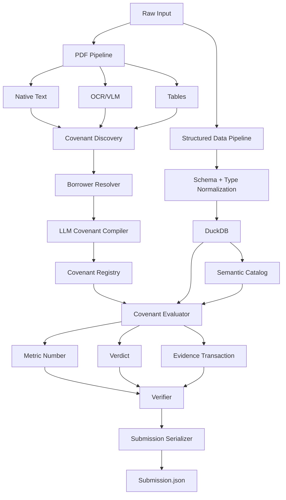

# Halyk Agentic Challenge — Covenant Evaluation MVP Architecture

> Implementation-ready architecture for Codex.
>
> This version is optimized for the clarified hackathon format:
>
> - every borrower has one or more covenants;
> - every covenant is evaluated independently;
> - output for each borrower/covenant pair contains:
>   1. verdict;
>   2. numeric value supporting the verdict;
>   3. evidence transaction when the violation is tied to a specific transaction;
> - partial credit is possible per answer component;
> - final score is the sum across all covenants.

---

# 0. Core idea

The system should **not** behave as a general autonomous agent at evaluation time.

Instead, separate the problem into two stages:

```text
PREPROCESSING / COMPILATION

PDFs
  |
parse / OCR / VLM
  |
detect borrowers + covenant clauses
  |
LLM Covenant Compiler
  |
CovenantSpec registry


EVALUATION

CovenantSpec registry
        +
DuckDB transactions
        |
deterministic evaluator
        |
+-----------+-------------+-------------------+
| VERDICT   | NUMBER      | EVIDENCE TX       |
+-----------+-------------+-------------------+
        |
Verifier
        |
Submission.json
```

### Core principle

```text
LLM interprets the covenant text.

DuckDB/Python executes the covenant.

Verifier checks the result.

Serializer produces exactly the required JSON.
```

The LLM is not the calculator and should not determine the final number if the number can be produced by SQL or Python.

---

# 1. Main optimization target

Because scoring is independent per covenant and partial credit is possible, optimize these outputs separately:

```text
1. NUMBER accuracy
2. VERDICT accuracy
3. EVIDENCE TRANSACTION accuracy
```

Usually:

```text
correct number
    |
    v
correct comparator
    |
    v
correct verdict
```

Therefore the main technical bottleneck is likely:

```text
Covenant text
   |
   v
correct machine-readable rule
   |
   v
correct filtered transaction set
   |
   v
correct numeric metric
```

---

# 2. MVP goals

The MVP must:

- ingest PDF, CSV, Excel and optionally Parquet;
- extract native PDF text;
- use OCR/VLM only when needed;
- detect all covenant clauses;
- detect which borrower(s) each covenant applies to;
- preserve document/page provenance;
- compile covenant text into strict machine-readable rules;
- load transaction data into DuckDB;
- normalize borrower/entity identifiers;
- normalize dates, amounts, currencies and transaction directions;
- resolve covenant versions by effective date;
- execute covenant metrics deterministically;
- identify violating/triggering transactions when required;
- return partial results even when one answer component fails;
- validate result completeness;
- serialize exactly into the official submission template.

---

# 3. Non-goals for MVP

Do not build initially:

- generic autonomous multi-agent systems;
- Kubernetes;
- Airflow;
- graph database;
- generic unrestricted Text-to-SQL;
- web UI;
- large orchestration frameworks unless later needed;
- generic RAG chat interface;
- custom model fine-tuning;
- long chain-of-thought storage.

The pipeline should stay deterministic and debuggable.

---

# 4. Recommended technology stack

| Layer | Choice |
|---|---|
| Language | Python 3.12+ |
| Validation | Pydantic |
| Structured analytics | DuckDB |
| Dataframes | Polars or Pandas |
| Native PDF parsing | PyMuPDF |
| Layout/table parser | Docling adapter or equivalent |
| OCR | provider adapter |
| VLM | provider adapter |
| LLM | provider adapter |
| Embeddings | provider adapter |
| Vector search | Qdrant local or FAISS |
| Lexical retrieval | optional BM25 |
| Logging | structlog / stdlib logging |
| Tests | pytest |
| Config | YAML + Pydantic Settings |

---

# 5. High-level architecture



---

# 6. Repository structure

```text
halyk-covenant-mvp/
├── README.md
├── ARCHITECTURE_COVENANT_MVP.md
├── pyproject.toml
├── .env.example
│
├── configs/
│   ├── default.yaml
│   ├── local.yaml
│   └── experiments/
│
├── data/
│   ├── raw/
│   ├── processed/
│   ├── duckdb/
│   ├── vector/
│   └── submissions/
│
├── src/
│   └── halyk_covenants/
│       ├── config.py
│       ├── cli.py
│       │
│       ├── domain/
│       │   ├── borrower.py
│       │   ├── covenant.py
│       │   ├── transaction.py
│       │   ├── result.py
│       │   ├── evidence.py
│       │   └── source.py
│       │
│       ├── ingestion/
│       │   ├── pdf.py
│       │   ├── structured.py
│       │   ├── tables.py
│       │   ├── images.py
│       │   └── quality.py
│       │
│       ├── documents/
│       │   ├── classifier.py
│       │   ├── blocks.py
│       │   ├── summaries.py
│       │   └── retrieval.py
│       │
│       ├── borrowers/
│       │   ├── normalization.py
│       │   ├── resolver.py
│       │   └── aliases.py
│       │
│       ├── covenants/
│       │   ├── detector.py
│       │   ├── compiler.py
│       │   ├── registry.py
│       │   ├── temporal.py
│       │   └── validation.py
│       │
│       ├── storage/
│       │   ├── duckdb_store.py
│       │   ├── vector_store.py
│       │   └── artifact_store.py
│       │
│       ├── evaluators/
│       │   ├── base.py
│       │   ├── sum.py
│       │   ├── count.py
│       │   ├── max.py
│       │   ├── min.py
│       │   ├── average.py
│       │   ├── ratio.py
│       │   ├── existence.py
│       │   ├── frequency.py
│       │   └── registry.py
│       │
│       ├── sql/
│       │   ├── filters.py
│       │   ├── builder.py
│       │   ├── validators.py
│       │   └── analytics.py
│       │
│       ├── verification/
│       │   ├── completeness.py
│       │   ├── evidence.py
│       │   ├── calculations.py
│       │   └── final.py
│       │
│       ├── submission/
│       │   ├── schema.py
│       │   ├── serializer.py
│       │   └── validator.py
│       │
│       ├── llm/
│       │   ├── client.py
│       │   ├── structured_output.py
│       │   ├── embeddings.py
│       │   └── prompts/
│       │
│       ├── evaluation/
│       │   ├── metrics.py
│       │   ├── fixtures.py
│       │   └── runner.py
│       │
│       └── pipeline/
│           ├── preprocess.py
│           └── evaluate.py
│
├── tests/
│   ├── unit/
│   ├── integration/
│   └── fixtures/
│
└── scripts/
    ├── preprocess.py
    ├── evaluate.py
    ├── inspect_covenants.py
    └── validate_submission.py
```

---

# 7. Canonical domain entities

## 7.1 SourceRef

Every extracted value must retain provenance.

```python
class SourceRef(BaseModel):
    document_id: str | None = None
    page: int | None = None
    bbox: tuple[float, float, float, float] | None = None

    table_id: str | None = None
    row_id: str | None = None

    transaction_id: str | None = None
```

---

# 8. Borrower model

```python
class Borrower(BaseModel):
    borrower_id: str

    canonical_name: str | None = None

    identifiers: dict[str, str] = {}
    aliases: list[str] = []
```

Possible identifiers:

```text
borrower_id
client_id
customer_id
BIN
IIN
account_id
IBAN
contract_id
```

---

# 9. Transaction model

Use exact numeric types.

```python
class Transaction(BaseModel):
    transaction_id: str

    borrower_id: str | None = None
    account_id: str | None = None

    transaction_date: date

    amount: Decimal
    currency: str | None = None

    direction: str | None = None

    counterparty_id: str | None = None
    counterparty_name: str | None = None

    purpose: str | None = None

    source_row_id: str | None = None
```

Important:

```text
Money => Decimal / DuckDB DECIMAL
Never FLOAT for exact scoring.
```

---

# 10. CovenantSpec — central object

This is the most important object in the system.

```python
class CovenantSpec(BaseModel):
    covenant_id: str

    raw_text: str

    borrower_ids: list[str]

    metric: "MetricSpec"
    condition: "ConditionSpec"

    transaction_filters: list["FilterSpec"] = []

    time_window: "TimeWindowSpec | None" = None

    evidence_mode: str

    effective_from: date | None = None
    effective_to: date | None = None

    source: SourceRef

    confidence: float
```

---

# 11. MetricSpec

```python
class MetricSpec(BaseModel):
    metric_type: Literal[
        "sum",
        "count",
        "max",
        "min",
        "avg",
        "ratio",
        "existence",
        "frequency",
    ]

    field: str | None = None

    numerator: "MetricSpec | None" = None
    denominator: "MetricSpec | None" = None

    unit: str | None = None
```

Examples:

```text
sum(amount)
count(transaction_id)
max(amount)
ratio(sum(amount with counterparty=X), sum(amount))
```

---

# 12. ConditionSpec

```python
class ConditionSpec(BaseModel):
    comparator: Literal[
        "<",
        "<=",
        ">",
        ">=",
        "==",
        "!=",
    ]

    threshold: Decimal | int | None

    unit: str | None = None
    currency: str | None = None
```

Mapping examples:

```text
"не более"  -> <=
"не выше"   -> <=
"менее"     -> <
"не менее"  -> >=
"минимум"   -> >=
"более"     -> >
"превышает" -> >
```

Boundary correctness must be tested.

---

# 13. FilterSpec

```python
class FilterSpec(BaseModel):
    field: str

    operator: Literal[
        "eq",
        "neq",
        "gt",
        "gte",
        "lt",
        "lte",
        "in",
        "not_in",
        "contains",
        "not_contains",
    ]

    value: object
```

Examples:

```yaml
- field: direction
  operator: eq
  value: outgoing
```

```yaml
- field: amount
  operator: gt
  value: 1000000
```

---

# 14. TimeWindowSpec

```python
class TimeWindowSpec(BaseModel):
    type: Literal[
        "calendar_day",
        "calendar_week",
        "calendar_month",
        "calendar_quarter",
        "calendar_year",
        "rolling_days",
        "custom",
        "none",
    ]

    rolling_days: int | None = None

    start_date: date | None = None
    end_date: date | None = None
```

Do not hardcode that every covenant is monthly.

---

# 15. EvidenceMode

```python
class EvidenceMode(StrEnum):
    NONE = "none"

    VIOLATING_TRANSACTION = "violating_transaction"

    TRIGGER_TRANSACTION = "trigger_transaction"

    MAX_TRANSACTION = "max_transaction"
```

Meaning:

```text
NONE
    aggregate violation has no single evidence transaction

VIOLATING_TRANSACTION
    one specific transaction violates the rule

TRIGGER_TRANSACTION
    transaction causes count/threshold to cross the limit

MAX_TRANSACTION
    strongest violating transaction is expected
```

Exact behavior must be adapted once the official template/examples are visible.

---

# 16. CovenantResult

Internal result must preserve more information than the final JSON.

```python
class CovenantResult(BaseModel):
    borrower_id: str
    covenant_id: str

    verdict: Literal[
        "complied",
        "violated",
        "unknown",
    ]

    number: Decimal | int | None
    number_unit: str | None = None

    evidence_transaction_id: str | None = None

    calculation_id: str | None = None

    status: Literal[
        "success",
        "partial",
        "failed",
    ]

    errors: list[str] = []
```

Important:

```text
Internal schema != official submission schema.
```

Use a separate serializer.

---

# 17. PDF ingestion pipeline

```text
PDF
 |
 v
page classification
 |
 +-- native text available?
 |       |
 |       +-- extract natively
 |
 +-- scanned / low text?
 |       |
 |       +-- OCR
 |
 +-- visual layout / complex table?
         |
         +-- layout parser / VLM
```

Do not OCR all pages.

---

# 18. Page extraction quality

```python
class ExtractionQuality(BaseModel):
    native_text_chars: int
    text_density: float

    image_count: int
    table_count: int

    ocr_required: bool
    vlm_required: bool

    confidence: float
```

Thresholds must be config-driven.

---

# 19. Multi-borrower PDF support

A PDF must not be assigned to a single borrower by default.

Possible structure:

```text
document
 |
 +-- borrower A section
 |
 +-- borrower B section
 |
 +-- covenant applying to borrowers A/B/C
```

Therefore support:

```text
document -> many borrowers
covenant -> one or many borrowers
```

Use mapping tables, not a single `document.borrower_id`.

---

# 20. Document block model

```python
class DocumentBlock(BaseModel):
    block_id: str

    document_id: str
    page: int

    block_type: Literal[
        "text",
        "table",
        "image",
        "header",
        "footer",
    ]

    text: str

    bbox: tuple[float, float, float, float] | None = None

    borrower_ids: list[str] = []

    source: SourceRef
```

---

# 21. Covenant discovery pipeline

This step should optimize **recall**.

```text
Document
   |
   v
page/block segmentation
   |
   v
candidate covenant sections
   |
   v
LLM / classifier
   |
   v
independent covenant clauses
   |
   v
CovenantSpec candidates
```

Missing a covenant means guaranteed lost points.

Therefore track:

```text
Covenant Detection Recall
```

as a first-class metric.

---

# 22. Covenant splitting

One paragraph may contain multiple independently scored conditions.

Example:

```text
Monthly outgoing payments must not exceed 10M,
and no more than 5 payments above 1M are permitted.
```

Must become:

```text
COV_A:
SUM(outgoing amount per month) <= 10M

COV_B:
COUNT(outgoing transactions where amount > 1M per month) <= 5
```

The Covenant Compiler must not combine independent rules.

---

# 23. LLM Covenant Compiler

The LLM should **compile**, not answer.

Input:

```text
borrower context
raw covenant clause
nearby definitions
document metadata
```

Output:

```text
strict CovenantSpec JSON
```

No prose.

---

# 24. Covenant compiler prompt requirements

The compiler must explicitly extract:

```text
borrower scope
metric
aggregation
field
filters
time window
comparator
threshold
unit
currency
evidence mode
effective date
exceptions
```

Prompt principles:

```text
Extract every independently testable condition.
Preserve exact comparator semantics.
Preserve units.
Preserve currency.
Preserve exceptions.
Do not invent identifiers.
Do not calculate.
```

---

# 25. Compiler validation

Every compiled covenant goes through deterministic validation.

Checks:

```text
metric type supported?
field exists?
comparator valid?
threshold type valid?
unit consistent?
currency consistent?
borrower scope non-empty?
time window valid?
source page exists?
```

Unsupported covenant types should be marked explicitly.

---

# 26. Covenant Registry

Persist compiled covenants.

Recommended DuckDB tables:

```sql
covenants
covenant_borrowers
covenant_filters
covenant_versions
```

Possible `covenants` columns:

```sql
covenant_id
raw_text
metric_json
condition_json
time_window_json
evidence_mode
effective_from
effective_to
source_document_id
source_page
confidence
status
```

---

# 27. Structured data ingestion

Inputs:

```text
CSV
Excel
Parquet
```

Pipeline:

```text
file
 |
schema inference
 |
type normalization
 |
DuckDB raw table
 |
canonical normalized views
```

IDs must remain strings.

Money must use DECIMAL.

Dates must become proper DATE/TIMESTAMP.

---

# 28. DuckDB schema

At minimum:

```sql
borrowers
borrower_aliases

documents
document_borrowers

covenants
covenant_borrowers

transactions

covenant_results
calculations
```

Optional:

```sql
document_blocks
tables_metadata
extracted_table_rows
```

---

# 29. Raw vs canonical structured tables

Keep source data intact.

Example:

```text
raw_transactions
      |
normalization
      |
transactions
```

Benefits:

```text
debugging
reproducibility
schema adaptation
source-row traceability
```

---

# 30. Canonical transactions view

Recommended shape:

```sql
CREATE VIEW transactions AS
SELECT
    CAST(transaction_id AS VARCHAR) AS transaction_id,
    CAST(borrower_id AS VARCHAR) AS borrower_id,
    CAST(account_id AS VARCHAR) AS account_id,
    CAST(transaction_date AS DATE) AS transaction_date,
    CAST(amount AS DECIMAL(38, 6)) AS amount,
    currency,
    direction,
    CAST(counterparty_id AS VARCHAR) AS counterparty_id,
    counterparty_name,
    purpose,
    source_row_id
FROM normalized_transactions;
```

Adapt fields after public dataset release.

---

# 31. Semantic catalog

LLM should not inspect random DB rows every time.

Build metadata:

```yaml
tables:
  transactions:
    description: Canonical transaction registry

    primary_key:
      - transaction_id

    columns:
      borrower_id:
        type: string

      transaction_date:
        type: date

      amount:
        type: decimal

      currency:
        type: string

      direction:
        type: string

      counterparty_name:
        type: string

      purpose:
        type: string
```

The catalog supports:

```text
compiler validation
filter mapping
debugging
optional fallback Text-to-SQL
```

---

# 32. Borrower resolution

Potential mismatch:

```text
PDF:
ТОО "Альфа Трейд"

Registry:
ALFA TRADE LLP

Transactions:
borrower_id=000341
```

Resolution precedence:

```text
1. exact borrower/customer ID
2. exact BIN/IIN
3. exact account/IBAN
4. exact contract ID
5. normalized name
6. alias mapping
7. fuzzy match
8. LLM adjudication only for ambiguous cases
```

Never let fuzzy/LLM matches silently override exact identifiers.

---

# 33. Temporal covenant resolution

Covenants can change over time.

Example:

```text
COV_v1:
limit = 10M
effective_from = Jan 1

COV_v2:
limit = 15M
effective_from = May 1
```

For April:

```text
use 10M
```

For June:

```text
use 15M
```

Resolver:

```python
resolve_covenant(
    covenant_group_id: str,
    borrower_id: str,
    at_date: date,
) -> CovenantSpec
```

---

# 34. Vector retrieval role

Vector search becomes a **preprocessing helper**, not necessarily a runtime dependency.

Use it for:

```text
finding covenant sections
finding amendments
finding definitions
finding exceptions
finding borrower-related sections
```

Do not require vector retrieval for every covenant evaluation if the covenant was already compiled.

---

# 35. Table handling

If covenants appear in PDF tables, keep three forms:

```text
             TABLE
      +--------+--------+
      |        |        |
   raw image structured semantic
      |        |        |
 evidence   DuckDB    vector summary
```

Summary helps find the table.

Structured rows provide truth.

---

# 36. Evaluator architecture

The evaluator should be a registry of deterministic implementations.

```python
EVALUATORS = {
    "sum": SumEvaluator(),
    "count": CountEvaluator(),
    "max": MaxEvaluator(),
    "min": MinEvaluator(),
    "avg": AverageEvaluator(),
    "ratio": RatioEvaluator(),
    "existence": ExistenceEvaluator(),
    "frequency": FrequencyEvaluator(),
}
```

---

# 37. Base evaluator contract

```python
class CovenantEvaluator(Protocol):
    def evaluate(
        self,
        covenant: CovenantSpec,
        borrower_id: str,
        db: DuckDBStore,
    ) -> CovenantResult:
        ...
```

---

# 38. SUM covenant

Example:

```text
Total monthly outgoing payments <= 15M KZT
```

Possible compiled rule:

```yaml
metric:
  metric_type: sum
  field: amount

filters:
  - field: direction
    operator: eq
    value: outgoing

time_window:
  type: calendar_month

condition:
  comparator: <=
  threshold: 15000000
  currency: KZT

evidence_mode: none
```

SQL:

```sql
SELECT SUM(amount)
FROM transactions
WHERE borrower_id = ?
  AND direction = 'outgoing'
  AND transaction_date >= ?
  AND transaction_date < ?;
```

---

# 39. COUNT covenant

Example:

```text
No more than 5 transactions above 1M per month.
```

Rule:

```yaml
metric:
  metric_type: count
  field: transaction_id

filters:
  - field: amount
    operator: gt
    value: 1000000

time_window:
  type: calendar_month

condition:
  comparator: <=
  threshold: 5
```

---

# 40. MAX / single-transaction covenant

Example:

```text
No individual outgoing transaction may exceed 5M.
```

Rule:

```yaml
metric:
  metric_type: max
  field: amount

filters:
  - field: direction
    operator: eq
    value: outgoing

condition:
  comparator: <=
  threshold: 5000000

evidence_mode: violating_transaction
```

Evaluator returns:

```text
number = max amount
verdict
transaction_id of violating max transaction
```

---

# 41. RATIO covenant

Example:

```text
Payments to a single counterparty must not exceed 30%
of all outgoing payments.
```

Possible metric:

```yaml
metric:
  metric_type: ratio

  numerator:
    metric_type: sum
    field: amount

  denominator:
    metric_type: sum
    field: amount

condition:
  comparator: <=
  threshold: 0.30
  unit: ratio
```

Additional grouping logic may be required to evaluate each counterparty and choose the maximum ratio.

---

# 42. EXISTENCE covenant

Example:

```text
Transactions to prohibited counterparties are not allowed.
```

Metric can be:

```text
COUNT(matching prohibited transactions)
```

Condition:

```text
== 0
```

If violated:

```text
evidence transaction = first or strongest violating transaction
```

---

# 43. FREQUENCY covenant

Example:

```text
No more than 3 outgoing transfers per day.
```

Evaluation:

```text
GROUP BY borrower_id, transaction_date
COUNT(*)
MAX(daily_count)
```

Returned number should reflect the exact metric expected by the official template.

---

# 44. Number semantics

The numeric output may be:

```text
money
count
percentage
ratio
days
frequency
other exact metric
```

Therefore internal model must keep:

```text
value
unit
currency
```

Do not assume every number is an amount.

---

# 45. Submission number normalization

Official evaluator may expect:

```text
0.34
```

or:

```text
34
```

for 34%.

Do not embed this convention in the evaluator.

Keep internal:

```python
MetricValue(
    value=Decimal("0.34"),
    unit="ratio",
)
```

Then use:

```text
SubmissionSerializer
```

to match the exact official format.

---

# 46. Comparator engine

Central deterministic function:

```python
def compare(
    value: Decimal | int,
    comparator: str,
    threshold: Decimal | int,
) -> bool:
    ...
```

Meaning:

```text
True = covenant satisfied
False = covenant violated
```

Test every comparator on boundaries.

Example:

```text
value == threshold
<= -> satisfied
<  -> violated
>= -> satisfied
>  -> violated
```

---

# 47. Evidence transaction logic

Not every violated covenant has one transaction.

Examples:

```text
aggregate monthly sum violation
-> no single transaction required

single-transaction max violation
-> violating transaction required

count threshold
-> possibly trigger transaction required

existence prohibition
-> violating transaction required
```

Evidence behavior must be encoded in `evidence_mode`.

---

# 48. Trigger transaction

For count/frequency rules, a useful definition is:

```text
the transaction that causes the covenant to become violated
```

Example:

```text
limit = 5 transactions

TX1
TX2
TX3
TX4
TX5
TX6 <- trigger
```

If the official scoring expects another interpretation, adapt only the evidence selector.

---

# 49. Partial-result strategy

Each component must fail independently.

Example:

```python
CovenantResult(
    verdict="violated",
    number=Decimal("17300000"),
    evidence_transaction_id=None,
    status="partial",
    errors=["evidence transaction unresolved"],
)
```

Never discard a correct number/verdict because evidence selection failed.

---

# 50. Fault isolation

Evaluate every pair independently:

```text
borrower x covenant
```

Pseudo-flow:

```python
for borrower in borrowers:
    for covenant in borrower_covenants:

        try:
            result = evaluator.evaluate(
                covenant=covenant,
                borrower_id=borrower.borrower_id,
            )

        except Exception as exc:
            result = make_failed_result(
                borrower=borrower,
                covenant=covenant,
                error=exc,
            )

        save_result(result)
```

One failure must never terminate the whole submission.

---

# 51. Calculation provenance

Every number should be reproducible.

```python
class Calculation(BaseModel):
    calculation_id: str

    covenant_id: str
    borrower_id: str

    metric_type: str

    sql: str | None = None

    input_transaction_ids: list[str] = []

    value: Decimal | int

    unit: str | None = None
```

For huge transaction sets, storing every ID may be optional; preserve enough traceability to reproduce the result.

---

# 52. Verifier

Before serialization, run deterministic checks.

## 52.1 Completeness

```text
expected borrower/covenant pairs
vs
actual results
```

No pair should be missing silently.

---

# 53. Number verification

Check:

```text
number not null when required
number finite
Decimal serialization valid
unit known
currency consistent
calculation reproducible
```

---

# 54. Verdict verification

Recalculate:

```text
compare(number, comparator, threshold)
```

and ensure it matches stored verdict.

Do not trust an LLM-produced verdict.

---

# 55. Evidence verification

If evidence transaction exists:

```text
transaction exists
belongs to expected borrower
satisfies covenant filters
actually violates/triggers rule
```

If evidence is required but absent:

```text
status = partial
```

---

# 56. Temporal verification

Ensure the applied covenant version was valid for the target period/date.

Reject silently superseded rules.

---

# 57. Submission completeness matrix

Build a matrix:

```text
Borrower A -> COV1, COV2, COV3
Borrower B -> COV1, COV4
Borrower C -> COV5, COV6
```

Expected pair count:

```text
7
```

Actual successful/partial/failed count must equal expected pair count.

A missing row is worse than an explicit failed/partial row during debugging.

---

# 58. Submission serializer

Keep official format isolated.

```python
class SubmissionSerializer:
    def serialize(
        self,
        results: list[CovenantResult],
    ) -> dict:
        ...
```

This module should be the only place that knows:

```text
official key names
percentage representation
null behavior
verdict labels
transaction evidence format
ordering requirements
```

---

# 59. Official template adaptation

When template appears:

1. create exact Pydantic schema;
2. map internal result to official schema;
3. validate JSON;
4. reject extra keys if evaluator expects strict shape;
5. run golden-file tests.

Do not modify evaluator internals to fit presentation details.

---

# 60. Evaluation metrics

Track more than final accuracy.

## Preprocessing

```text
borrower resolution accuracy
covenant detection recall
covenant splitting accuracy
covenant compiler accuracy
```

## Execution

```text
metric number accuracy
verdict accuracy
evidence transaction accuracy
```

## End-to-end

```text
full exact-match covenant accuracy
partial component score
submission validity
latency
cost
```

---

# 61. Covenant compiler metrics

Given manually labeled fixtures:

```text
metric type correct?
field correct?
filters correct?
period correct?
comparator correct?
threshold correct?
currency correct?
borrower scope correct?
evidence mode correct?
```

This is more useful than one binary compiler score.

---

# 62. Synthetic fixtures to create immediately

## Fixture A — simple SUM

```text
Monthly outgoing <= 10M
```

---

# 63. Fixture B — single transaction MAX

```text
Each outgoing transaction <= 5M
```

Expected evidence transaction.

---

# 64. Fixture C — COUNT with filter

```text
No more than 5 transactions above 1M.
```

---

# 65. Fixture D — RATIO

```text
One counterparty <= 30% of outgoing volume.
```

---

# 66. Fixture E — temporal amendment

```text
Jan 1: limit 10M
May 1: limit 15M
```

Test April vs June.

---

# 67. Fixture F — multi-borrower PDF

One document applies different covenants to:

```text
Borrower A
Borrower B
Borrowers C/D as group
```

---

# 68. Fixture G — scanned covenant

Covenant only visible through OCR.

---

# 69. Fixture H — table covenant

Covenants encoded as rows:

| Borrower | Metric | Limit |
|---|---|---:|
| A | monthly outgoing | 10M |
| B | monthly outgoing | 15M |

---

# 70. Fixture I — exact boundary

```text
limit = 10M
actual = 10M
```

Test:

```text
<= satisfied
< violated
```

---

# 71. Fixture J — partial output

Correct:

```text
number
verdict
```

Missing:

```text
evidence transaction
```

Ensure result stays serializable/debuggable.

---

# 72. Minimal end-to-end scenario

## Contract

```text
Borrower: Alpha Trade
Monthly outgoing transaction volume must not exceed
15,000,000 KZT.
Effective from 2026-03-15.
```

## Transactions

```csv
transaction_id,borrower_id,date,amount,currency,direction
TX1,B001,2026-04-01,5000000,KZT,outgoing
TX2,B001,2026-04-10,6000000,KZT,outgoing
TX3,B001,2026-04-20,5000000,KZT,outgoing
```

Expected metric:

```text
16,000,000
```

Expected verdict:

```text
violated
```

Expected evidence transaction:

```text
null
```

because violation is aggregate.

---

# 73. Second end-to-end scenario

Covenant:

```text
No individual outgoing transfer may exceed 5,000,000 KZT.
```

Transactions:

```text
TX1 = 4M
TX2 = 6M
TX3 = 3M
```

Expected:

```text
number = 6M
verdict = violated
evidence transaction = TX2
```

---

# 74. Configuration

Example:

```yaml
storage:
  duckdb_path: data/duckdb/hackathon.duckdb

pdf:
  native_text_min_chars: 80
  enable_ocr: true
  enable_vlm: true

covenants:
  compiler_enabled: true
  confidence_threshold: 0.80
  split_independent_rules: true

retrieval:
  enabled: true
  candidate_k: 20
  rerank_k: 8

evaluation:
  continue_on_error: true
  store_calculation_sql: true

submission:
  strict_schema: true

verification:
  require_number: true
  verify_verdict_from_number: true
  verify_evidence_transaction: true
```

---

# 75. Observability

Each evaluation should have:

```text
run_id
borrower_id
covenant_id

raw covenant text
compiled rule
resolved version

generated SQL / calculation
transaction filters
metric value
verdict
evidence transaction

status
errors
latency
```

Do not log hidden chain-of-thought.

Log structured artifacts.

---

# 76. Recommended preprocessing command

```bash
python -m halyk_covenants.cli preprocess ./data/raw
```

Expected stages:

```text
documents parsed
borrowers resolved
covenants discovered
covenants compiled
transactions loaded
registry built
```

---

# 77. Recommended inspect command

```bash
python -m halyk_covenants.cli inspect-covenants
```

Display:

```text
covenant_id
borrower_ids
raw text
metric
filters
condition
period
effective dates
confidence
source page
```

Manual inspection of compiled rules will likely be extremely valuable during the public stage.

---

# 78. Recommended evaluation command

```bash
python -m halyk_covenants.cli evaluate
```

Outputs:

```text
internal results
verification report
submission candidate
```

---

# 79. Recommended validation command

```bash
python -m halyk_covenants.cli validate-submission \
  data/submissions/submission.json
```

Validation must be runnable independently from evaluation.

---

# 80. Implementation phases for Codex

## Phase 1 — project skeleton

Implement:

```text
Pydantic domain models
config
CLI
logging
pytest
```

No LLM integration yet.

---

# 81. Phase 2 — DuckDB

Implement:

```text
structured file ingestion
transactions normalization
borrower table
DECIMAL amounts
date normalization
```

Tests first.

---

# 82. Phase 3 — evaluator engine

Implement deterministic:

```text
SUM
COUNT
MAX
MIN
AVG
```

with:

```text
FilterSpec
TimeWindowSpec
ConditionSpec
```

This is the most important early milestone.

---

# 83. Phase 4 — ratio/existence/frequency

Add:

```text
RATIO
EXISTENCE
FREQUENCY
```

Only after basic evaluator tests pass.

---

# 84. Phase 5 — PDF native ingestion

Implement:

```text
document pages
blocks
provenance
borrower hints
```

---

# 85. Phase 6 — OCR/VLM adapters

Add scanned-document handling.

Do not tightly couple provider SDKs to domain modules.

---

# 86. Phase 7 — borrower resolution

Implement:

```text
exact IDs
normalized names
aliases
fuzzy fallback
```

---

# 87. Phase 8 — covenant detection

Optimize recall.

Build synthetic tests with:

```text
one rule
multiple rules in one paragraph
tables
multi-borrower sections
```

---

# 88. Phase 9 — covenant compiler

Implement LLM structured output to `CovenantSpec`.

Add deterministic schema validator.

---

# 89. Phase 10 — temporal resolution

Implement covenant amendments/effective dates.

---

# 90. Phase 11 — evidence transaction selectors

Implement:

```text
violating transaction
trigger transaction
max transaction
```

---

# 91. Phase 12 — verifier

Implement:

```text
number reproduction
verdict reproduction
evidence transaction validation
completeness matrix
```

---

# 92. Phase 13 — submission serializer

Wait for official template if necessary.

Keep interface ready beforehand.

---

# 93. Phase 14 — evaluation harness

Track component-level scores.

Then optimize:

```text
compiler
retrieval
OCR
entity mapping
```

based on measured errors.

---

# 94. Definition of Done

MVP is ready when:

- [ ] CSV/Excel loads into DuckDB.
- [ ] Money uses DECIMAL.
- [ ] Borrower IDs remain strings.
- [ ] Basic SUM covenant executes.
- [ ] COUNT covenant executes.
- [ ] MAX/single-transaction covenant returns evidence.
- [ ] Ratio covenant executes.
- [ ] Comparator boundaries are tested.
- [ ] PDF native text ingestion works.
- [ ] OCR fallback works.
- [ ] Multi-borrower documents are supported.
- [ ] Covenant discovery extracts independent rules.
- [ ] Covenant Compiler outputs valid `CovenantSpec`.
- [ ] Covenant versions are date-aware.
- [ ] Borrower/entity aliases resolve.
- [ ] Each borrower/covenant pair is evaluated independently.
- [ ] Partial results survive evidence failures.
- [ ] Number can be reproduced.
- [ ] Verdict is deterministically recomputed.
- [ ] Evidence transaction is validated.
- [ ] Completeness matrix detects missing covenants.
- [ ] Submission serializer is isolated.
- [ ] Synthetic end-to-end tests pass.

---

# 95. What to inspect immediately after public dataset release

Answer these before adding architecture:

1. What is the exact `Submission.json` schema?
2. What are the exact verdict labels?
3. How is the numeric component represented?
4. How are percentages represented?
5. When exactly is an evidence transaction expected?
6. Is evidence a transaction ID or a full transaction object?
7. How are borrowers identified?
8. Is there a borrower master table?
9. Are covenants explicitly numbered?
10. Does each PDF contain one or many borrowers?
11. Can one covenant apply to many borrowers?
12. Are covenant amendments/version dates common?
13. What transaction columns are available?
14. What date field should be used?
15. Are amounts already normalized by currency?
16. Are FX conversions required?
17. Which covenant metric types actually occur?
18. Are covenant periods monthly/quarterly/custom?
19. Are covenant definitions hidden in other documents?
20. Is there a public labeled example output?

---

# 96. Likely adaptation points

After dataset release, expect changes mainly in:

```text
Borrower resolver
Transaction canonical schema
Covenant compiler prompt
Metric types
Evidence selector
Period semantics
Currency handling
Submission serializer
```

Stable parts should be:

```text
CovenantSpec
Evaluator registry pattern
DuckDB abstraction
Comparator engine
Temporal resolver interface
Partial-result handling
Verifier structure
Evaluation harness
```

---

# 97. Currency handling

Do not automatically sum across currencies unless the covenant explicitly allows it and an FX rule/data source exists.

Example unsafe case:

```text
5M KZT + 10K USD
```

This must not become one metric without a defined conversion rule.

Possible result:

```text
unsupported / requires FX conversion
```

until dataset semantics are known.

---

# 98. NULL handling

Define semantics explicitly.

Examples:

```text
no transactions
SUM -> usually 0, not NULL
COUNT -> 0
MAX -> no value
MIN -> no value
AVG -> no value
```

Covenant-specific behavior may differ.

Tests must cover empty transaction sets.

---

# 99. Duplicate transactions

Ingestion should detect exact duplicate source rows.

Do not silently deduplicate unless source semantics justify it.

Keep:

```text
source_row_id
source_file
source_hash
```

for auditability.

---

# 100. Transaction date semantics

Datasets may contain:

```text
operation_date
posting_date
value_date
created_at
```

Do not guess globally.

Map the covenant's intended temporal field explicitly after inspecting the dataset.

---

# 101. Group covenants

Some covenants may apply to a cluster of borrowers.

Support:

```text
covenant -> many borrower_ids
```

Potentially also:

```text
metric_scope = per_borrower
```

versus:

```text
metric_scope = borrower_group
```

Add field when needed:

```python
scope_mode: Literal[
    "per_borrower",
    "group",
]
```

---

# 102. Group-level metric example

Covenant:

```text
Combined outgoing payments of companies A, B and C
must not exceed 50M monthly.
```

This is not:

```text
evaluate each borrower separately
```

It is:

```text
WHERE borrower_id IN (A, B, C)
SUM(amount)
```

Architecture must allow this extension.

---

# 103. Exceptions

Covenant:

```text
Outgoing transfers may not exceed 5M,
except tax payments.
```

Compiler must preserve:

```yaml
filters:
  direction: outgoing

exclusions:
  purpose_category: tax
```

Do not drop exceptions during summarization.

---

# 104. Definitions

Some documents may define terms elsewhere:

```text
"Permitted Payments" means ...
```

and covenant uses:

```text
Payments other than Permitted Payments...
```

This is where retrieval remains useful during covenant compilation.

Pipeline:

```text
covenant clause
   |
find referenced definition
   |
include definition in compiler context
```

---

# 105. Covenant dependencies

Some rules may depend on another metric:

```text
Payments <= 20% of previous month's revenue.
```

Need references to external metrics.

Do not force such a rule into a simple scalar threshold.

Allow future:

```python
threshold_source: MetricSpec | None
```

but implement only if public dataset requires it.

---

# 106. Fail closed, not silently

Unsupported rule:

```text
status = failed_unsupported_rule
```

Do not invent a generic interpretation.

Because partial scoring favors reliable components over fabricated full answers.

---

# 107. Performance strategy

During private stage:

```text
compile documents once
load DuckDB once
evaluate covenants in batches
```

Avoid repeated:

```text
re-parsing PDFs
re-embedding unchanged blocks
re-asking LLM to compile same covenant
```

Cache by content hash.

---

# 108. Content hashing

Store:

```text
document_sha256
parser_version
compiler_model
compiler_prompt_version
```

Compiled covenant cache key:

```text
hash(
    covenant text
    + nearby context
    + prompt version
    + model
)
```

---

# 109. Experiment strategy

Do not optimize everything at once.

Examples:

```text
baseline compiler
vs
compiler + definitions retrieval

native parser
vs
Docling tables

no reranker
vs
reranker

exact entity mapping
vs
exact + fuzzy
```

Measure each change separately.

---

# 110. Priority order

Current expected priorities:

```text
★★★★★ DuckDB transaction normalization
★★★★★ Covenant detection recall
★★★★★ Covenant Compiler accuracy
★★★★★ Deterministic evaluator
★★★★★ Comparator correctness
★★★★★ Borrower mapping
★★★★★ Submission validation

★★★★☆ Temporal covenant resolution
★★★★☆ Evidence transaction selection
★★★★☆ OCR / table handling

★★★☆☆ Vector retrieval
★★★☆☆ Reranking

★☆☆☆☆ Generic agent planner
★☆☆☆☆ Multi-agent orchestration
```

---

# 111. Recommended first Codex prompt

```text
Use ARCHITECTURE_COVENANT_MVP.md as the source of truth.

Implement only Phases 1-3:

1. project skeleton and Pydantic domain models,
2. DuckDB structured-data ingestion and canonical transaction schema,
3. deterministic covenant evaluator for SUM, COUNT, MAX, MIN and AVG.

Requirements:

- use Decimal / DuckDB DECIMAL for numeric money values;
- keep IDs as strings;
- implement FilterSpec, TimeWindowSpec, MetricSpec, ConditionSpec,
  CovenantSpec and CovenantResult;
- implement a deterministic comparator engine;
- do not implement PDF parsing, OCR, LLM calls, vector retrieval or agent orchestration yet;
- create pytest unit/integration tests;
- create synthetic transaction fixtures;
- test exact comparator boundaries;
- test partial-result behavior;
- expose a minimal CLI command that loads fixtures and evaluates a CovenantSpec;
- run the full test suite and report results;
- do not deviate from the architecture without documenting the reason.
```

---

# 112. Final target architecture

```text
RAW PDF DOCUMENTS
       |
       v
PARSER / OCR / VLM
       |
       v
BORROWER + COVENANT DISCOVERY
       |
       v
LLM COVENANT COMPILER
       |
       v
COVENANT REGISTRY
       |
       +----------------------+
                              |
                        DUCKDB TRANSACTIONS
                              |
       +----------------------+
       |
       v
DETERMINISTIC COVENANT EVALUATOR
       |
       +--> NUMBER
       |
       +--> VERDICT
       |
       +--> EVIDENCE TRANSACTION
       |
       v
VERIFIER
       |
       v
STRICT SUBMISSION SERIALIZER
       |
       v
Submission.json
```

The competitive advantage should come from:

```text
high covenant recall
+ correct covenant compilation
+ exact transaction filtering
+ exact numeric calculation
+ exact comparator semantics
+ correct evidence selection
+ strict output validation
```

Not from building more agents.
