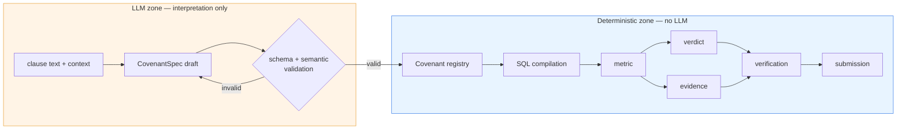

# 01 — Task Model (implementation-independent)

> What the problem actually is, described without reference to any current implementation.
> If you rewrote this repository from zero, this document is what you would have to satisfy.

Related: [00_CONTEXT.md](00_CONTEXT.md) · [09_ARCHITECTURE_V3.md](09_ARCHITECTURE_V3.md)

---

## 1. The pipeline in four questions

```text
what arrives
      ↓
what must be understood
      ↓
what must be computed
      ↓
what must be returned
```

### What arrives

| # | Artifact | Reality |
| --- | --- | --- |
| 1 | Loan/credit documents | PDF; mixed native-text and scanned; tables; multiple borrowers per file; amendments that supersede clauses |
| 2 | Transaction ledger | Tabular; one row per transaction; borrower key, date, amount, currency, direction, counterparty, purpose |
| 3 | Borrower registry | Canonical IDs plus aliases and identifiers (BIN/IIN-like) |
| 4 | An evaluation date | The as-of date the covenants are judged against |

### What must be understood

1. **Which text fragments are covenants.** A covenant is an obligation with a testable constraint.
   Not every "shall" is a covenant; not every number is a threshold.
2. **Who each covenant binds.** One document can bind several borrowers; a portfolio table can bind a
   different borrower per row; an amendment inherits the scope of the clause it replaces.
3. **What each covenant means, mechanically.** The clause must reduce to:
   *metric* over *a filtered transaction set* within *a time window*, compared against *a threshold*.
4. **When each covenant is in force.** Amendments create versions with effective dates. The version
   that governs a given evaluation date must be selected — and a version change *inside* an
   aggregation window is a genuine semantic problem, not a bug.
5. **What counts as evidence.** For some covenants the violating transaction is well-defined (the
   single payment over the cap); for others it is the transaction that *crossed* the threshold; for
   aggregate covenants there may be no single responsible transaction at all.

### What must be computed

For each `(borrower, covenant)`:

```text
filtered transaction set  =  transactions
                             ∩ borrower scope
                             ∩ covenant filters (direction, currency, counterparty, purpose, …)
                             ∩ time window
                             ∩ covenant effective period
                             − exclusions

number                    =  metric(filtered set)
verdict                   =  compare(number, comparator, threshold)
evidence                  =  selector(filtered set, evidence mode)   [when applicable]
```

The metric vocabulary that actually occurs in covenant language:

| Metric | Typical clause shape |
| --- | --- |
| `sum` | "aggregate outgoing payments shall not exceed X per month" |
| `count` | "no more than N transfers per quarter" |
| `max` | "no single payment shall exceed X" |
| `min` | "each settlement shall be at least X" |
| `avg` | "average monthly turnover shall be at least X" |
| `ratio` | "outgoing payments shall not exceed 30% of incoming" |
| `existence` | "no payments to sanctioned counterparties" |
| `frequency` | "no more than N transactions per day" |

### What must be returned

One record per `(borrower, covenant)` pair, containing:

```text
borrower_id
covenant_id
verdict            complied | violated   (unknown must still be emitted, not dropped)
number             the metric value supporting the verdict
evidence_tx_id     when the covenant type implies a specific responsible transaction
```

Formatted exactly to the organizer's template. Completeness matters: a missing pair scores zero on
all three components, so **emitting a low-confidence answer strictly dominates emitting nothing.**

---

## 2. Responsibility split

The central design question is which parts an LLM may touch. The answer follows from a single
property: **arithmetic over a known table is verifiable and cheap; language interpretation is not.**

### LLM responsibilities

| Responsibility | Why it must be the LLM |
| --- | --- |
| Interpreting clause semantics into a `CovenantSpec` | Irreducibly a natural-language task |
| Choosing metric type from prose | "no more than 5 per day" → `frequency`, not `count`, is a reading decision |
| Mapping vague qualifiers to filters | "third-party transfers", "non-operational payments" |
| Recognising units, currencies and percentage semantics in prose | Ambiguous phrasing, implicit units |
| Deciding which borrowers a clause binds *within an already-resolved set* | Requires reading the clause |
| Repairing its own structurally invalid output | Cheaper than escalation |

### Deterministic responsibilities

| Responsibility | Why it must NOT be the LLM |
| --- | --- |
| Every arithmetic operation | Reproducible, auditable, free |
| Filter → SQL compilation | Must be injection-safe and closed-vocabulary |
| Time window boundary math | Off-by-one errors are systematic, not stochastic |
| Comparator application | A one-line function should never be delegated |
| Evidence selection | Deterministic ranking over a filtered set |
| Borrower identity resolution | Must be stable and auditable; fuzzy-match with explicit thresholds |
| Covenant version resolution by effective date | Interval arithmetic |
| Currency consistency enforcement | A policy decision, not a judgement call |
| Provenance and completeness accounting | Bookkeeping |
| Submission serialization | Schema conformance |

### The boundary, drawn explicitly



The one-way arrow from `C` to `D` is the whole architecture. Nothing downstream of the registry may
consult a model, and nothing upstream may compute a number.

---

## 3. What makes this problem hard

Ordered by expected score impact, not by engineering interest:

1. **Detection recall.** A clause that is never detected is unrecoverable. There is no downstream
   stage that can notice its absence, because nothing knows it should exist. This is the only
   *silent, total* failure in the system.
2. **Compilation fidelity.** A spec that is structurally valid but semantically wrong produces a
   confident, well-formatted, wrong answer that passes every internal check. This is the second
   silent failure.
3. **Filter completeness.** Missing `direction=outgoing` silently doubles a sum. Missing a currency
   filter mixes KZT and USD into one meaningless total.
4. **Window boundaries.** Half-open vs. closed intervals, "per month" as calendar vs. rolling.
5. **Borrower scoping.** A portfolio table where the borrower is implied by row position, or a
   heading two blocks above.
6. **Version resolution.** Amendments, and the window-straddling case.
7. **Evidence semantics.** Which transaction is "the" violating one when the covenant is aggregate.

Note that items 1 and 2 are both *interpretation* failures and both *silent*. Everything the system
does downstream — the verifier, the review layer, the provenance records — operates on the assumption
that a spec exists and is correct. **The architecture's verification effort is concentrated where
errors are loud, and thin where errors are silent.** That observation drives
[09_ARCHITECTURE_V3.md](09_ARCHITECTURE_V3.md).

---

## 4. Success criteria for any implementation

An implementation of this task model is adequate if and only if:

- **C1.** Every `(borrower, covenant)` pair that the input implies produces exactly one output record.
- **C2.** No single covenant failure can remove another covenant's answer.
- **C3.** Every number is reproducible from stored SQL + parameters without re-running any model.
- **C4.** Every verdict is `compare(number, comparator, threshold)` — never a model's opinion.
- **C5.** Every emitted evidence transaction is inside the covenant's own filtered scope.
- **C6.** The system reports what it does not know, separately from what it got wrong.
- **C7.** A full run completes within the operational window without manual intervention.

`codex-1` satisfies C2–C5 well, C3 with a caveat, and C1/C6 only nominally.
`codex-2` adds observability toward C6 but does not change C1–C5.
See [06_CODEX_1_VS_CODEX_2.md](06_CODEX_1_VS_CODEX_2.md) and [07_FINDINGS.md](07_FINDINGS.md).

---

Next: [02_REPOSITORY_MAP.md](02_REPOSITORY_MAP.md)
