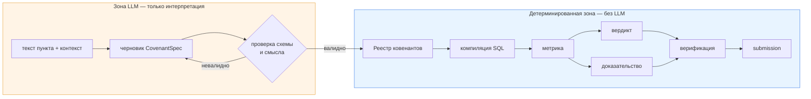

# 01 — Модель задачи (независимо от реализации)

> В чём состоит задача, описанная без ссылок на текущую реализацию.
> Если бы вы переписывали репозиторий с нуля, этому документу пришлось бы удовлетворить.

Связанные документы: [00_CONTEXT.md](00_CONTEXT.md) · [09_ARCHITECTURE_CLOUD1.md](09_ARCHITECTURE_CLOUD1.md)

---

## 1. Пайплайн в четырёх вопросах

*Пайплайн* (pipeline) — конвейер: данные проходят цепочку этапов, каждый что-то с ними делает.

```text
что приходит
      ↓
что нужно понять
      ↓
что нужно вычислить
      ↓
что вернуть
```

### Что приходит

| № | Артефакт | Как это выглядит в реальности |
| --- | --- | --- |
| 1 | Кредитные документы | PDF; смесь нативного текста и сканов; таблицы; несколько заёмщиков в одном файле; дополнительные соглашения, отменяющие прежние пункты |
| 2 | Реестр транзакций | Таблица; одна строка на транзакцию; ключ заёмщика, дата, сумма, валюта, направление, контрагент, назначение |
| 3 | Реестр заёмщиков | Канонические идентификаторы плюс псевдонимы и коды (типа БИН/ИИН) |
| 4 | Дата оценки | Дата, «на момент» которой судят о ковенантах |

### Что нужно понять

1. **Какие фрагменты текста являются ковенантами.** Ковенант — это обязательство с проверяемым
   ограничением. Не всякое «обязан» — ковенант; не всякое число — порог.
2. **Кого связывает каждый ковенант.** Один документ может связывать несколько заёмщиков; в
   портфельной таблице каждая строка может относиться к своему заёмщику; дополнительное соглашение
   наследует область действия пункта, который оно заменяет.
3. **Что каждый ковенант означает механически.** Пункт должен свестись к формуле:
   *метрика* по *отфильтрованному набору транзакций* внутри *временного окна*, сравнённая с *порогом*.
4. **Когда каждый ковенант действует.** Дополнительные соглашения создают версии с датами вступления
   в силу. Нужно выбрать версию, действующую на дату оценки, — а смена версии *внутри* окна агрегации
   является настоящей смысловой проблемой, а не багом.
5. **Что считается доказательством.** Для одних ковенантов нарушающая транзакция определена
   однозначно (единственный платёж свыше лимита); для других это транзакция, которая *пересекла*
   порог; для агрегатных ковенантов единственной «виноватой» транзакции может не быть вовсе.

### Что нужно вычислить

Для каждой пары `(заёмщик, ковенант)`:

```text
отфильтрованный набор  =  транзакции
                          ∩ область действия по заёмщику
                          ∩ фильтры ковенанта (направление, валюта, контрагент, назначение, …)
                          ∩ временное окно
                          ∩ период действия ковенанта
                          − исключения

число                  =  метрика(отфильтрованный набор)
вердикт                =  сравнить(число, оператор, порог)
доказательство         =  селектор(отфильтрованный набор, режим доказательства)   [где применимо]
```

Словарь метрик, реально встречающийся в языке ковенантов:

| Метрика | Типичная форма пункта |
| --- | --- |
| `sum` | «совокупные исходящие платежи не должны превышать X за месяц» |
| `count` | «не более N переводов за квартал» |
| `max` | «ни один отдельный платёж не должен превышать X» |
| `min` | «каждый расчёт должен быть не менее X» |
| `avg` | «средний месячный оборот должен быть не менее X» |
| `ratio` | «исходящие платежи не должны превышать 30% от входящих» |
| `existence` | «отсутствие платежей в адрес подсанкционных контрагентов» |
| `frequency` | «не более N транзакций в день» |

### Что вернуть

Одна запись на пару `(заёмщик, ковенант)`, содержащая:

```text
borrower_id        идентификатор заёмщика
covenant_id        идентификатор ковенанта
verdict            соблюдён | нарушен   («неизвестно» тоже надо выдать, а не пропустить)
number             значение метрики, подтверждающее вердикт
evidence_tx_id     если тип ковенанта подразумевает конкретную ответственную транзакцию
```

Отформатировано ровно по шаблону организатора. Полнота критична: пропущенная пара даёт ноль по всем
трём компонентам, поэтому **выдать ответ с низкой уверенностью строго лучше, чем не выдать ничего.**

---

## 2. Разделение ответственности

Центральный вопрос проектирования — к чему вообще можно допускать LLM. Ответ следует из одного
свойства: **арифметика по известной таблице проверяема и дешева; интерпретация языка — нет.**

### Ответственность LLM

| Ответственность | Почему это должна быть LLM |
| --- | --- |
| Перевод смысла пункта в `CovenantSpec` | Неустранимо задача на естественном языке |
| Выбор типа метрики из прозы | «не более 5 в день» → `frequency`, а не `count` — это решение о прочтении |
| Отображение расплывчатых определений в фильтры | «переводы третьим лицам», «неоперационные платежи» |
| Распознавание единиц, валют и процентной семантики в тексте | Неоднозначные формулировки, неявные единицы |
| Выбор заёмщиков, которых связывает пункт, *внутри уже разрешённого набора* | Требует чтения пункта |
| Починка собственного структурно невалидного вывода | Дешевле, чем эскалация |

### Детерминированная ответственность

*Детерминированный* — всегда даёт один и тот же результат на одних и тех же входных данных.

| Ответственность | Почему это НЕ должна быть LLM |
| --- | --- |
| Любая арифметическая операция | Воспроизводимо, проверяемо, бесплатно |
| Компиляция фильтров в SQL | Должна быть защищена от инъекций и работать по закрытому словарю |
| Арифметика границ временных окон | Ошибки на единицу систематические, а не случайные |
| Применение оператора сравнения | Однострочную функцию нельзя делегировать модели |
| Выбор доказательства | Детерминированное ранжирование по отфильтрованному набору |
| Разрешение личности заёмщика | Должно быть стабильным и проверяемым; нечёткое сопоставление с явными порогами |
| Разрешение версии ковенанта по дате | Арифметика интервалов |
| Контроль единства валюты | Решение о политике, а не суждение |
| Учёт происхождения и полноты | Бухгалтерия |
| Сериализация ответа | Соответствие схеме |

### Граница, проведённая явно



Односторонняя стрелка из `C` в `D` — это и есть вся архитектура. Ничто после реестра не имеет права
обращаться к модели, и ничто до него не имеет права вычислять число.

---

## 3. Что делает задачу сложной

Упорядочено по ожидаемому влиянию на балл, а не по инженерной интересности:

1. **Полнота обнаружения.** Пункт, который не обнаружен, невосстановим. Ни один следующий этап не
   заметит его отсутствия, потому что никто не знает, что он должен быть. Это единственный
   *молчаливый и полный* отказ в системе.
2. **Точность компиляции.** Спецификация, структурно валидная, но смыслово неверная, даёт уверенный,
   аккуратно оформленный, неправильный ответ, который проходит все внутренние проверки. Это второй
   молчаливый отказ.
3. **Полнота фильтров.** Пропущенный `direction=outgoing` молча удваивает сумму. Пропущенный фильтр
   по валюте смешивает тенге и доллары в один бессмысленный итог.
4. **Границы окон.** Полуоткрытый интервал против закрытого, «за месяц» как календарный против
   скользящего.
5. **Привязка к заёмщику.** Портфельная таблица, где заёмщик подразумевается позицией строки, или
   заголовком двумя блоками выше.
6. **Разрешение версий.** Дополнительные соглашения и случай пересечения границы окна.
7. **Семантика доказательства.** Какая транзакция «та самая» нарушающая, если ковенант агрегатный.

Обратите внимание: пункты 1 и 2 — оба отказы *интерпретации* и оба *молчаливые*. Всё, что система
делает дальше — верификатор, слой ревью, записи о происхождении, — исходит из допущения, что
спецификация существует и верна. **Усилия по верификации сосредоточены там, где ошибки громкие, и
редки там, где ошибки молчаливые.** Именно это наблюдение движет
[09_ARCHITECTURE_CLOUD1.md](09_ARCHITECTURE_CLOUD1.md).

---

## 4. Критерии успеха для любой реализации

Реализация этой модели задачи адекватна тогда и только тогда, когда:

- **C1.** Каждая пара `(заёмщик, ковенант)`, подразумеваемая входными данными, даёт ровно одну
  выходную запись.
- **C2.** Сбой одного ковенанта не может удалить ответ другого.
- **C3.** Каждое число воспроизводимо из сохранённых SQL и параметров без повторного запуска модели.
- **C4.** Каждый вердикт есть `сравнить(число, оператор, порог)` — никогда не мнение модели.
- **C5.** Каждая выданная транзакция-доказательство лежит внутри отфильтрованной области самого
  ковенанта.
- **C6.** Система сообщает, чего она не знает, отдельно от того, в чём она ошиблась.
- **C7.** Полный прогон завершается в отведённое время без ручного вмешательства.

`codex-1` хорошо удовлетворяет C2–C5, C3 — с оговоркой, а C1 и C6 — лишь номинально.
`codex-2` добавляет наблюдаемость в сторону C6, но не меняет C1–C5.
См. [06_CODEX_1_VS_CODEX_2.md](06_CODEX_1_VS_CODEX_2.md) и [07_FINDINGS.md](07_FINDINGS.md).

---

Далее: [02_REPOSITORY_MAP.md](02_REPOSITORY_MAP.md)
