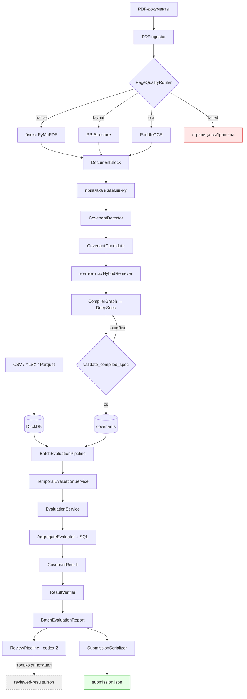

# 02 — Карта репозитория

> Структурная карта кода в том виде, в каком он существует в `codex-2` (ветка-надмножество).
> Количество строк указано по `codex-2`; ~9 600 строк Python в 60 модулях.

Связанные документы: [03_BRANCH_ANALYSIS.md](03_BRANCH_ANALYSIS.md) · [04_CODEX_1_ARCHITECTURE.md](04_CODEX_1_ARCHITECTURE.md)

---

## Верхний уровень

```text
Halyk_ai_challenge/
├── .github/workflows/codex-1-ci.yml     CI: ruff + pytest на Python 3.12
├── docs/
│   ├── 1_ARCHITECTURE_Halyk_Agentic_Challenge_MVP.md   общий агентный дизайн (не реализован)
│   ├── 2_ARCHITECTURE_COVENANT_MVP.md                  дизайн ковенантов (реализован)
│   └── architecture-v3/                                ← этот исследовательский трек
└── 2_ARCHITECTURE_COVENANT_MVP/        собственно Python-проект
    ├── pyproject.toml                   halyk-covenants, python >= 3.12
    ├── README.md                        руководство оператора на 34 КБ
    ├── Dockerfile / Dockerfile.ocr / docker-compose.yml
    ├── configs/                         default.yaml, submission/synthetic.yaml
    ├── data/                            исходные фикстуры + синтетический корпус для бенчмарка
    ├── docs/                            заметки CODEX_1, workflow CODEX_2, спеки и планы superpowers
    ├── scripts/regression_v2.py
    ├── src/halyk_covenants/             15 пакетов
    └── tests/                           unit / integration / live / fixtures
```

*CI* (continuous integration) — робот на GitHub, который при каждой отправке кода автоматически
прогоняет проверки. *ruff* — линтер (проверяет стиль и типичные ошибки), *pytest* — запускалка тестов.

В корне лежат два архитектурных документа. **Реализованную систему описывает только
`2_ARCHITECTURE_COVENANT_MVP.md`.** `1_ARCHITECTURE_*.md` описывает более широкий агентный дизайн
(Qdrant, планировщик, запасной путь text-to-SQL, хранилище фактов), который сознательно не строили —
см. [07_FINDINGS.md](07_FINDINGS.md), раздел «Расхождения документации и кода».

---

## Точки входа

*Точка входа* (entrypoint) — команда, которой пользователь запускает программу.

| Точка входа | Объявлена в | Назначение |
| --- | --- | --- |
| `halyk-covenants` | `cli.py:app` | Основной CLI пайплайна (11 команд) |
| `halyk-review` | `review_cli.py:app` | CLI ревью из `codex-2` (1 команда) |
| `scripts/regression_v2.py` | скрипт | Отдельный синтетический регрессионный прогон |

*CLI* (command-line interface) — интерфейс командной строки.

Команды `halyk-covenants`:

```text
preprocess            загрузить PDF и структурированные данные, обнаружить и скомпилировать ковенанты
evaluate              одна пара заёмщик/ковенант
evaluate-all          полный пакет → BatchEvaluationReport
inspect-covenants     выгрузить скомпилированный реестр
serialize-submission  CovenantResult[] → submission.json
validate-submission   проверка соответствия схеме
generate-synthetic    собрать синтетический корпус фикстур
benchmark             покомпонентный синтетический бенчмарк
benchmark-full        сквозной синтетический бенчмарк
ocr-smoke             проверить, что рантайм Paddle импортируется
```

---

## Структура пакетов

```text
src/halyk_covenants/
├── cli.py                326    основное приложение Typer
├── review_cli.py         163    приложение Typer из codex-2
├── config.py              78    pydantic-settings, префикс переменных HALYK_
│
├── domain/                       ← канонические модели, без ввода-вывода
│   ├── covenant.py       158    CovenantSpec, MetricSpec, ConditionSpec, FilterSpec, TimeWindowSpec
│   ├── result.py                CovenantResult
│   ├── calculation.py     42    Calculation (происхождение расчёта)
│   ├── document.py        39    DocumentBlock
│   ├── source.py                SourceRef
│   ├── failure.py         18    перечисление FailureStage
│   └── transaction_fields.py 32 ЗАКРЫТЫЙ КАТАЛОГ ПОЛЕЙ
│
├── ingestion/                    ← PDF → DocumentBlock
│   ├── pdf.py            135    загрузчик на PyMuPDF + маршрутизация
│   └── quality.py         63    PageQualityRouter (native/layout/ocr/failed)
├── ocr/paddle.py         173    адаптер PaddleOCR (опциональный extra)
├── vlm/paddle_layout.py  105    адаптер PP-Structure для вёрстки и таблиц (опциональный extra)
│
├── borrowers/                    ← разрешение сущностей
│   ├── resolver.py       211    BorrowerResolver на rapidfuzz
│   └── normalization.py   39    нормализация имён
│
├── covenants/                    ← обнаружение → компиляция → реестр
│   ├── detector.py       203    обнаружение пунктов регулярками + сборка логических единиц
│   ├── compiler.py       122    компилятор на структурированном выводе LLM
│   ├── compiler_graph.py 183    цикл LangGraph: компиляция → валидация → починка
│   ├── validation.py      74    смысловые перекрёстные проверки по тексту пункта
│   ├── identity.py        54    детерминированные covenant_id / group_id
│   ├── registry.py       131    сохранение в DuckDB + разрешение коллизий версий
│   └── temporal.py        40    помощники для версий
│
├── documents/retrieval.py 183   HybridRetriever (BM25 + опциональный косинус)
│
├── sql/                          ← ГРАНИЦА БЕЗОПАСНОСТИ
│   ├── builder.py        106    build_where_clause, window_bounds
│   └── filters.py         60    compile_filter — закрытый каталог, связанные параметры
│
├── evaluators/                   ← детерминированное исполнение
│   ├── base.py           313    AggregateEvaluator: оркестрация + происхождение + доказательство
│   ├── aggregate.py      127    Sum/Count/Max/Min/Average
│   ├── ratio.py          138    RatioEvaluator (+ путь худшей группы через group_by)
│   ├── frequency.py       31    худшая суточная корзина
│   ├── existence.py        5    подкласс CountEvaluator
│   ├── comparator.py             compare()
│   ├── temporal.py       233    TemporalEvaluationService — сегментация версий
│   ├── registry.py        37    metric_type → вычислитель
│   └── service.py         80    EvaluationService — изоляция сбоев
│
├── evidence/
│   ├── selectors.py      146    FirstViolating / Trigger / MaxTransaction
│   └── validation.py     169    EvidenceValidator — независимый перевывод ожидаемой транзакции
│
├── verification/
│   ├── verifier.py       130    ResultVerifier — пара + полнота
│   ├── repair_graph.py   163    ограниченный цикл починки
│   └── models.py                VerificationIssue, VerificationReport
│
├── storage/
│   ├── duckdb_store.py   437    схема + загрузка транзакций + нормализация
│   └── artifact_store.py         кеш эмбеддингов
│
├── submission/
│   ├── models.py          48    SubmissionProfile
│   ├── serializer.py      46    CovenantResult[] → dict
│   └── validator.py       60    проверка соответствия схеме
│
├── observability/
│   ├── tracing.py         79    декоратор @trace_stage
│   └── context.py         60    метаданные трейса через contextvar
│
├── evals/                        ← покомпонентные оценщики LangSmith
│   ├── scoring.py        115
│   └── langsmith.py       54
│
├── benchmark/                    ← сквозной стенд подсчёта баллов
│   ├── runner.py         152 · reporting.py 127 · scoring.py 52 · models.py 88
│
├── synthetic/                    ← генерация фикстур (1 300+ строк)
│   ├── definitions.py    579    определения ковенантов и транзакций
│   ├── regression_v2.py  426    регрессионный корпус для полного пайплайна
│   ├── pdf.py            278 · workbook.py 153 · validation.py 132 · generator.py 112
│   └── qa.py 57 · models.py 76 · fonts.py 41 · full_pipeline.py 66 · regression_runner.py 87
│
├── llm/
│   ├── client.py          34    DeepSeekChatFactory
│   └── prompts/           compiler.py, review.py (codex-2)
│
└── review/                       ← ТОЛЬКО CODEX-2
    ├── service.py        289    ReviewService — два прохода + валидация
    ├── models.py          76    ReviewCase, ReviewDecision, ReviewedResult
    ├── similarity.py      70    SimilarityRetriever — косинус на numpy
    ├── storage.py         69    ReviewDecisionStore
    ├── rationale.py       56    детерминированная сборка обоснования
    ├── langchain_reviewer.py 36 адаптер LLM
    └── reviewer.py        17    протокол
```

---

## Справка по ключевым файлам

### `pipeline/preprocess.py` (347)

```text
Путь:              src/halyk_covenants/pipeline/preprocess.py
Назначение:        Загрузить все входные данные; обнаружить и скомпилировать ковенанты в реестр
Кто вызывает:      cli.py preprocess_command
Что вызывает:      DuckDBStore.load_transactions, PDFIngestor.ingest, BorrowerResolver,
                   CovenantDetector.detect, HybridRetriever, CompilerGraph.invoke,
                   CovenantRegistry.save
Важные модели:     PreprocessReport, DocumentBlock, CovenantCandidate
```

Структурированные файлы обрабатываются **раньше** PDF (ключ сортировки в `preprocess.py:79`), чтобы
личности заёмщиков существовали к моменту привязки документов. Идемпотентность по SHA-256 через
`ingestion_artifacts`.

*Идемпотентность* — повторный запуск на тех же данных не делает работу заново и не портит результат.
*SHA-256* — «отпечаток» содержимого файла; если файл не менялся, отпечаток тот же.

### `pipeline/evaluate.py` (126)

```text
Путь:              src/halyk_covenants/pipeline/evaluate.py
Назначение:        Пакетно оценить каждую пару (заёмщик, группа ковенантов)
Кто вызывает:      cli.py evaluate_all_command; результат потребляет pipeline/review.py
Что вызывает:      CovenantRegistry.list, TemporalEvaluationService.evaluate_versions,
                   ResultVerifier.verify_pair / .verify
Важные модели:     BatchEvaluationReport, CovenantResult, VerificationReport
```

Группирует спецификации по `(borrower_id, covenant_group_id или covenant_id)`, чтобы цепочки
дополнительных соглашений оценивались один раз.

### `evaluators/base.py` (313)

```text
Путь:              src/halyk_covenants/evaluators/base.py
Назначение:        Общая оркестрация вычисления для всех агрегатных метрик
Кто вызывает:      EvaluationService через EvaluatorRegistry
Что вызывает:      build_where_clause, compare, EvidenceSelectorRegistry, EvidenceValidator
Важные модели:     CovenantResult, Calculation
```

Самый важный файл для корректности: собирает условие WHERE, проверяет единство валюты, вычисляет
метрику, применяет оператор сравнения, записывает происхождение, выбирает и проверяет доказательство.

### `sql/filters.py` (60) и `domain/transaction_fields.py` (32)

```text
Путь:              src/halyk_covenants/sql/filters.py
Назначение:        Компиляция одного проверенного FilterSpec в параметризованный SQL для DuckDB
Кто вызывает:      build_where_clause, RatioEvaluator._extend_scope
Что вызывает:      transaction_field_sql
Важные модели:     FilterSpec
```

**Граница безопасности.** Имена полей проверяются по замороженному каталогу
(`PHYSICAL_TRANSACTION_FIELDS` ∪ `DERIVED_TRANSACTION_FIELD_SQL`); значения всегда передаются как
связанные параметры. Шаблоны LIKE экранируются. Текст от модели никогда не подставляется в SQL.

*SQL-инъекция* — атака, когда текст, пришедший извне, подставляется в запрос и меняет его смысл.
*Связанный параметр* (bound parameter) — значение передаётся отдельно от текста запроса, поэтому
подменить логику запроса невозможно.

### `covenants/compiler_graph.py` (183)

```text
Путь:              src/halyk_covenants/covenants/compiler_graph.py
Назначение:        Конечный автомат LangGraph: компиляция → валидация → починка (с ограничением)
Кто вызывает:      PreprocessPipeline._load_pdf
Что вызывает:      CovenantCompiler.compile, LangChainCompilerRepairer.repair,
                   validate_compiled_spec, apply_resolved_candidate_facts
Важные модели:     CompilerState, CompilationOutcome
```

Починщик по построению видит только схему: он никогда не получает значений транзакций или вердиктов.

### `review/service.py` (289) — codex-2

```text
Путь:              src/halyk_covenants/review/service.py
Назначение:        Ревью в два прохода LLM с запасным путём по косинусной схожести
Кто вызывает:      ReviewPipeline.run
Что вызывает:      Reviewer.review, SimilarityRetriever.search, compare
Важные модели:     ReviewCase, ReviewDecision, ReviewedResult
```

`_validate_decision` запрещает ревьюеру менять число, доказательство и вердикт. Что из этого следует
— см. [05_CODEX_2_ARCHITECTURE.md](05_CODEX_2_ARCHITECTURE.md).

---

## Поток данных



Обратите внимание на пунктирную стрелку: результат ревью из `codex-2` не доходит до `submission.json`.

---

## Зависимости

Объявлены в `pyproject.toml`:

| Группа | Пакеты |
| --- | --- |
| core (основные) | duckdb, langchain, langchain-deepseek, langgraph, langsmith, openpyxl, pandas, pydantic, pydantic-settings, pyarrow, pyyaml (`==6.0.2`), pymupdf, reportlab, rapidfuzz, rank-bm25, typer |
| dev (разработка) | pytest, ruff |
| semantic | faiss-cpu, sentence-transformers |
| ocr | paddleocr `==3.4.1` |

Две проблемы с зависимостями зафиксированы в [07_FINDINGS.md](07_FINDINGS.md): `numpy` напрямую
импортируется тремя модулями, но нигде не объявлен, а `pyyaml==6.0.2` жёстко зафиксирован на версии,
для которой нет готовой сборки под Python 3.13/3.14, при том что заявлено `requires-python = ">=3.12"`.

---

Далее: [03_BRANCH_ANALYSIS.md](03_BRANCH_ANALYSIS.md)
