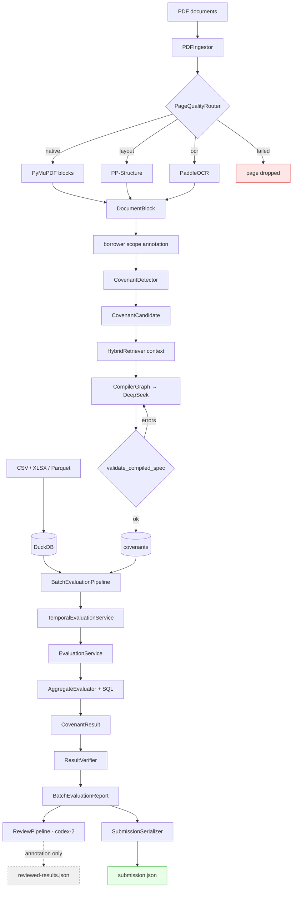

# 02 — Repository Map

> Structural map of the code as it exists on `codex-2` (the superset branch).
> Line counts are from `codex-2`; ~9,600 lines of Python across 60 modules.

Related: [03_BRANCH_ANALYSIS.md](03_BRANCH_ANALYSIS.md) · [04_CODEX_1_ARCHITECTURE.md](04_CODEX_1_ARCHITECTURE.md)

---

## Top level

```text
Halyk_ai_challenge/
├── .github/workflows/codex-1-ci.yml     CI: ruff + pytest on Python 3.12
├── docs/
│   ├── 1_ARCHITECTURE_Halyk_Agentic_Challenge_MVP.md   general agentic design (aspirational)
│   ├── 2_ARCHITECTURE_COVENANT_MVP.md                  covenant design (implemented)
│   └── architecture-v3/                                ← this research track
└── 2_ARCHITECTURE_COVENANT_MVP/        the actual Python project
    ├── pyproject.toml                   halyk-covenants, py>=3.12
    ├── README.md                        34 KB operator guide
    ├── Dockerfile / Dockerfile.ocr / docker-compose.yml
    ├── configs/                         default.yaml, submission/synthetic.yaml
    ├── data/                            raw fixtures + synthetic benchmark corpus
    ├── docs/                            CODEX_1 notes, CODEX_2 workflow, superpowers specs/plans
    ├── scripts/regression_v2.py
    ├── src/halyk_covenants/             15 packages
    └── tests/                           unit / integration / live / fixtures
```

Two architecture documents exist at the repo root. **Only `2_ARCHITECTURE_COVENANT_MVP.md` describes
the implemented system.** `1_ARCHITECTURE_*.md` describes a broader agentic design (Qdrant, planner,
text-to-SQL fallback, fact store) that was deliberately not built — see
[07_FINDINGS.md](07_FINDINGS.md) §Documentation mismatches.

---

## Entrypoints

| Entrypoint | Declared in | Purpose |
| --- | --- | --- |
| `halyk-covenants` | `cli.py:app` | Main pipeline CLI (11 commands) |
| `halyk-review` | `review_cli.py:app` | `codex-2` review CLI (1 command) |
| `scripts/regression_v2.py` | script | Standalone synthetic regression harness |

`halyk-covenants` commands:

```text
preprocess            ingest PDFs + structured data, detect and compile covenants
evaluate              single borrower/covenant pair
evaluate-all          full batch → BatchEvaluationReport
inspect-covenants     dump the compiled registry
serialize-submission  CovenantResult[] → submission.json
validate-submission   schema conformance check
generate-synthetic    build the synthetic fixture corpus
benchmark             component-level synthetic benchmark
benchmark-full        end-to-end synthetic benchmark
ocr-smoke             verify the Paddle runtime is importable
```

---

## Package structure

```text
src/halyk_covenants/
├── cli.py                326    main Typer app
├── review_cli.py         163    codex-2 Typer app
├── config.py              78    pydantic-settings, HALYK_ env prefix
│
├── domain/                       ← canonical models, no I/O
│   ├── covenant.py       158    CovenantSpec, MetricSpec, ConditionSpec, FilterSpec, TimeWindowSpec
│   ├── result.py                CovenantResult
│   ├── calculation.py     42    Calculation (provenance)
│   ├── document.py        39    DocumentBlock
│   ├── source.py                SourceRef
│   ├── failure.py         18    FailureStage enum
│   └── transaction_fields.py 32 THE CLOSED FIELD CATALOG
│
├── ingestion/                    ← PDF → DocumentBlock
│   ├── pdf.py            135    PyMuPDF ingestor + route dispatch
│   └── quality.py         63    PageQualityRouter (native/layout/ocr/failed)
├── ocr/paddle.py         173    PaddleOCR adapter (optional extra)
├── vlm/paddle_layout.py  105    PP-Structure layout/table adapter (optional extra)
│
├── borrowers/                    ← entity resolution
│   ├── resolver.py       211    rapidfuzz-based BorrowerResolver
│   └── normalization.py   39    name normalization
│
├── covenants/                    ← detection → compilation → registry
│   ├── detector.py       203    regex clause detection + logical unit assembly
│   ├── compiler.py       122    LLM structured-output compiler
│   ├── compiler_graph.py 183    LangGraph compile→validate→repair loop
│   ├── validation.py      74    semantic cross-checks against clause text
│   ├── identity.py        54    deterministic covenant_id / group_id
│   ├── registry.py       131    DuckDB persistence + version collision handling
│   └── temporal.py        40    version helpers
│
├── documents/retrieval.py 183   HybridRetriever (BM25 + optional cosine)
│
├── sql/                          ← THE SAFETY BOUNDARY
│   ├── builder.py        106    build_where_clause, window_bounds
│   └── filters.py         60    compile_filter — closed catalog, bound params
│
├── evaluators/                   ← deterministic execution
│   ├── base.py           313    AggregateEvaluator: orchestration + provenance + evidence
│   ├── aggregate.py      127    Sum/Count/Max/Min/Average
│   ├── ratio.py          138    RatioEvaluator (+ group_by worst-group path)
│   ├── frequency.py       31    worst daily bucket
│   ├── existence.py        5    subclass of CountEvaluator
│   ├── comparator.py             compare()
│   ├── temporal.py       233    TemporalEvaluationService — version segmentation
│   ├── registry.py        37    metric_type → evaluator
│   └── service.py         80    EvaluationService — fault isolation
│
├── evidence/
│   ├── selectors.py      146    FirstViolating / Trigger / MaxTransaction
│   └── validation.py     169    EvidenceValidator — re-derives the expected tx
│
├── verification/
│   ├── verifier.py       130    ResultVerifier — pair + completeness
│   ├── repair_graph.py   163    bounded repair loop
│   └── models.py                VerificationIssue, VerificationReport
│
├── storage/
│   ├── duckdb_store.py   437    schema + transaction loading + normalization
│   └── artifact_store.py         embedding cache
│
├── submission/
│   ├── models.py          48    SubmissionProfile
│   ├── serializer.py      46    CovenantResult[] → dict
│   └── validator.py       60    schema conformance
│
├── observability/
│   ├── tracing.py         79    @trace_stage decorator
│   └── context.py         60    contextvar-based trace metadata
│
├── evals/                        ← LangSmith component evaluators
│   ├── scoring.py        115
│   └── langsmith.py       54
│
├── benchmark/                    ← end-to-end scoring harness
│   ├── runner.py         152 · reporting.py 127 · scoring.py 52 · models.py 88
│
├── synthetic/                    ← fixture generation (1,300+ lines)
│   ├── definitions.py    579    covenant + transaction definitions
│   ├── regression_v2.py  426    full-pipeline regression corpus
│   ├── pdf.py            278 · workbook.py 153 · validation.py 132 · generator.py 112
│   └── qa.py 57 · models.py 76 · fonts.py 41 · full_pipeline.py 66 · regression_runner.py 87
│
├── llm/
│   ├── client.py          34    DeepSeekChatFactory
│   └── prompts/           compiler.py, review.py (codex-2)
│
└── review/                       ← CODEX-2 ONLY
    ├── service.py        289    ReviewService — two-pass + validation
    ├── models.py          76    ReviewCase, ReviewDecision, ReviewedResult
    ├── similarity.py      70    SimilarityRetriever — numpy cosine
    ├── storage.py         69    ReviewDecisionStore
    ├── rationale.py       56    deterministic rationale construction
    ├── langchain_reviewer.py 36 LLM adapter
    └── reviewer.py        17    Protocol
```

---

## Key file reference

### `pipeline/preprocess.py` (347)

```text
Path:              src/halyk_covenants/pipeline/preprocess.py
Purpose:           Ingest all inputs; detect and compile covenants into the registry
Called by:         cli.py preprocess_command
Calls:             DuckDBStore.load_transactions, PDFIngestor.ingest, BorrowerResolver,
                   CovenantDetector.detect, HybridRetriever, CompilerGraph.invoke,
                   CovenantRegistry.save
Important models:  PreprocessReport, DocumentBlock, CovenantCandidate
```

Processes structured files **before** PDFs (sort key at `preprocess.py:79`) so borrower identities
exist when documents are scoped. Idempotent by SHA-256 via `ingestion_artifacts`.

### `pipeline/evaluate.py` (126)

```text
Path:              src/halyk_covenants/pipeline/evaluate.py
Purpose:           Batch-evaluate every (borrower, covenant-group) pair
Called by:         cli.py evaluate_all_command; consumed by pipeline/review.py
Calls:             CovenantRegistry.list, TemporalEvaluationService.evaluate_versions,
                   ResultVerifier.verify_pair / .verify
Important models:  BatchEvaluationReport, CovenantResult, VerificationReport
```

Groups specs by `(borrower_id, covenant_group_id or covenant_id)` so amendment chains evaluate once.

### `evaluators/base.py` (313)

```text
Path:              src/halyk_covenants/evaluators/base.py
Purpose:           Shared evaluation orchestration for every aggregate metric
Called by:         EvaluationService via EvaluatorRegistry
Calls:             build_where_clause, compare, EvidenceSelectorRegistry, EvidenceValidator
Important models:  CovenantResult, Calculation
```

The single most important file for correctness: builds the WHERE clause, enforces currency scope,
computes the metric, applies the comparator, records provenance, selects and validates evidence.

### `sql/filters.py` (60) and `domain/transaction_fields.py` (32)

```text
Path:              src/halyk_covenants/sql/filters.py
Purpose:           Compile one validated FilterSpec into parameterized DuckDB SQL
Called by:         build_where_clause, RatioEvaluator._extend_scope
Calls:             transaction_field_sql
Important models:  FilterSpec
```

**The security boundary.** Field names are checked against a frozen catalog
(`PHYSICAL_TRANSACTION_FIELDS` ∪ `DERIVED_TRANSACTION_FIELD_SQL`); values are always bound
parameters. LIKE patterns are escaped. Model text is never interpolated as SQL.

### `covenants/compiler_graph.py` (183)

```text
Path:              src/halyk_covenants/covenants/compiler_graph.py
Purpose:           LangGraph state machine: compile → validate → repair (bounded)
Called by:         PreprocessPipeline._load_pdf
Calls:             CovenantCompiler.compile, LangChainCompilerRepairer.repair,
                   validate_compiled_spec, apply_resolved_candidate_facts
Important models:  CompilerState, CompilationOutcome
```

Repairer is schema-only by construction: it never sees transaction values or verdicts.

### `review/service.py` (289) — codex-2

```text
Path:              src/halyk_covenants/review/service.py
Purpose:           Two-pass LLM review with cosine-similarity fallback
Called by:         ReviewPipeline.run
Calls:             Reviewer.review, SimilarityRetriever.search, compare
Important models:  ReviewCase, ReviewDecision, ReviewedResult
```

`_validate_decision` forbids the reviewer from changing the number, the evidence, or the verdict.
See [05_CODEX_2_ARCHITECTURE.md](05_CODEX_2_ARCHITECTURE.md) for what that implies.

---

## Data flow



Note the dashed edge: the `codex-2` review output does not reach `submission.json`.

---

## Dependencies

Declared in `pyproject.toml`:

| Group | Packages |
| --- | --- |
| core | duckdb, langchain, langchain-deepseek, langgraph, langsmith, openpyxl, pandas, pydantic, pydantic-settings, pyarrow, pyyaml (`==6.0.2`), pymupdf, reportlab, rapidfuzz, rank-bm25, typer |
| dev | pytest, ruff |
| semantic | faiss-cpu, sentence-transformers |
| ocr | paddleocr `==3.4.1` |

Two dependency issues are recorded in [07_FINDINGS.md](07_FINDINGS.md): `numpy` is imported directly
by three modules but never declared, and `pyyaml==6.0.2` is hard-pinned to a version with no wheel
for Python 3.13/3.14 despite `requires-python = ">=3.12"`.

---

Next: [03_BRANCH_ANALYSIS.md](03_BRANCH_ANALYSIS.md)
