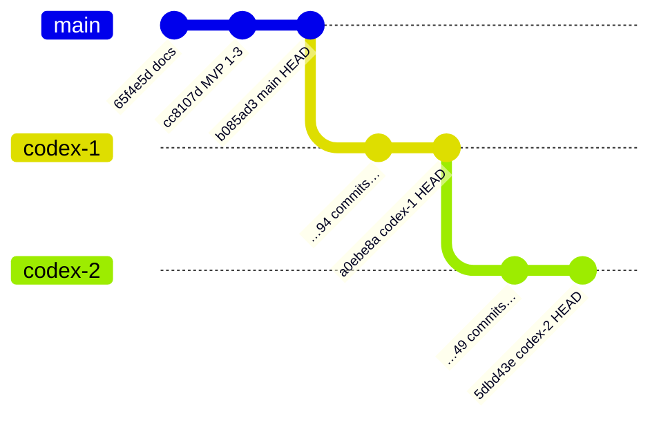

# 03 — Branch Analysis

> The single most consequential finding of this research track, and the one that determines how
> every other document should be read.

Related: [04_CODEX_1_ARCHITECTURE.md](04_CODEX_1_ARCHITECTURE.md) · [05_CODEX_2_ARCHITECTURE.md](05_CODEX_2_ARCHITECTURE.md) · [06_CODEX_1_VS_CODEX_2.md](06_CODEX_1_VS_CODEX_2.md)

---

## Headline

**`codex-1` and `codex-2` are not two competing architectures. They are one architecture and its
continuation.** `codex-2` contains every line of `codex-1` and adds a review layer on top.

Any framing that treats them as alternatives to choose between is factually wrong. The real question
is not *"which branch?"* but *"is the codex-2 delta worth keeping?"*

---

## Branch heads

| Branch | HEAD | Date | Subject |
| --- | --- | --- | --- |
| `main` | `b085ad38ce38a6fcd2d1d94876b26e0df295a4d5` | 2026-08-02 23:53 +0500 | `add few files` |
| `codex-1` | `a0ebe8accb47a419ba096839a340a39cca15c9d8` | 2026-08-03 02:37 +0500 | `fix: join only nearby complementary covenant fragments` |
| `codex-2` | `5dbd43efa5c2fe185174ac5b8719692265e2aa8d` | 2026-08-03 16:15 +0500 | `test: verify question-default embeddings` |

## Merge bases

```text
merge-base(main, codex-1)    = b085ad38…   ← main HEAD
merge-base(main, codex-2)    = b085ad38…   ← main HEAD
merge-base(codex-1, codex-2) = a0ebe8ac…   ← codex-1 HEAD
```

`git merge-base --is-ancestor` confirms both relations:

```text
main    is an ancestor of codex-1   → YES
codex-1 is an ancestor of codex-2   → YES
```

## Divergence counts

`git rev-list --left-right --count`:

| Comparison | Behind | Ahead |
| --- | --- | --- |
| `main` … `codex-1` | 0 | **94** |
| `main` … `codex-2` | 0 | **143** |
| `codex-1` … `codex-2` | 0 | **49** |

`94 + 49 = 143`. There is **zero divergence in either direction** at any point in the chain.

## Shared history



This is a **strictly linear chain**, not a fork:

```text
main (b085ad3)
  └── +94 commits ──> codex-1 (a0ebe8a)
                        └── +49 commits ──> codex-2 (5dbd43e)
```

Work windows are also sequential, not parallel:

| Branch | First unique commit | Last unique commit |
| --- | --- | --- |
| `codex-1` | 2026-08-03 00:29 | 2026-08-03 02:37 |
| `codex-2` | 2026-08-03 15:24 | 2026-08-03 16:15 |

A ~13-hour gap separates them. `codex-2` began after `codex-1` was finished.

---

## Changed files: `main` → `codex-1`

57 files, **+3,732 / −247**. This is where the system was actually built out from the MVP.

| Area | Files | Nature of change |
| --- | --- | --- |
| Evaluators | `base.py` +155, `ratio.py` +117, `temporal.py` **+233 (new)**, `service.py` +72 | Temporal segmentation, ratio components, provenance |
| Covenants | `detector.py` +126, `registry.py` +57, `identity.py` **+54 (new)**, `compiler.py` +29, `validation.py` +24 | Deterministic identity, version collisions, detection hardening |
| Evidence | `evidence/validation.py` **+135 (new)** | Independent re-derivation of expected evidence |
| Ingestion | `pdf.py` +43, `quality.py` +6, `vlm/paddle_layout.py` +77, `ocr/paddle.py` +11 | Render bounds, layout fallbacks |
| Storage / SQL | `duckdb_store.py` +102, `sql/builder.py` +23, `sql/filters.py` +32 | Derived fields, window intersection |
| Observability | `observability/context.py` **+60 (new)**, `tracing.py` +51 | Contextvar trace metadata |
| Evals | `evals/scoring.py` **+115 (new)**, `evals/langsmith.py` **+54 (new)** | Component-level scoring |
| Synthetic | `synthetic/regression_v2.py` **+426 (new)**, `regression_runner.py` **+87 (new)** | Full-pipeline regression corpus |
| Tests | 8 new test modules, +829 | Review-hardening tasks 1/3, temporal, component evals |
| CI | `.github/workflows/codex-1-ci.yml` **+42 (new)** | ruff + pytest on Python 3.12 |

Commit history shape: a burst of `feat:` commits building the executable DSL, then a long tail of
`fix:` and `style:` commits — a hardening pass driven by code review
(`docs/superpowers/plans/2026-08-03-code-review-hardening.md`).

## Changed files: `codex-1` → `codex-2`

25 files, **+3,119 / −4**. The `−4` is the entire story.

**Purely new files (2,876 lines of the 3,119):**

```text
src/halyk_covenants/review/__init__.py            28
src/halyk_covenants/review/service.py            289
src/halyk_covenants/review/models.py              76
src/halyk_covenants/review/similarity.py          70
src/halyk_covenants/review/storage.py             69
src/halyk_covenants/review/rationale.py           56
src/halyk_covenants/review/langchain_reviewer.py  36
src/halyk_covenants/review/reviewer.py            17
src/halyk_covenants/review_cli.py                163
src/halyk_covenants/pipeline/review.py           238
src/halyk_covenants/llm/prompts/review.py         57
docs/CODEX_2_REVIEW_WORKFLOW.md                  235
docs/superpowers/plans/…llm-review-similarity…   439
docs/superpowers/specs/…llm-review-similarity…   517
tests/… (7 new review test modules)              814
```

**Modified existing files — 4 files, 19 lines, all additive wiring:**

| File | Change |
| --- | --- |
| `pyproject.toml` | +1 — registers the `halyk-review` script |
| `llm/prompts/__init__.py` | +9/−1 — exports `review_messages` |
| `pipeline/__init__.py` | +3 — exports `ReviewPipeline`, `ReviewedBatchReport` |
| `.github/workflows/codex-1-ci.yml` | +6/−2 — adds `codex-2` to trigger branches |

**Not one line of the deterministic pipeline was modified.** No evaluator, no SQL builder, no
compiler, no verifier, no serializer, no domain model changed between `codex-1` and `codex-2`.

---

## Conclusion

> **Is this two independent architectures?**
> **No.**
>
> **Is `codex-2` an extension of `codex-1`?**
> **Yes — a strict, purely additive superset.**

Formally: `codex-1 ⊂ codex-2`, with the delta confined to a new `review/` package, a new pipeline
stage that consumes `BatchEvaluationReport`, a second CLI, and their tests.

### What follows from this

1. **There is no merge to perform and no conflict to resolve.** Checking out `codex-2` gives you all
   of `codex-1`.
2. **The comparison in [06_CODEX_1_VS_CODEX_2.md](06_CODEX_1_VS_CODEX_2.md) is not "A vs B".** It is
   "baseline vs baseline + optional layer". The only meaningful axis is whether the layer earns its
   cost.
3. **Every defect found in `codex-1` is also present in `codex-2`,** because the code is identical.
   [07_FINDINGS.md](07_FINDINGS.md) therefore labels findings by *component*, and marks a finding
   `codex-2 only` when — and only when — it lives in the review delta.
4. **`codex-2` is the correct base branch** for any further work. It is the only branch containing
   the full current pipeline, and basing off `codex-1` would silently discard the review layer.

### Base branch decision for this research track

```text
Working branch:  covenant-architecture-v3
Base branch:     codex-2
Reason:          codex-2 is a strict superset of codex-1 (merge-base(codex-1, codex-2) == codex-1
                 HEAD, 0 commits behind). It is the only branch that contains the complete current
                 pipeline. Basing off main would discard 143 commits; basing off codex-1 would
                 discard the 49-commit review layer that is part of the system under audit.
```

---

Next: [04_CODEX_1_ARCHITECTURE.md](04_CODEX_1_ARCHITECTURE.md)
