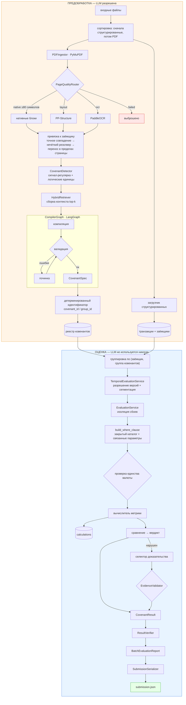

# 04 — Архитектура codex-1

> Полный детерминированный пайплайн оценки ковенантов.
> `codex-1` — это и есть система; `codex-2` добавляет слой поверх, ничего в ней не меняя.

Связанные документы: [03_BRANCH_ANALYSIS.md](03_BRANCH_ANALYSIS.md) · [05_CODEX_2_ARCHITECTURE.md](05_CODEX_2_ARCHITECTURE.md) · [07_FINDINGS.md](07_FINDINGS.md)

---

## 1. Схема архитектуры



---

## 2. Ход выполнения

### Этап 1 — Предобработка (`preprocess.py:76`)

```text
для каждого файла, отсортированного (структурированные, затем PDF, затем прочее):
    отпечаток = sha256(содержимое)
    если отпечаток не изменился в ingestion_artifacts:  пропустить    ← идемпотентность
    если структурированный:  DuckDBStore.load_transactions(путь)
    иначе если pdf:          _load_pdf(путь, отпечаток)
    отметить обработанным
записать PreprocessReport
```

Структурированные файлы намеренно обрабатываются первыми (`preprocess.py:79-89`), чтобы таблица
`borrowers` была заполнена до того, как какому-либо PDF понадобится привязка к заёмщику. Этот порядок
несущий.

Каждый файл обёрнут в `try/except`, который добавляет запись в `report.errors` и продолжает работу —
один битый PDF не может оборвать загрузку.

### Этап 2 — Документ → блоки (`ingestion/pdf.py:36`)

По каждой странице `PageQualityRouter.classify` возвращает один из четырёх маршрутов, исходя из
количества печатаемых непробельных символов (порог по умолчанию 80), количества изображений и таблиц:

| Маршрут | Условие | Действие |
| --- | --- | --- |
| `native` | ≥80 читаемых символов | Блоки PyMuPDF; **плюс** PP-Structure, если найдены таблицы |
| `layout` | <80 символов, но есть таблицы | PP-Structure; запасной путь — нативный, затем OCR |
| `ocr` | <80 символов, есть изображения или немного текста | PaddleOCR; запасной путь — нативный |
| `failed` | ничего пригодного нет | **страница молча выбрасывается** |

Рендеринг страницы ограничен 12 мегапикселями, масштаб зажат в `[0.5, 2.0]` — явная защита от
переполнения памяти на страницах большого формата.

### Этап 3 — Привязка к заёмщику (`preprocess.py:255`)

Трёхуровневое разрешение, по каждому блоку, по порядку:

1. Блок уже несёт `borrower_ids` (от извлекателя).
2. **Точное** совпадение по регулярке с идентификатором / кодами / каноническим именем / псевдонимами
   заёмщика, с защитой границ слова `(?<![\w-])…(?![\w-])`.
3. Шаблон заголовка `Заёмщик:` / `Borrower:`, переданный в нечёткий `BorrowerResolver`; принимается
   только если `status.startswith("resolved_")`.

Найденная привязка **переносится вперёд в пределах страницы** и сбрасывается на границе страницы. Это
моделирует типичную вёрстку «заголовок называет заёмщика, следующие абзацы его наследуют».

### Этап 4 — Обнаружение (`covenants/detector.py:48`)

Конструкция из двух частей:

**`_logical_units`** собирает обнаружимые единицы до сопоставления:
- ячейки таблиц группируются в строки по `(документ, страница, table_id, row_index)` и склеиваются `|`;
- текстовые блоки сортируются в порядке чтения по координатам;
- соседние текстовые блоки консервативно склеиваются, когда **ни один из них по отдельности не
  проходит**, а пара проходит; они вертикально близки, разделяют одну привязку к заёмщику и
  дополняют друг друга (в одном модальный сигнал, в другом — числовое ограничение).

Условие «ни один по отдельности не проходит» — это то, что предотвращает дублирование кандидатов при
склейке.

**`_qualifies`** требует наличия сигнальной регулярки ковенанта **и** (цифры **или** слова-запрета).

Наконец `_deduplicate_explicit_codes` оставляет самый длинный текст на каждый явный код `COV-…`.

### Этап 5 — Компиляция (`compiler_graph.py`, `compiler.py`)

```text
контекст = TRANSACTION_SEMANTIC_CATALOG + top-k найденных блоков (отфильтрованных по заёмщику,
                                          плюс исходная страница ±1, упорядоченных по близости)
        ↓
DeepSeek with_structured_output(CompiledCovenants, method="json_mode")
        ↓
apply_resolved_candidate_facts   ← накладывает детерминированные факты, пересекает область заёмщиков
        ↓
validate_compiled_spec           ← смысловые перекрёстные проверки по тексту пункта
        ↓
route == "straightforward"?  → реестр
route == "ambiguous"?        → починка (только схема, максимум 3 попытки) → failed_compilation
```

Два свойства стоит назвать явно:

- **Модель не может выдумать заёмщика.** `apply_resolved_candidate_facts` пересекает `borrower_ids`
  от модели с детерминированно разрешённой областью кандидата. Идентификаторы вне области
  отбрасываются, а `validate_compiled_spec` отвергает те, что уцелели.
- **Починщик слеп к результатам.** `LangChainCompilerRepairer` получает только текст пункта,
  контекст, ошибки валидации и предыдущий черновик — но никогда значение транзакции или вердикт. Он
  структурно не способен подогнать спецификацию под желаемый ответ.

### Этап 6 — Оценка (`pipeline/evaluate.py:43`)

```text
сгруппировать спецификации по (borrower_id, covenant_group_id или covenant_id)
для каждой группы:
    TemporalEvaluationService.evaluate_versions(версии, заёмщик, дата)
    если ровно одна скомпилированная версия:  ResultVerifier.verify_pair(спека, результат)
    сохранить в covenant_results + covenant_result_history
ResultVerifier.verify(ожидаемые_пары, результаты)
```

### Этап 7 — Исполнение метрики (`evaluators/base.py:43`)

```text
область_заёмщиков = все заёмщики группы, если scope_mode=="group", иначе один заёмщик
фильтры           = covenant.transaction_filters + covenant.metric.filters
исключения        = covenant.exclusions       + covenant.metric.exclusions
where_sql, параметры = build_where_clause(...)       ← окно ∩ период действия
_validate_currency_scope(...)                        ← бросает исключение при смеси валют
значение = self.calculate(...)                       ← SQL, специфичный для подкласса
если значение None: вернуть partial/unknown
calculation_id = _record_calculation(...)            ← sha256 от структуры расчёта
вердикт = "complied" если compare(значение, оператор, порог) иначе "violated"
если нарушен и evidence_mode != none:
    доказательство = select_evidence(...)
    EvidenceValidator.validate(доказательство, контекст)  ← независимый перевывод
```

---

## 3. Важные модули

| Модуль | Ответственность | Почему важен |
| --- | --- | --- |
| `sql/filters.py` | Фильтр из закрытого каталога → параметризованный SQL | Граница защиты от инъекций |
| `sql/builder.py` | Сборка WHERE, границы окон | Вся арифметика границ живёт здесь |
| `evaluators/base.py` | Оркестрация, происхождение, доказательство | Единственное место, где выносится вердикт |
| `evaluators/temporal.py` | Работа с версиями и доп. соглашениями | Самая тонкая логика в репозитории |
| `evidence/validation.py` | Независимый перевывод доказательства | Настоящее второе мнение, без LLM |
| `covenants/identity.py` | Детерминированные идентификаторы ковенантов | Модель никогда не именует сущность |
| `covenants/registry.py` | Сохранение + коллизии версий | Семейства версий между документами |
| `observability/context.py` | Метаданные трейса через contextvar | Делает трейсы фильтруемыми по паре |

---

## 4. Модели данных

`CovenantSpec` (`domain/covenant.py:112`) — это контракт. Его инварианты (`validate_execution_scope`):

*Инвариант* — условие, которое обязано выполняться всегда; при нарушении объект не создаётся.

```text
scope_mode == "group"  ⟹  len(borrower_ids) ≥ 2
group_by               ⊆  GROUP_BY_FIELDS
date_field             ∈  DATE_FIELDS  (сейчас только transaction_date)
effective_from ≤ effective_to
status == "compiled"   ⟹  condition.threshold не None
status == "compiled"   ∧ metric ∈ {sum,max,min,avg} ⟹ metric.field не None
```

`MetricSpec` рекурсивна (`numerator`/`denominator` для отношений), с валидатором, который запрещает
вложенные метрики вне отношений и запрещает прямое поле `field` у отношения.

**Закрытый каталог полей** (`domain/transaction_fields.py`) — корень всей истории с безопасностью:

```python
PHYSICAL_TRANSACTION_FIELDS = {transaction_id, borrower_id, account_id, transaction_date,
                               amount, currency, direction, counterparty_id,
                               counterparty_name, purpose, source_row_id}
DERIVED_TRANSACTION_FIELD_SQL = {"weekday": "EXTRACT(ISODOW FROM transaction_date)"}
FILTER_FIELDS = PHYSICAL ∪ DERIVED
```

`CovenantResult` несёт `status ∈ {success, partial, failed}` и опциональную `FailureStage`
(`COMPILATION`, `QUERY`, `CALCULATION`, `EVIDENCE`, `TEMPORAL`, `VERIFICATION`) — механизм, который
делает возможным частичный балл.

---

## 5. Граница LLM

| Место вызова | Модель | Вход | Видит ли числа? |
| --- | --- | --- | --- |
| `CovenantCompiler.compile` | DeepSeek | пункт + найденный контекст документа + JSON-схема | Нет — только семантический каталог |
| `LangChainCompilerRepairer.repair` | DeepSeek | пункт + контекст + ошибки валидации + прежний черновик | Нет |

Это полный список для `codex-1`. **Два места вызова, оба в предобработке, ни одно не имеет доступа к
данным транзакций.** Путь оценки не содержит вызова модели вообще.

Внедрённые факты всегда перекрывают вывод модели:

```text
covenant_id, covenant_group_id  ← resolve_covenant_identity (детерминированно)
raw_text                        ← обнаруженный пункт, а не пересказ модели
borrower_ids                    ← пересечено с разрешённой областью кандидата
source                          ← SourceRef кандидата
confidence                      ← min(уверенность модели, уверенность кандидата)
```

---

## 6. Детерминированный расчёт

Каждая метрика — один SQL-запрос к `transactions` с общим условием WHERE:

| Метрика | SQL |
| --- | --- |
| `sum` | `SELECT SUM(amount) …` → `0.000000` при NULL |
| `count` | `SELECT COUNT(поле или *) …` |
| `max` / `min` | `SELECT MAX(поле) …` → `None` на пустом наборе |
| `avg` | `SELECT SUM(f), COUNT(f) …`, затем `total / Decimal(count)` |
| `ratio` | агрегат знаменателя, затем агрегат числителя (или худшая группа), `Decimal / Decimal` |
| `existence` | наследует `CountEvaluator` |
| `frequency` | `MAX(bucket_count)` по `GROUP BY CAST(date AS DATE)` — худшая суточная корзина |

`avg` считается как `SUM/COUNT` в типе `Decimal`, а не через SQL `AVG`, чтобы избежать погрешности
чисел с плавающей точкой. Небольшое, осознанное и правильное решение.

Пересечение окон в `build_where_clause` везде полуоткрытое `[начало, конец)`, поверх него
пересекается собственный период действия ковенанта — так что одна версия не может захватить
транзакции за пределами своего срока действия.

*Полуоткрытый интервал* — начало включается, конец нет. Это устраняет классическую ошибку двойного
счёта на границе периодов.

---

## 7. Валидация

Четыре независимых слоя:

1. **Схема** — Pydantic с `extra="forbid"` на каждой модели (запрещает неизвестные поля).
2. **Структурные инварианты** — `CovenantSpec.validate_execution_scope`,
   `MetricSpec.validate_metric_shape`.
3. **Смысловые перекрёстные проверки** — `validate_compiled_spec` перечитывает текст пункта и требует:
   - валюта есть в тексте ⟹ задано `condition.currency` **и** есть фильтр `currency=`;
   - «outgoing»/«исходящ» в тексте ⟹ есть фильтр `direction=outgoing`;
   - «incoming»/«входящ»/«пополн» ⟹ есть фильтр `direction=incoming`;
   - идентификаторы заёмщиков ⊆ разрешённой области, и область не пуста.
4. **После исполнения** — `ResultVerifier.verify_pair` и `EvidenceValidator`.

Слой 3 — самая интересная идея в репозитории: **детерминированный читатель, который проверяет вывод
модели по исходному тексту правилами, которых модель не видит**. Он узок — три семейства регулярок,
— но форма правильная.

## 8. Сильные стороны

- **Граница LLM реальна и обеспечена конструкцией**, а не договорённостью. Набор входов починщика
  делает подгонку под результат структурно невозможной.
- **Закрытый каталог полей + связанные параметры.** Нет пути от текста модели к идентификаторам или
  литералам SQL. Шаблоны LIKE экранируют `\`, `%`, `_`.
- **Изоляция сбоев настоящая.** `EvaluationService` ловит `duckdb.Error` отдельно от прочих исключений
  и сопоставляет каждое со своей `FailureStage`; каждая пара всё равно даёт запись.
- **Валидация доказательства — это настоящее второе мнение.** `EvidenceValidator` независимо
  перевыводит ожидаемую транзакцию и отвергает несовпадение, вместо того чтобы доверять селектору.
- **Детерминированная идентичность.** Идентификаторы ковенантов — это либо явный код договора, либо
  хеш исполняемой семантики, но никогда не генерация модели.
- **Происхождение спроектировано изначально.** `Calculation` хранит SQL, сводку параметров и число
  входных строк, поэтому число можно перевывести без всякой модели.
- **Идемпотентная загрузка** через SHA-256 содержимого.
- **Темпоральная сегментация отказывается, а не гадает.** Разбиение SUM через смену версии явно
  отвергается как бессмысленное; сегментируются только `max`/`min`. Выбор *отказаться* — правильный и
  редкий для хакатонного кода.
- **Полуоткрытые интервалы применяются последовательно.**

## 9. Известные слабости

Подробно — в [07_FINDINGS.md](07_FINDINGS.md); здесь сводка.

| Слабость | Последствие |
| --- | --- |
| **Проверка полноты тавтологична** — `expected_pairs` строится из самих результатов (`evaluate.py:74`), поэтому `missing_result` не может сработать никогда | Единственная проверка, защищающая критерий C1, недействующая |
| **Проверка пары замкнута на себя** — заново вычисляет `compare()` из того же числа и порога, которые породили вердикт | Ловит только баги вычислителей; ноль сигнала об ошибках компиляции |
| **Обнаружение только на регулярках, только EN/RU** | Качественные запреты по-английски без цифры теряются; казахский не обрабатывается |
| **Дедупликация по явному коду теряет данные** — оставляет только самый длинный пункт на код `COV-…` | Два разных правила под одним кодом молча становятся одним |
| **`calculation_id` конфликтует у групповых ковенантов** | Записи о происхождении перезаписывают друг друга |
| **SQL происхождения `existence` ≠ исполненный SQL** | Записано `COUNT(*) > 0`, исполнено `COUNT(*)` |
| **Гибридный поиск на практике только BM25** — `HybridRetriever()` создаётся без эмбеддера в `preprocess.py:163` | Качество контекста для компилятора ниже задуманного |
| **`MaxEvaluator.select_evidence` обходит режим доказательства** | Селектор и валидатор могут разойтись |
| **Страницы с маршрутом `failed` исчезают без записи** | Молчаливая потеря полноты |
| **`_has_overlap` рано выходит из цикла на бессрочной версии** | Пересекающиеся версии могут пройти незамеченными |
| **Опциональные extra не входят в CI** | Пути OCR и семантики никогда не проверяются |

Общий узор этих находок: **верификация в `codex-1` сильна там, где ошибки громкие (исполнение), и
слаба или отсутствует там, где ошибки молчаливые (обнаружение и компиляция).** Эта инверсия — и есть
центральная архитектурная проблема, которой занимается данный трек.

---

Далее: [05_CODEX_2_ARCHITECTURE.md](05_CODEX_2_ARCHITECTURE.md)
