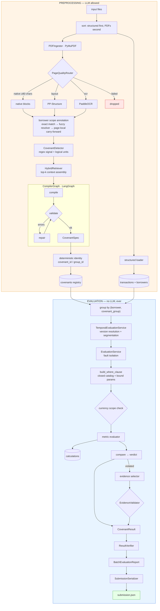

# 04 — codex-1 Architecture

> The complete deterministic covenant evaluation pipeline.
> `codex-1` is the system; `codex-2` adds a layer on top of it without changing any of it.

Related: [03_BRANCH_ANALYSIS.md](03_BRANCH_ANALYSIS.md) · [05_CODEX_2_ARCHITECTURE.md](05_CODEX_2_ARCHITECTURE.md) · [07_FINDINGS.md](07_FINDINGS.md)

---

## 1. Architecture diagram



---

## 2. Runtime flow

### Stage 1 — Preprocessing (`preprocess.py:76`)

```text
for each file, sorted (structured, then PDF, then other):
    digest = sha256(bytes)
    if digest unchanged in ingestion_artifacts:  skip          ← idempotency
    if structured:  DuckDBStore.load_transactions(path)
    elif pdf:       _load_pdf(path, digest)
    mark processed
record PreprocessReport
```

Structured files are deliberately processed first (`preprocess.py:79-89`) so that the `borrowers`
table is populated before any PDF needs borrower scoping. This ordering is load-bearing.

Every file is wrapped in `try/except` that appends to `report.errors` and continues — one corrupt PDF
cannot abort ingestion.

### Stage 2 — Document → blocks (`ingestion/pdf.py:36`)

Per page, `PageQualityRouter.classify` returns one of four routes based on printable non-space
character count (default threshold 80), image count, and table count:

| Route | Condition | Action |
| --- | --- | --- |
| `native` | ≥80 readable chars | PyMuPDF blocks; **plus** PP-Structure if tables detected |
| `layout` | <80 chars but tables present | PP-Structure; falls back to native, then OCR |
| `ocr` | <80 chars, images or some text | PaddleOCR; falls back to native |
| `failed` | nothing usable | **page dropped silently** |

Page rendering is bounded at 12 MP with scale clamped to `[0.5, 2.0]` — an explicit defence against
memory blowup on large-format pages.

### Stage 3 — Borrower scoping (`preprocess.py:255`)

Three-tier resolution, per block, in order:
1. Block already carries `borrower_ids` (from the extractor).
2. **Exact** regex match of borrower ID / identifiers / canonical name / aliases, with word-boundary
   guards `(?<![\w-])…(?![\w-])`.
3. A `Заёмщик:` / `Borrower:` heading pattern, passed to the fuzzy `BorrowerResolver`, accepted only
   if `status.startswith("resolved_")`.

Resolved scope **carries forward within a page** and resets at each page boundary. This models the
common layout "heading names the borrower, following paragraphs inherit it".

### Stage 4 — Detection (`covenants/detector.py:48`)

Two-part design:

**`_logical_units`** assembles detectable units before matching:
- table cells are grouped into rows by `(document, page, table_id, row_index)` and joined with `|`;
- text blocks are sorted into reading order by bbox;
- adjacent text blocks are conservatively joined when **neither alone qualifies** but the pair does,
  they are vertically nearby, share a borrower scope, and are complementary (one has the modal signal,
  the other has the constraint value).

The "neither alone qualifies" guard is what prevents duplicate candidates from the join pass.

**`_qualifies`** requires a covenant signal regex **and** (a digit **or** a prohibition keyword).

Finally `_deduplicate_explicit_codes` keeps the longest text per explicit `COV-…` code.

### Stage 5 — Compilation (`compiler_graph.py`, `compiler.py`)

```text
context = TRANSACTION_SEMANTIC_CATALOG + top-k retrieved blocks (borrower-scope filtered,
                                          plus source page ±1, ordered by proximity)
        ↓
DeepSeek with_structured_output(CompiledCovenants, method="json_mode")
        ↓
apply_resolved_candidate_facts   ← overlays deterministic facts, intersects borrower scope
        ↓
validate_compiled_spec           ← semantic cross-checks against clause text
        ↓
route == "straightforward"?  → registry
route == "ambiguous"?        → repair (schema-only, max 3 attempts) → failed_compilation
```

Two properties are worth naming explicitly:

- **The model cannot invent a borrower.** `apply_resolved_candidate_facts` intersects the model's
  `borrower_ids` with the deterministically resolved candidate scope. IDs outside the scope are
  discarded, and `validate_compiled_spec` rejects any that survive.
- **The repairer is blind to results.** `LangChainCompilerRepairer` receives only the clause, the
  context, the validation errors and the previous draft — never a transaction value or a verdict.
  It structurally cannot tune a spec toward a desired answer.

### Stage 6 — Evaluation (`pipeline/evaluate.py:43`)

```text
group specs by (borrower_id, covenant_group_id or covenant_id)
for each group:
    TemporalEvaluationService.evaluate_versions(versions, borrower, at_date)
    if exactly one compiled version:  ResultVerifier.verify_pair(spec, result)
    persist to covenant_results + covenant_result_history
ResultVerifier.verify(expected_pairs, results)
```

### Stage 7 — Metric execution (`evaluators/base.py:43`)

```text
borrower_scope  = all group borrowers if scope_mode=="group" else the single borrower
filters         = covenant.transaction_filters + covenant.metric.filters
exclusions      = covenant.exclusions       + covenant.metric.exclusions
where_sql, params = build_where_clause(...)          ← window ∩ effective period
_validate_currency_scope(...)                        ← raises on mixed currencies
value = self.calculate(...)                          ← subclass-specific SQL
if value is None: return partial/unknown
calculation_id = _record_calculation(...)            ← sha256 of identity payload
verdict = "complied" if compare(value, comparator, threshold) else "violated"
if violated and evidence_mode != none:
    evidence = select_evidence(...)
    EvidenceValidator.validate(evidence, context)    ← independent re-derivation
```

---

## 3. Important modules

| Module | Responsibility | Why it matters |
| --- | --- | --- |
| `sql/filters.py` | Closed-catalog filter → parameterized SQL | The injection boundary |
| `sql/builder.py` | WHERE assembly, window bounds | All boundary arithmetic lives here |
| `evaluators/base.py` | Orchestration, provenance, evidence | Single place where verdicts are made |
| `evaluators/temporal.py` | Amendment/version handling | The subtlest logic in the repo |
| `evidence/validation.py` | Independent evidence re-derivation | Genuine second opinion, no LLM |
| `covenants/identity.py` | Deterministic covenant IDs | Model never names an entity |
| `covenants/registry.py` | Persistence + version collision | Cross-document version families |
| `observability/context.py` | Contextvar trace metadata | Makes traces queryable per pair |

---

## 4. Data models

`CovenantSpec` (`domain/covenant.py:112`) is the contract. Its invariants (`validate_execution_scope`):

```text
scope_mode == "group"  ⟹  len(borrower_ids) ≥ 2
group_by               ⊆  GROUP_BY_FIELDS
date_field             ∈  DATE_FIELDS  (currently only transaction_date)
effective_from ≤ effective_to
status == "compiled"   ⟹  condition.threshold is not None
status == "compiled"   ∧ metric ∈ {sum,max,min,avg} ⟹ metric.field is not None
```

`MetricSpec` is recursive (`numerator`/`denominator` for ratios) with a validator forbidding nested
metrics outside ratios and forbidding a direct `field` on a ratio.

The **closed field catalog** (`domain/transaction_fields.py`) is the root of the safety story:

```python
PHYSICAL_TRANSACTION_FIELDS = {transaction_id, borrower_id, account_id, transaction_date,
                               amount, currency, direction, counterparty_id,
                               counterparty_name, purpose, source_row_id}
DERIVED_TRANSACTION_FIELD_SQL = {"weekday": "EXTRACT(ISODOW FROM transaction_date)"}
FILTER_FIELDS = PHYSICAL ∪ DERIVED
```

`CovenantResult` carries `status ∈ {success, partial, failed}` and an optional `FailureStage`
(`COMPILATION`, `QUERY`, `CALCULATION`, `EVIDENCE`, `TEMPORAL`, `VERIFICATION`) — the mechanism that
makes partial credit possible.

---

## 5. LLM boundary

| Call site | Model | Input | Can it see numbers? |
| --- | --- | --- | --- |
| `CovenantCompiler.compile` | DeepSeek | clause + retrieved doc context + JSON schema | No — only the semantic catalog |
| `LangChainCompilerRepairer.repair` | DeepSeek | clause + context + validation errors + prior draft | No |

That is the complete list for `codex-1`. **Two call sites, both in preprocessing, neither with access
to transaction data.** The evaluation path contains no model invocation of any kind.

Injected facts always override model output:

```text
covenant_id, covenant_group_id  ← resolve_covenant_identity (deterministic)
raw_text                        ← the detected clause, not the model's paraphrase
borrower_ids                    ← intersected with the resolved candidate scope
source                          ← the candidate's SourceRef
confidence                      ← min(model confidence, candidate confidence)
```

---

## 6. Deterministic calculation

Every metric is one SQL statement against `transactions` with a shared WHERE clause:

| Metric | SQL |
| --- | --- |
| `sum` | `SELECT SUM(amount) …` → `0.000000` when NULL |
| `count` | `SELECT COUNT(field or *) …` |
| `max` / `min` | `SELECT MAX(field) …` → `None` on empty set |
| `avg` | `SELECT SUM(f), COUNT(f) …` then `total / Decimal(count)` |
| `ratio` | denominator aggregate, then numerator aggregate (or worst group), `Decimal / Decimal` |
| `existence` | inherits `CountEvaluator` |
| `frequency` | `MAX(bucket_count)` over `GROUP BY CAST(date AS DATE)` — the worst daily bucket |

`avg` is computed as `SUM/COUNT` in `Decimal` rather than SQL `AVG` to avoid float drift. This is a
small, deliberate, correct decision.

The window intersection in `build_where_clause` is half-open `[start, end)` throughout, with the
covenant's own effective period intersected on top — so a single version cannot consume transactions
from outside its own validity.

---

## 7. Validation

Four independent layers:

1. **Schema** — Pydantic with `extra="forbid"` on every model.
2. **Structural invariants** — `CovenantSpec.validate_execution_scope`, `MetricSpec.validate_metric_shape`.
3. **Semantic cross-checks** — `validate_compiled_spec` re-reads the clause text and requires:
   - a currency in the clause ⟹ `condition.currency` set **and** a matching `currency=` filter;
   - "outgoing"/"исходящ" in the clause ⟹ `direction=outgoing` filter;
   - "incoming"/"входящ"/"пополн" ⟹ `direction=incoming` filter;
   - borrower IDs ⊆ resolved scope, and scope non-empty.
4. **Post-execution** — `ResultVerifier.verify_pair` and `EvidenceValidator`.

Layer 3 is the most interesting idea in the repository: a **deterministic reader that checks the
model's output against the source text using rules the model cannot see**. It is narrow — three
regex families — but it is the right shape.

---

## 8. Strong parts

- **The LLM boundary is real and enforced by construction,** not by convention. The repairer's
  input set makes result-tuning structurally impossible.
- **Closed field catalog + bound parameters.** No path exists from model text to SQL identifiers or
  literals. LIKE patterns escape `\`, `%`, `_`.
- **Fault isolation is genuine.** `EvaluationService` catches `duckdb.Error` separately from generic
  exceptions and maps each to the right `FailureStage`; every pair still produces a record.
- **Evidence validation is a real second opinion.** `EvidenceValidator` re-derives the expected
  transaction independently and rejects mismatches, rather than trusting the selector.
- **Deterministic identity.** Covenant IDs are either the explicit contract code or a hash of the
  executable semantics — never model-generated.
- **Provenance is designed in.** `Calculation` stores the SQL, the parameter summary, and the input
  row count, so a number can be re-derived without any model.
- **Idempotent ingestion** via content SHA-256.
- **Temporal segmentation refuses rather than guesses.** Splitting a SUM across a version change is
  explicitly rejected as semantically meaningless; only `max`/`min` are segmented. Choosing to
  *refuse* is the right call and is rare in hackathon code.
- **Half-open intervals used consistently.** `[start, end)` everywhere avoids the classic
  double-counting boundary bug.

## 9. Known weaknesses

Detailed in [07_FINDINGS.md](07_FINDINGS.md); summarised here.

| Weakness | Impact |
| --- | --- |
| **Completeness verification is tautological** — `expected_pairs` is built from the results themselves (`evaluate.py:74`), so `missing_result` can never fire | The one check protecting C1 is inert |
| **Pair verification is circular** — recomputes `compare()` from the same number and threshold that produced the verdict | Catches evaluator bugs only; zero signal on compilation errors |
| **Detection is regex-only, EN/RU only** | Qualitative English prohibitions without a digit are dropped; Kazakh is unhandled |
| **Explicit-code dedup is lossy** — keeps only the longest clause per `COV-…` code | Two distinct rules under one code silently become one |
| **`calculation_id` collides for group-scope covenants** | Provenance rows overwrite each other |
| **`existence` provenance SQL ≠ executed SQL** | Recorded `COUNT(*) > 0`, executed `COUNT(*)` |
| **Hybrid retrieval is BM25-only in practice** — `HybridRetriever()` is constructed with no embedder at `preprocess.py:163` | Compiler context quality below design intent |
| **`MaxEvaluator.select_evidence` bypasses evidence mode** | Selector/validator can disagree |
| **Pages routed `failed` vanish without a record** | Silent recall loss |
| **`_has_overlap` early-breaks on an open-ended version** | Overlapping versions can pass undetected |
| **Optional extras are not in CI** | OCR and semantic paths are never exercised |

The pattern across these: **`codex-1`'s verification is strong where errors are loud (execution) and
weak-to-absent where errors are silent (detection and compilation).** That inversion is the central
architectural problem this research track addresses.

---

Next: [05_CODEX_2_ARCHITECTURE.md](05_CODEX_2_ARCHITECTURE.md)
