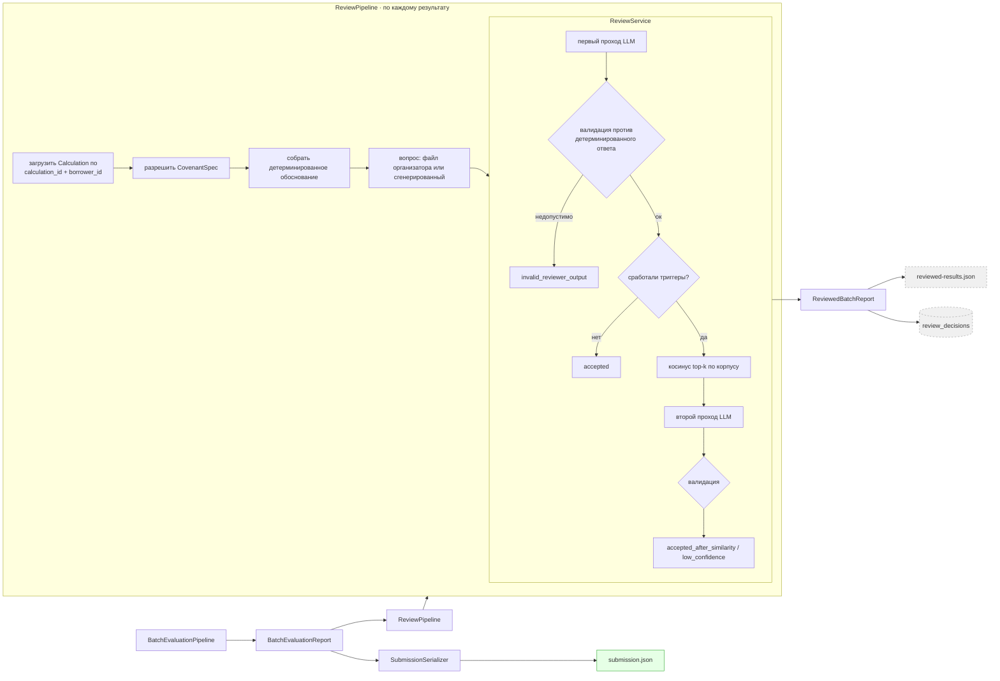

# 05 — Архитектура codex-2 (добавка поверх codex-1)

> `codex-2` = `codex-1` + слой ревью.
> Этот документ описывает **только добавку**. Общую основу см. в
> [04_CODEX_1_ARCHITECTURE.md](04_CODEX_1_ARCHITECTURE.md).

Связанные документы: [03_BRANCH_ANALYSIS.md](03_BRANCH_ANALYSIS.md) · [06_CODEX_1_VS_CODEX_2.md](06_CODEX_1_VS_CODEX_2.md) · [07_FINDINGS.md](07_FINDINGS.md)

---

## 1. Что добавлено

```text
codex-1  (весь детерминированный пайплайн, без изменений)
   +
codex-2  review/  ── 8 модулей, 641 строка
         pipeline/review.py ── 238 строк
         review_cli.py      ── 163 строки
         llm/prompts/review.py ── 57 строк
         7 тестовых модулей ── 814 строк
         3 документа        ── 1 191 строка
```

Изменения в уже существующих файлах — **19 строк в 4 файлах**, и всё это обвязка экспорта (команда в
`pyproject.toml`, два реэкспорта в `__init__.py`, ветки-триггеры CI). Детерминированный пайплайн не
тронут.

## 2. Зачем это добавлено

Из `docs/CODEX_2_REVIEW_WORKFLOW.md` и спецификации
`docs/superpowers/specs/2026-08-03-llm-review-similarity-fallback-design.md`: цель — **контроль
качества**, второе мнение, которое помечает ответы, требующие внимания человека или цикла починки, не
позволяя при этом модели трогать арифметику.

Заявленная не-цель сформулирована столь же явно:

> `reviewed-results.json` — артефакт качества и отладки. Официальный сериализатор по-прежнему
> потребляет авторитетные детерминированные поля результата.

## 3. Где это стоит в пайплайне



Ответвление от `BatchEvaluationReport` — это **развилка, а не звено цепи**. Путь сериализатора и путь
ревью читают один и тот же отчёт; путь ревью никогда не возвращается обратно.

## 4. Как это работает на самом деле

### 4.1 Сборка случая (`pipeline/review.py:68`)

По каждому `CovenantResult`:

1. `_load_calculation` — `SELECT … WHERE calculation_id = ? AND borrower_id = ?`.
2. `_resolve_spec` — три уровня: спецификация, чей `covenant_id` совпал с расчётом → единственный
   кандидат → версия, действующая на дату оценки → самая новая, с явной записью проблемы, когда
   неоднозначность разрешили запасным путём.
3. `build_rationale` — **детерминированная** сводка: метрика, окно, период действия, вычисленное
   значение и число совпавших строк, правило, вердикт, доказательство, замечания верификации.
4. Вопрос — заданный организатором для `(заёмщик, ковенант)`, иначе сгенерированный
   `"Does borrower {id} comply with the following covenant as of {date}? {raw_text}"`.

### 4.2 Ревью (`review/service.py:48`)

```text
первый_проход = reviewer.review(случай, similar_cases=[])
validate(первый_проход)                    ← бросает InvalidReviewerDecision при любом нарушении
причины = fallback_reasons(случай, первый_проход)
если причин нет:  → "accepted"
иначе:
    совпадения = similarity.search(случай.question, k=5, min_sim=0.55)
    второй     = reviewer.review(случай, similar_cases=совпадения)
    validate(второй)
    → "accepted_after_similarity", если второй.accepted и уверенность ≥ 0.70
    → "low_confidence" в остальных случаях
```

Триггеры запасного пути (достаточно любого одного):

| Триггер | Источник |
| --- | --- |
| `review_confidence` | уверенность первого прохода < 0.70 |
| `review_rejected` | первый проход выставил `accepted=false` |
| `verification_issue` | `ResultVerifier` пометил эту пару |
| `result_status` | `CovenantResult.status != "success"` |
| `compiler_confidence` | `CovenantSpec.confidence` < 0.70 |

### 4.3 Клетка ревьюера (`review/service.py:168`)

`_validate_decision` полностью отвергает решение, если:

```text
decision.number ≠ answer.number                                  → «изменил детерминированное число»
decision.evidence_tx ∉ {None, answer.evidence_tx}                → «подставил чужое доказательство»
decision.verdict ≠ compare(answer.number, оператор, порог)       → «противоречит оператору сравнения»
```

`InvalidReviewerDecision` даёт `review_status="invalid_reviewer_output"`, и детерминированный
результат сохраняется дословно.

**Следствие:** единственные свободные переменные ревьюера — `accepted` (да/нет), `confidence` (0–1),
`issues` (список) и `rationale` (текст). Каждое поле, попадающее в итоговый ответ, зафиксировано.

### 4.4 Схожесть (`review/similarity.py`)

Косинусная схожесть на numpy внутри процесса по корпусу отобранных записей `SimilarReviewCase`.
Векторы корпуса вычисляются лениво и кешируются по `case_id`; вектор запроса вычисляется при каждом
вызове. Совпадения ниже `minimum_similarity` отбрасываются, остальные сортируются по
`(-схожесть, case_id)` и обрезаются до top-k. Эмбеддер по умолчанию — `intfloat/multilingual-e5-small`
через SentenceTransformers.

*Эмбеддинг* — перевод текста в вектор чисел, чтобы близкие по смыслу тексты давали близкие векторы.
*Косинусная схожесть* — мера близости двух векторов от −1 до 1.

Промпт (`llm/prompts/review.py`) сообщает модели, что похожие случаи — *только образцы способа
рассуждения*, и запрещает копировать из них идентификаторы, пороги, числа, вердикты и транзакции. Эта
инструкция — ремень; `_validate_decision` — подтяжки.

### 4.5 Сохранение

Таблица `review_decisions` с ключом `(review_run_id, borrower_id, covenant_id)`, хранит статус, модель
ревьюера, версию промпта и полное решение в JSON. Для добавления двух колонок метаданных используется
`ALTER TABLE … ADD COLUMN IF NOT EXISTS`.

`covenant_results` не изменяется — это явно заявлено в документации и соответствует коду.

---

## 5. Оценка добавки

### Что она реально даёт

- **Сигнал для сортировки по приоритету.** `review_status` + `fallback_reasons` +
  `similarity_scores` дают обоснованное ранжирование, какие ответы проверять первыми, объединяя
  суждение LLM с тремя детерминированными сигналами (замечания верификации, статус результата,
  уверенность компилятора).
- **Метаданные ревьюера для воспроизводимости.** Имя модели и версия промпта сохраняются с каждым
  решением.
- **Чистое доказательство безопасности.** Клетка в `_validate_decision` — правильный паттерн,
  корректно реализованный и покрытый тестами (`tests/unit/test_review_service.py`,
  `test_review_similarity.py`).
- **Ревьюер видит нужные входные данные.** В промпт попадают `covenant.raw_text` **и**
  скомпилированная спецификация. Ревьюер, имеющий и то и другое, в принципе способен заметить, что
  спецификация искажает пункт договора, — а это ровно самый ценный класс ошибок в системе.

### Центральная проблема

**Слой ревью доказуемо не способен изменить ни один оцениваемый вывод, а его самый ценный сигнал
выбрасывается.**

`ReviewedBatchReport.authoritative_results` (`pipeline/review.py:33`) — это буквально:

```python
return [item.result for item in self.reviewed_results]
```

— нетронутые входные данные. Вместе с `_validate_decision`, фиксирующим вердикт, число и
доказательство, и с сериализатором, читающим `CovenantResult` напрямую, верно следующее:

> Для любого ковенанта выдаваемая тройка `(вердикт, число, доказательство)` побитово идентична вне
> зависимости от того, запускался слой ревью или нет.

Соотношение затрат и выгоды:

| | |
| --- | --- |
| **Затраты** | 1–2 вызова DeepSeek на ковенант, плюс загрузка модели SentenceTransformer, плюс корпус |
| **Влияние на балл** | **ровно ноль**, по построению |
| **Влияние на понимание оператором** | реальное, но только если человек прочитает `reviewed-results.json` и что-то сделает |

Это не баг — проектные документы прямо заявляют такое намерение, и ограничение сознательное. Это
находка о **приоритетах**: слой нацелен на реальную проблему (соответствует ли скомпилированная
спецификация тексту пункта?) и останавливается за шаг до того, чтобы с ней что-то сделать. Сигнал
вычисляется, сохраняется и выбрасывается.

В [09_ARCHITECTURE_V3.md](09_ARCHITECTURE_V3.md) сохранены входные данные ревьюера и его клетка, но
цикл замкнут: отклонённое ревью становится триггером ограниченной **перекомпиляции**, а не просто
строчкой в логе.

### Новые режимы отказа, привнесённые добавкой

| № | Режим отказа | Механизм | Серьёзность |
| --- | --- | --- | --- |
| D1 | **Асимметрия текста для эмбеддинга** | Со стороны запроса всегда `case.question`; со стороны корпуса — `embedding_text or question`. Сгенерированный по умолчанию вопрос содержит идентификатор заёмщика и дату в формате ISO, поэтому косинус считается между двумя разными распределениями текста. | Средняя |
| D2 | **Молчаливая деградация контекста для групповых ковенантов** | `_load_calculation` фильтрует по `calculation_id AND borrower_id`, но `calculation_id` конфликтует между заёмщиками группового ковенанта (см. [07_FINDINGS.md](07_FINDINGS.md), F-03), поэтому все заёмщики кроме одного получают `calculation=None` и более слабое обоснование. | Средняя |
| D3 | **Разрешение неоднозначной спецификации почти молчаливое** | Когда подходит несколько версий, `_resolve_spec` берёт самую новую и добавляет строку-замечание — которая затем становится триггером `verification_issue`, раздувая долю запасных путей и стоимость LLM. | Низкая |
| D4 | **Жёсткая зависимость от неустановленного extra** | `SentenceTransformerEmbeddingProvider` требует extra `semantic`, который CI не ставит и обычная установка `pip install -e '.[dev]'` не даёт. CLI ревью падает на этапе эмбеддинга, причём только на запасном пути. | Средняя |
| D5 | **Необъявленный `numpy`** | `review/similarity.py` импортирует numpy напрямую; в `pyproject.toml` его нет (приходит транзитивно через pandas/pyarrow). | Низкая |
| D6 | **Уверенность используется как порог, хотя она не откалибрована** | Документация верно отмечает, что уверенность LLM не вероятность, а затем использует `< 0.70` как жёсткий триггер. Доля запасных путей поэтому непредсказуема, а стоимость на практике не ограничена. | Низкая |
| D7 | **Риск отравления корпуса** | Документация предупреждает не добавлять ответы модели в корпус автоматически, но в коде это ничем не обеспечено. Ошибочный случай в корпусе становится постоянным образцом рассуждения. | Низкая |

---

## 6. Вердикт по добавке

**Идеи оставить, вывод перенаправить.** А именно:

- **Оставить** `_validate_decision` — это правильный паттерн безопасности, он должен перейти в V3 без
  изменений.
- **Оставить** детерминированный сборщик обоснования — дёшево, полезно, не зависит от модели.
- **Оставить** детерминированные триггеры запасного пути (замечания верификации, статус результата,
  уверенность компилятора).
- **Убрать** пока машинерию схожести и эмбеддингов: она добавляет зависимость, ошибку асимметрии и
  нагрузку по ведению корпуса — ради подбора примеров для ревьюера, чей вывод ни на что не влияет.
  Вернуться к ней, только если вывод ревьюера станет действующим *и* few-shot-примеры измеримо его
  улучшат.
- **Перенаправить** ревьюера с «проверки ответа» на «**проверку спецификации**», а отклонение
  завести в ограниченную перекомпиляцию, чтобы сигнал доходил до балла.

---

Далее: [06_CODEX_1_VS_CODEX_2.md](06_CODEX_1_VS_CODEX_2.md)
