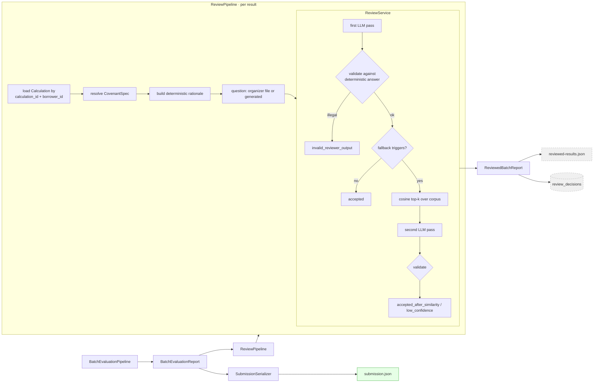

# 05 — codex-2 Architecture (delta over codex-1)

> `codex-2` = `codex-1` + a review layer.
> This document covers **only the delta**. For the shared baseline see
> [04_CODEX_1_ARCHITECTURE.md](04_CODEX_1_ARCHITECTURE.md).

Related: [03_BRANCH_ANALYSIS.md](03_BRANCH_ANALYSIS.md) · [06_CODEX_1_VS_CODEX_2.md](06_CODEX_1_VS_CODEX_2.md) · [07_FINDINGS.md](07_FINDINGS.md)

---

## 1. What was added

```text
codex-1  (the whole deterministic pipeline, unchanged)
   +
codex-2  review/  ── 8 modules, 641 lines
         pipeline/review.py ── 238 lines
         review_cli.py      ── 163 lines
         llm/prompts/review.py ── 57 lines
         7 test modules     ── 814 lines
         3 docs             ── 1,191 lines
```

Modifications to pre-existing files total **19 lines across 4 files**, all of it export wiring
(`pyproject.toml` script entry, two `__init__.py` re-exports, CI trigger branches). The deterministic
pipeline was not touched.

## 2. Why it was added

From `docs/CODEX_2_REVIEW_WORKFLOW.md` and the design spec
`docs/superpowers/specs/2026-08-03-llm-review-similarity-fallback-design.md`: the goal is a
**quality gate** — a second opinion that flags answers a human or a repair loop should look at,
without letting the model touch the arithmetic.

The stated non-goal is equally explicit:

> `reviewed-results.json` is a quality/debug artifact. The official submission serializer still
> consumes authoritative deterministic result fields.

## 3. Where it sits in the pipeline



The branch from `BatchEvaluationReport` is a **fork, not a chain**. The serializer path and the review
path both read the same report; the review path never rejoins.

## 4. How it actually works

### 4.1 Case construction (`pipeline/review.py:68`)

Per `CovenantResult`:

1. `_load_calculation` — `SELECT … WHERE calculation_id = ? AND borrower_id = ?`.
2. `_resolve_spec` — three-tier: the spec whose `covenant_id` matches the calculation → the sole
   candidate → the version active at the evaluation date → newest, with an explicit issue string
   recorded when ambiguity was resolved by fallback.
3. `build_rationale` — a **deterministic** English summary: metric, window, effective range,
   calculated value and matched row count, the rule, the verdict, the evidence, verification issues.
4. Question — the organizer-supplied one for `(borrower, covenant)`, else a generated
   `"Does borrower {id} comply with the following covenant as of {date}? {raw_text}"`.

### 4.2 Review (`review/service.py:48`)

```text
first_pass  = reviewer.review(case, similar_cases=[])
validate(first_pass)                       ← raises InvalidReviewerDecision on any violation
reasons = fallback_reasons(case, first_pass)
if not reasons:  → "accepted"
else:
    matches = similarity.search(case.question, k=5, min_sim=0.55)
    second  = reviewer.review(case, similar_cases=matches)
    validate(second)
    → "accepted_after_similarity" if second.accepted and confidence ≥ 0.70
    → "low_confidence" otherwise
```

Fallback triggers (any one suffices):

| Trigger | Source |
| --- | --- |
| `review_confidence` | first-pass confidence < 0.70 |
| `review_rejected` | first pass set `accepted=false` |
| `verification_issue` | `ResultVerifier` flagged this pair |
| `result_status` | `CovenantResult.status != "success"` |
| `compiler_confidence` | `CovenantSpec.confidence` < 0.70 |

### 4.3 The reviewer's cage (`review/service.py:168`)

`_validate_decision` rejects the decision outright if:

```text
decision.number ≠ answer.number                                → "changed deterministic number"
decision.evidence_tx ∉ {None, answer.evidence_tx}              → "injected foreign evidence"
decision.verdict ≠ compare(answer.number, comparator, threshold) → "contradicts comparator"
```

An `InvalidReviewerDecision` produces `review_status="invalid_reviewer_output"` and the deterministic
result is retained verbatim.

**Consequence:** the reviewer's only free variables are `accepted` (bool), `confidence` (0–1),
`issues` (list) and `rationale` (prose). Every field that appears in the submission is pinned.

### 4.4 Similarity (`review/similarity.py`)

In-process numpy cosine over a corpus of curated `SimilarReviewCase` records. Corpus vectors are
embedded lazily and cached per `case_id`; the query is embedded per call. Matches below
`minimum_similarity` are dropped; the rest are sorted by `(-similarity, case_id)` and truncated to
top-k. Default embedder is `intfloat/multilingual-e5-small` via SentenceTransformers.

The prompt (`llm/prompts/review.py`) instructs the model that similar cases are *reasoning-pattern
references only* and forbids copying IDs, thresholds, numbers, verdicts or transaction IDs from them.
This instruction is belt; `_validate_decision` is braces.

### 4.5 Persistence

`review_decisions` table, keyed `(review_run_id, borrower_id, covenant_id)`, storing status,
reviewer model, prompt version and the full JSON decision. `ALTER TABLE … ADD COLUMN IF NOT EXISTS`
is used for forward migration of the two metadata columns.

`covenant_results` is not modified — stated explicitly in the workflow doc and true in the code.

---

## 5. Assessment of the delta

### What it genuinely adds

- **A triage signal.** `review_status` + `fallback_reasons` + `similarity_scores` give a defensible
  ranking of which answers to inspect first, combining LLM judgement with three deterministic
  signals (verification issues, result status, compiler confidence).
- **Reviewer metadata for reproducibility.** Model name and prompt version are persisted per decision.
- **A clean safety proof.** The cage in `_validate_decision` is the correct pattern, correctly
  implemented, and it is tested (`tests/unit/test_review_service.py`, `test_review_similarity.py`).
- **The reviewer sees the right inputs.** The prompt payload includes `covenant.raw_text` **and** the
  compiled spec. A reviewer with those two things can, in principle, notice that the spec
  misrepresents the clause — which is exactly the highest-value error class in the system.

### The central problem

**The review layer is provably incapable of changing any scored output, and its most valuable signal
is discarded.**

`ReviewedBatchReport.authoritative_results` (`pipeline/review.py:33`) is literally:

```python
return [item.result for item in self.reviewed_results]
```

— the untouched inputs. Combined with `_validate_decision` pinning verdict, number and evidence, and
with the serializer reading `CovenantResult` directly, the following holds:

> For any covenant, the submitted `(verdict, number, evidence)` is bit-identical whether the review
> layer runs or not.

So the cost/benefit is:

| | |
| --- | --- |
| **Cost** | 1–2 DeepSeek calls per covenant, plus a SentenceTransformer model load, plus a corpus |
| **Effect on score** | **exactly zero**, by construction |
| **Effect on operator insight** | real, but only if a human reads `reviewed-results.json` and acts |

This is not a bug — the design documents state the intent plainly and the constraint is deliberate.
It is a **prioritisation** finding: the layer is aimed at a real problem (is the compiled spec
faithful to the clause?) and stops one step short of doing anything about it. The signal is
generated, persisted, and then dropped on the floor.

[09_ARCHITECTURE_V3.md](09_ARCHITECTURE_V3.md) keeps the reviewer's inputs and cage, and closes the
loop: a rejected review becomes a bounded **re-compilation** trigger, not just a log line.

### New failure modes introduced by the delta

| # | Failure mode | Mechanism | Severity |
| --- | --- | --- | --- |
| D1 | **Asymmetric embedding text** | Query side always uses `case.question`; corpus side uses `embedding_text or question`. The generated default question embeds the borrower ID and an ISO date, so cosine is computed between two different text distributions. | Medium |
| D2 | **Silent context degradation for group covenants** | `_load_calculation` filters on `calculation_id AND borrower_id`, but `calculation_id` collides across borrowers of a group-scope covenant (see [07_FINDINGS.md](07_FINDINGS.md) F-03), so all but one borrower get `calculation=None` and a weaker rationale. | Medium |
| D3 | **Ambiguous spec resolution is silent-ish** | When several versions match, `_resolve_spec` picks the newest and appends an issue string — which then becomes a `verification_issue` fallback trigger, inflating fallback rate and LLM cost. | Low |
| D4 | **Hard dependency on an uninstalled extra** | `SentenceTransformerEmbeddingProvider` needs the `semantic` extra, which CI does not install and the default `pip install -e '.[dev]'` does not provide. The review CLI fails at embedding time, only on the fallback path. | Medium |
| D5 | **Undeclared `numpy`** | `review/similarity.py` imports numpy directly; it is not in `pyproject.toml` (arrives transitively via pandas/pyarrow). | Low |
| D6 | **Confidence treated as a threshold despite being uncalibrated** | The docs correctly note LLM confidence is not a probability, then use `< 0.70` as a hard trigger. Fallback rate is therefore unpredictable and cost is unbounded in practice. | Low |
| D7 | **Corpus poisoning risk** | The docs warn against auto-adding model answers to the corpus, but nothing in code enforces it. A wrong case in the corpus becomes a persistent reasoning-pattern example. | Low |

---

## 6. Verdict on the delta

**Keep the ideas, rewire the output.** Specifically:

- **Keep** `_validate_decision` — it is the correct safety pattern and should survive into V3 unchanged.
- **Keep** the deterministic rationale builder — cheap, useful, model-independent.
- **Keep** the deterministic fallback triggers (verification issues, result status, compiler confidence).
- **Drop** the similarity/embedding machinery for now: it adds a dependency, an asymmetry bug and a
  corpus-curation burden, to select examples for a reviewer whose output changes nothing. Revisit only
  if the reviewer's output becomes actionable *and* few-shot examples measurably improve it.
- **Rewire** the reviewer from "answer reviewer" to "**spec reviewer**", and route rejection into a
  bounded re-compilation, so the signal reaches the score.

---

Next: [06_CODEX_1_VS_CODEX_2.md](06_CODEX_1_VS_CODEX_2.md)
