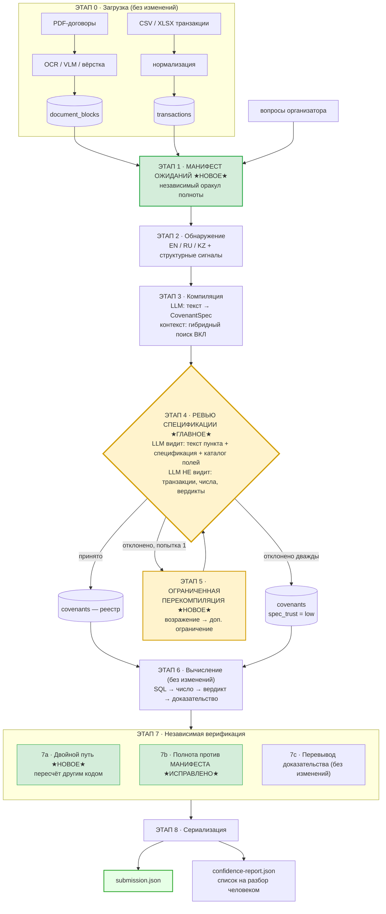

# 09 — Архитектура **Cloud1**

> Третья архитектура в этом репозитории. Не переписывание с нуля, а **перераспределение усилий по
> проверке** внутри уже работающей системы.
>
> Обоснование выбора именно этого варианта — в [10_WHY_CLOUD1.md](10_WHY_CLOUD1.md).
> Разбор предшественников — в [04_CODEX_1_ARCHITECTURE.md](04_CODEX_1_ARCHITECTURE.md) и
> [05_CODEX_2_ARCHITECTURE.md](05_CODEX_2_ARCHITECTURE.md).

---

## Оглавление

1. [Тезис в одном абзаце](#1-тезис-в-одном-абзаце)
2. [Три принципа](#2-три-принципа)
3. [Что остаётся нетронутым](#3-что-остаётся-нетронутым)
4. [Схема пайплайна](#4-схема-пайплайна)
5. [Этапы по порядку](#5-этапы-по-порядку)
6. [Главный ход: ревью спецификации вместо ревью ответа](#6-главный-ход-ревью-спецификации-вместо-ревью-ответа)
7. [Контракты данных](#7-контракты-данных)
8. [Граница LLM](#8-граница-llm)
9. [Модель уверенности](#9-модель-уверенности)
10. [Что удаляется](#10-что-удаляется)
11. [Наблюдаемость](#11-наблюдаемость)
12. [Не-цели](#12-не-цели)

---

## 1. Тезис в одном абзаце

В `codex-1` и `codex-2` почти вся проверочная работа направлена на **исполнение** — на ту половину
системы, где ошибки редки и громки (SQL либо посчитал, либо упал). При этом **интерпретация** —
половина, где ошибки часты и молчаливы (модель неверно прочитала пункт договора, и SQL честно
посчитал не то) — проверяется одной узкой регулярочной валидацией. `codex-2` первым нацелился на эту
проблему, посадив ревьюера читать текст пункта рядом со спецификацией, — но поставил его **после**
вычисления, из-за чего его вывод оказалось невозможно использовать, и записал результат в файл,
который никто не читает.

**Cloud1 переносит ревьюера на позицию до вычисления и замыкает цикл.** Один этот сдвиг делает три
вещи одновременно: снижает стоимость (ревью на *ковенант*, а не на *пару*, и однократно, а не при
каждом прогоне), упрощает защиту (ревьюер физически не видит чисел, значит не может их изменить) и
превращает вычисляемый сигнал в действие (отклонение запускает ограниченную перекомпиляцию).

---

## 2. Три принципа

### П1. Граница LLM не двигается

`CovenantSpec` остаётся единственным контрактом между моделью и вычислителем. Ни один путь, по
которому текст модели попадал бы в число, вердикт, доказательство или SQL, не создаётся. Это сильная
сторона `codex-1`, и Cloud1 её не трогает.

### П2. Проверка должна опираться на источник, который не породил проверяемое

*Тавтология* — утверждение, истинное по построению и потому бессодержательное. В текущем коде три
проверки тавтологичны:

| Проверка | Почему тавтологична | Файл |
| --- | --- | --- |
| Полнота | `expected_pairs` собирается из самих результатов | [evaluate.py:74](2_ARCHITECTURE_COVENANT_MVP/src/halyk_covenants/pipeline/evaluate.py:74) |
| Пара | `compare()` заново считается из того же числа и порога, что породили вердикт | [verifier.py:20](2_ARCHITECTURE_COVENANT_MVP/src/halyk_covenants/verification/verifier.py:20) |
| Ревью | решение ревьюера валидируется против ответа, который ревьюер и рецензирует | [service.py:168](2_ARCHITECTURE_COVENANT_MVP/src/halyk_covenants/review/service.py:168) |

Каждой Cloud1 даёт **независимый источник истины** (*оракул*): манифест ожиданий, второй путь
вычисления, каталог полей.

### П3. Вычисленный сигнал обязан иметь потребителя

Если система что-то вычислила о собственной надёжности, у этого должен быть автоматический
потребитель. Если потребителя нет — сигнал либо подключается, либо удаляется. Промежуточное состояние
(«вычисляем и пишем в файл на всякий случай») — самая дорогая из возможных форм.

---

## 3. Что остаётся нетронутым

Cloud1 наследует от `codex-2` без изменений:

| Компонент | Почему сохраняется |
| --- | --- |
| Двухфазная архитектура (LLM интерпретирует → SQL считает) | Правильное разделение; вся ценность `codex-1` в нём |
| `CovenantSpec` как контракт | Абстракция подобрана верно, менять нечего |
| Закрытый каталог полей + связанные параметры | Граница SQL-инъекций, реализована корректно |
| Вычислители (SUM/COUNT/MAX/MIN/AVG/RATIO/FREQUENCY) | Считают верно, Decimal вместо float, полуоткрытые интервалы |
| Независимый перевывод доказательства (`EvidenceValidator`) | Единственная по-настоящему независимая проверка в системе |
| Изоляция сбоев (`FailureStage`, частичные результаты) | Каждая пара даёт запись даже при падении |
| Идемпотентная загрузка по SHA-256 | Повторный прогон не переделывает работу |
| Темпоральная сегментация с отказом | Правильный отказ вместо угадывания |
| Детерминированный сборщик обоснования (`review/rationale.py`) | Дёшево, полезно, не зависит от модели |

Из `codex-2` сохраняется **сам замысел ревьюера** и его входной пакет данных. Меняется только
позиция в пайплайне и назначение.

---

## 4. Схема пайплайна



Границы этапов совпадают с границами `codex-1`. Новое — только жёлтое (ревью и перекомпиляция,
перенесённые и переназначенные) и зелёное (независимые оракулы).

---

## 5. Этапы по порядку

### Этап 0 — Загрузка

Без изменений. PDF → OCR/VLM → `document_blocks`; CSV/XLSX → `raw_transactions` → `transactions`.
Идемпотентность по SHA-256 сохраняется.

Одно уточнение: страницы, для которых распознавание провалилось, сейчас исчезают без записи. Cloud1
требует записи `ingestion_artifacts` со статусом `failed` на каждую такую страницу — иначе манифест
ожиданий (этап 1) не сможет отличить «в документе ковенантов нет» от «страницу не прочитали».

### Этап 1 — Манифест ожиданий ★ новое ★

Строится **до** вычисления, из трёх источников, ни один из которых не является результатом
вычисления:

```text
источник A: файл вопросов организатора   → пары (заёмщик, ковенант), которые ТОЧНО должны быть
источник B: обнаруженные кандидаты        → пары, которые система намерена оценить
источник C: реестр заёмщиков + область    → раскрытие групповых ковенантов на участников
```

Результат — таблица `expectation_manifest` с полями
`(borrower_id, covenant_id, source, document_id, page, required)`.

Проверка полноты на этапе 7b сравнивает результаты **с этим манифестом**, а не сама с собой. Впервые
становится возможным сработать событию «ковенант обнаружен в документе, но результата по нему нет» —
именно тот класс ошибок, который сейчас невидим.

### Этап 2 — Обнаружение

Расширения к существующему `detector.py`:

| Что | Сейчас | Cloud1 |
| --- | --- | --- |
| Языки | EN, RU | EN, RU, **KZ** |
| Сигналы | регулярки по ключевым словам | + структурные: нумерованный пункт, строка таблицы, ссылка на определённый термин |
| Порог | нужен сигнал И (цифра ИЛИ запрет) | + нижняя граница полноты: любой блок в разделе с заголовком типа «Ковенанты» / «Обязательства» / «Financial covenants» становится кандидатом |
| Дедупликация по коду | оставляет самый длинный текст (теряет данные) | сохраняет **все** варианты как отдельных кандидатов; слияние решает компилятор |

Рациональ: обнаружение — это фильтр с потерями, стоящий в самом начале. Всё, что он пропустил, не
может быть восстановлено ниже по потоку. Ложноположительное срабатывание стоит одного вызова LLM;
ложноотрицательное стоит балла и невидимо.

### Этап 3 — Компиляция

Ядро без изменений: LangGraph `compile → validate → repair`, максимум 3 попытки, починщик слеп к
данным транзакций.

Два уточнения:

1. **Гибридный поиск включается по-настоящему.** Сейчас `HybridRetriever()` создаётся без эмбеддера
   ([preprocess.py:163](2_ARCHITECTURE_COVENANT_MVP/src/halyk_covenants/pipeline/preprocess.py:163)),
   из-за чего `semantic_weight` выставляется в `0.0` и «гибридный» поиск работает как чистый BM25.
   Cloud1 передаёт эмбеддер. При его отсутствии режим деградации **логируется явно** и попадает в
   отчёт, а не остаётся молчаливым.
2. **Починщик видит каталог полей.** Сейчас он видит только текст ошибки схемы. Добавление списка
   допустимых полей `FILTER_FIELDS` в его вход не нарушает границу LLM (каталог — статическая
   константа, не данные), но убирает целый класс безнадёжных попыток починки.

### Этап 4 — Ревью спецификации ★ главное ★

Отдельный раздел ниже: [§6](#6-главный-ход-ревью-спецификации-вместо-ревью-ответа).

### Этап 5 — Ограниченная перекомпиляция ★ новое ★

При отклонении спецификации ревьюером:

```text
попытка 1 отклонена
   ↓
перекомпиляция с добавленным ограничением:
   «Предыдущая попытка была отклонена по причине: {возражение ревьюера}.
    Устраните именно это расхождение. Текст пункта не изменился.»
   ↓
попытка 2 → ревью
   ↓
принято     → covenants, spec_trust = "revised"
отклонено   → covenants, spec_trust = "low"  (ковенант ВСЁ РАВНО оценивается)
```

Жёсткие ограничения:

- **Максимум 1 перекомпиляция на ковенант.** Не цикл, а один шанс. Без этого ограничения возможна
  бесконечная перепалка между компилятором и ревьюером.
- **Отклонение никогда не отменяет оценку.** Ковенант с `spec_trust = "low"` считается по последней
  спецификации и попадает в `submission.json`. Ответ с низкой уверенностью лучше отсутствующего:
  система оценки даёт частичный балл, а пропуск даёт ноль.
- **Возражение ревьюера — текст, а не структура.** Ревьюер не предлагает исправленную спецификацию;
  он описывает расхождение. Составляет спецификацию по-прежнему только компилятор.

### Этап 6 — Вычисление

Без изменений, кроме одной поправки:

`calculation_id` сейчас считается как SHA-256 от набора данных, где для групповой области стоит
`sorted(covenant.borrower_ids)` — одинаковый для всех участников группы
([base.py:185](2_ARCHITECTURE_COVENANT_MVP/src/halyk_covenants/evaluators/base.py:185)). Вставка идёт
с `ON CONFLICT (calculation_id) DO UPDATE SET borrower_id = excluded.borrower_id`, поэтому в таблице
`calculations` остаётся запись только последнего заёмщика. Cloud1 добавляет `borrower_id` в набор для
хеширования **всегда**, независимо от области. Список группы остаётся в `borrower_ids` как данные, но
не как единственный различитель.

### Этап 7 — Независимая верификация

**7a. Двойной путь вычисления ★ новое ★**

Число пересчитывается вторым, независимым кодом: прямой SQL по сохранённому в `Calculation` тексту
запроса и сводке параметров, без участия классов-вычислителей. Расхождение — жёсткая ошибка
(`dual_path_mismatch`), не предупреждение.

Это не паранойя, а следствие П2: происхождение (`Calculation.sql`) уже сохраняется, но никогда не
исполняется повторно. Сохранять доказательство и не проверять его — половина работы. Стоимость —
один дополнительный SQL-запрос на пару, без участия LLM.

**7b. Полнота против манифеста ★ исправлено ★**

`ResultVerifier.verify` получает ожидаемые пары из `expectation_manifest` (этап 1), а не из
результатов. Коды `missing_result` и `unexpected_result` впервые становятся работоспособными.

**7c. Перевывод доказательства**

Без изменений. `EvidenceValidator` уже независим и уже работает правильно.

Дополнительно закрывается расхождение: `MaxEvaluator.select_evidence` обходит `evidence_mode`, из-за
чего селектор и валидатор могут разойтись на одном и том же ковенанте. Селектор приводится к режиму.

### Этап 8 — Сериализация

`submission.json` — формат без изменений, чтобы не сломать совместимость с оценкой организатора.

Второй файл, `confidence-report.json`, содержит по каждой паре: `spec_trust`, возражения ревьюера,
флаги верификации, `FailureStage`, и итоговый ранг для разбора человеком. Это то, чем должен был
стать `reviewed-results.json` из `codex-2`, — но теперь его входные данные получены **до** вычисления
и уже повлияли на результат.

---

## 6. Главный ход: ревью спецификации вместо ревью ответа

### Как это устроено в `codex-2`

```text
для каждой ПАРЫ (заёмщик × ковенант), при КАЖДОМ прогоне оценки:

   вход ревьюера = текст пункта
                 + скомпилированная спецификация
                 + ЧИСЛО
                 + ВЕРДИКТ
                 + ДОКАЗАТЕЛЬСТВО
                 + обоснование
   ↓
   решение ревьюера содержит поля number / verdict / evidence
   ↓
   _validate_decision отвергает решение, если хоть одно из трёх изменилось
   ↓
   результат: запись в reviewed-results.json
   ↓
   потребитель: отсутствует
```

### Как это устроено в Cloud1

```text
для каждого КОВЕНАНТА, ОДНОКРАТНО (на этапе предобработки, кешируется по SHA-256):

   вход ревьюера = текст пункта
                 + скомпилированная спецификация
                 + каталог допустимых полей
                 (чисел, вердиктов и доказательств НЕ СУЩЕСТВУЕТ — вычисление ещё не запускалось)
   ↓
   решение ревьюера = { accepted: bool, objection: str, confidence: float }
                       ← полей number / verdict / evidence НЕТ В ТИПЕ
   ↓
   отклонено → ограниченная перекомпиляция → повторное ревью
   ↓
   результат: спецификация, попавшая в реестр, + метка spec_trust
   ↓
   потребитель: сам пайплайн оценки
```

### Почему это лучше по четырём независимым осям

**1. Стоимость падает с O(P) до O(C).**

Пусть `C` — число различных ковенантов, `P` — число пар (заёмщик, ковенант), `R` — число прогонов
оценки. Всегда `C ≤ P`; на практике `C ≪ P`, потому что один ковенант из типового договора
распространяется на всех заёмщиков этого договора.

| | codex-2 | Cloud1 |
| --- | --- | --- |
| Вызовов LLM на ревью | `P … 2P` за прогон | `C … 2C` **всего** |
| Умножается на число прогонов | **да** | нет (кешируется идемпотентностью предобработки) |
| Пример: 12 ковенантов, 40 пар, 3 прогона | 120 … 240 | 12 … 24 |
| Влияние на балл | **ноль по построению** | **прямое** |

**2. Защита становится структурной, а не проверочной.**

`codex-2` вынужден держать `_validate_decision` — тридцать строк, отвергающих попытку ревьюера
изменить число, вердикт или доказательство. Проверка написана корректно и покрыта тестами, но она
защищает от опасности, которую сама же и создала: ревьюеру *показали* число, поэтому появилась
возможность его изменить.

В Cloud1 ревьюер работает до вычисления. Числа не существует. Тип его решения не содержит поля для
числа. **Защищать нечего — нечему протечь.** Это разница между «нельзя открывать дверь» и «двери нет».

*(Клетка `_validate_decision` при этом сохраняется в коде на случай, если ревьюер когда-нибудь снова
получит доступ к результатам, — но на основном пути Cloud1 она не задействована.)*

**3. Ревьюер перестаёт быть заякоренным на ответе.**

Модель, которой показали связный, аккуратно оформленный ответ с числом и обоснованием, склонна его
принять — согласованность выглядит как правильность. Ревьюер `codex-2` смотрит на пункт договора
через призму уже готового ответа.

Ревьюер Cloud1 видит две вещи и один вопрос: вот текст, вот его формальная запись, соответствуют ли
они друг другу. Ничто не подсказывает ему, каким «должен быть» ответ.

**4. Отклонение становится исполнимым.**

В `codex-2` отклонение приходит после того, как всё вычислено. Чтобы им воспользоваться, надо
перекомпилировать спецификацию и заново прогнать оценку — то есть построить ровно тот цикл, который
Cloud1 и строит, но с полным вычислением внутри каждой итерации.

В Cloud1 отклонение приходит тогда, когда вычислять ещё нечего. Перекомпиляция стоит одного вызова
LLM и не требует ничего откатывать.

### Что теряется

Ревьюер Cloud1 не увидит ошибок, проявляющихся только в данных: спецификация формально верна, но при
столкновении с реальными транзакциями даёт бессмысленное число (например, фильтр по валюте, которой
в выборке вообще нет). Такие случаи ловятся детерминированно — `input_row_count = 0` в `Calculation`
уже сейчас является признаком и в Cloud1 становится флагом верификации, а не молчаливым нулём.

Это осознанный размен: **LLM отвечает за соответствие текста и спецификации, детерминированный код —
за соответствие спецификации и данных.** Каждый занят тем, что умеет проверять.

---

## 7. Контракты данных

### `CovenantSpec` — расширение

Добавляются три поля, все заполняются детерминированно:

```python
spec_trust: Literal["accepted", "revised", "low"]   # результат этапа 4/5
review_objection: str | None                        # текст возражения, если было
review_confidence: float | None                     # уверенность ревьюера, 0..1
```

Существующие поля не меняются. Обратная совместимость: значение по умолчанию `"accepted"`, чтобы
спецификации, скомпилированные до Cloud1, читались без миграции.

### `SpecReviewDecision` — новый тип

```python
class SpecReviewDecision(BaseModel):
    model_config = ConfigDict(extra="forbid")

    accepted: bool
    confidence: float = Field(ge=0.0, le=1.0)
    objection: str | None = None      # обязателен, если accepted=False
    issues: list[str] = []
```

Обратите внимание на отсутствующие поля: `number`, `verdict`, `evidence_transaction_id`. `extra="forbid"`
означает, что модель не сможет добавить их самовольно — pydantic отвергнет ответ на уровне разбора.
Это и есть структурная защита из §6.2.

### `expectation_manifest` — новая таблица

```sql
CREATE TABLE expectation_manifest (
    borrower_id   VARCHAR NOT NULL,
    covenant_id   VARCHAR NOT NULL,
    source        VARCHAR NOT NULL,   -- 'organizer_question' | 'detected' | 'group_expansion'
    document_id   VARCHAR,
    page          INTEGER,
    required      BOOLEAN NOT NULL,   -- true для источника organizer_question
    PRIMARY KEY (borrower_id, covenant_id, source)
);
```

### `Calculation` — расширение

```python
verification_value: Decimal | None    # результат двойного пути (этап 7a)
verification_match: bool | None       # совпало ли
```

---

## 8. Граница LLM

Полный перечень мест, где Cloud1 вызывает модель:

| № | Где | Вход | Выход | Может ли повлиять на число/вердикт |
| --- | --- | --- | --- | --- |
| 1 | Компиляция | текст пункта + контекст документа | `CovenantSpec` | **Опосредованно** — через спецификацию, которая затем валидируется, ревьюируется и исполняется детерминированно |
| 2 | Починка (схемы) | ошибка схемы + каталог полей | `CovenantSpec` | То же, слеп к данным |
| 3 | **Ревью спецификации** | текст пункта + спецификация + каталог полей | `SpecReviewDecision` | **Нет** — тип не содержит числовых полей; влияет только на то, будет ли перекомпиляция |
| 4 | Починка (после отклонения) | возражение ревьюера + текст пункта | `CovenantSpec` | То же, что №2 |

Все четыре — на этапе предобработки. **На этапе оценки вызовов LLM нет вообще.** Это возврат к
свойству `codex-1`, которое `codex-2` потерял, добавив ревью после вычисления.

Инварианты, которые обязаны выполняться (проверяются тестами):

```text
И1. Ни одна строка текста, порождённого моделью, не попадает в SQL иначе как через
    закрытый каталог FILTER_FIELDS или как связанный параметр.
И2. При фиксированных (CovenantSpec, транзакции) тройка (вердикт, число, доказательство)
    воспроизводима побитово, независимо от того, какая модель и когда компилировала.
И3. Ревьюер не имеет доступа к таблице transactions ни прямо, ни через контекст промпта.
И4. Число перекомпиляций на ковенант ≤ 1.
```

---

## 9. Модель уверенности

Уверенность в ответе — **детерминированная функция** нескольких сигналов. Не число от модели.

```text
вход:
    spec_trust           ∈ {accepted, revised, low}
    review_confidence    ∈ [0,1] | None      ← от LLM, используется как один из входов
    compiler_confidence  ∈ [0,1]             ← от LLM, используется как один из входов
    verification_flags   ⊆ {dual_path_mismatch, evidence_mismatch,
                            manifest_gap, empty_input_rows, temporal_ambiguity}
    result_status        ∈ {success, partial, failed}

выход:
    answer_confidence ∈ {high, medium, low, unreliable}
    triage_rank       ∈ ℕ                    ← порядок разбора человеком
```

Правила (сверху вниз, первое сработавшее побеждает):

| Условие | Уверенность |
| --- | --- |
| `dual_path_mismatch` или `result_status = failed` | `unreliable` |
| `spec_trust = low` или `evidence_mismatch` | `low` |
| `spec_trust = revised` или `result_status = partial` или `empty_input_rows` | `medium` |
| `spec_trust = accepted` и флагов нет и обе LLM-уверенности ≥ 0.70 | `high` |
| иначе | `medium` |

Почему уверенности LLM не используются как пороги напрямую: они не откалиброваны — это не
вероятности, а самооценка модели. Cloud1 использует их только как один вход среди пяти, причём
детерминированные сигналы имеют приоритет. Это прямой ответ на находку D6 из
[05_CODEX_2_ARCHITECTURE.md](05_CODEX_2_ARCHITECTURE.md).

---

## 10. Что удаляется

| Компонент | Причина |
| --- | --- |
| `review/similarity.py` + корпус `SimilarReviewCase` | Существовал, чтобы подбирать примеры рассуждения ревьюеру ответов. Ревьюер спецификаций заземлён на каталог полей и текст пункта — примеры ему не нужны. Убирает ошибку асимметрии текста (D1), риск отравления корпуса (D7) и нагрузку по ведению корпуса |
| Зависимость ревью от extra `semantic` | Следствие предыдущего пункта. Устраняет D4 — жёсткую зависимость от неустановленного пакета |
| Второй проход ревью с подсказками по схожести | Заменён на ограниченную перекомпиляцию, у которой есть потребитель |
| `ReviewedBatchReport.authoritative_results` | Возвращал нетронутый вход — свойство, маскирующееся под функцию. Заменён на `confidence-report.json` |

`numpy` при этом объявляется в `pyproject.toml` явно (сейчас приходит транзитивно через pandas —
находка D5): он остаётся нужен для `HybridRetriever`, который в Cloud1 работает по-настоящему.

Extra `semantic` из опционального становится **рекомендованным** — от него зависит поиск контекста
для компилятора. Режим без него сохраняется, но перестаёт быть молчаливым.

---

## 11. Наблюдаемость

Сохраняется всё из `codex-1` (спаны LangSmith, `Calculation`, `FailureStage`, `contextvar` с
метаданными трейса). Добавляется:

| Метрика | Зачем |
| --- | --- |
| `spec_review_rejection_rate` | Доля спецификаций, отклонённых с первого раза. Растёт → компилятор или промпт деградировали |
| `recompile_success_rate` | Доля отклонённых, принятых после перекомпиляции. Низкая → возражения ревьюера бесполезны |
| `dual_path_mismatch_count` | Обязан быть нулём. Ненулевой — баг вычислителя |
| `manifest_gap_count` | Пары в манифесте без результата. Обязан быть нулём |
| `empty_input_rows_count` | Спецификации, отфильтровавшие всё. Признак ошибки интерпретации |
| `degraded_retrieval` | Флаг работы без эмбеддера. Больше не молчит |

Первые две метрики — то, чего в системе не было вообще: измерение качества **интерпретации**. Сейчас
единственный доступный сигнал о ней — `compiler_confidence`, самооценка модели.

---

## 12. Не-цели

Явно не входит в Cloud1:

- **Переписывание вычислителей.** Они работают корректно.
- **Смена LLM-провайдера или переход на локальную модель.** Ортогонально архитектуре.
- **Полноценный веб-интерфейс разбора.** `confidence-report.json` + сортировка — достаточно.
- **Автоматическое исправление данных транзакций.** Вне зоны ответственности.
- **Обучение или дообучение моделей.** Только промптинг.
- **Мультиагентные схемы, самопланирование, автономность на этапе оценки.** Прямо противоречит П1 —
  на этапе оценки LLM не участвует вообще.
- **Возврат ревьюера к результатам.** Даже как опция. Если такая потребность возникнет, это отдельное
  архитектурное решение с отдельным обоснованием.

---

## Сводка изменений относительно `codex-2`

| # | Изменение | Тип | Устраняет |
| --- | --- | --- | --- |
| 1 | Ревьюер перенесён до вычисления, переназначен на проверку спецификации | **архитектурное** | Центральную проблему `codex-2` |
| 2 | Ограниченная перекомпиляция по возражению ревьюера | **архитектурное** | Разрыв «сигнал вычислен → выброшен» |
| 3 | Манифест ожиданий как оракул полноты | **архитектурное** | Тавтологичную проверку полноты |
| 4 | Двойной путь вычисления числа | новое | Замкнутую на себя проверку пары |
| 5 | `spec_trust` + детерминированная модель уверенности | новое | D6 (некалиброванные пороги) |
| 6 | `confidence-report.json` с рангом разбора | новое | Отсутствие потребителя сигнала |
| 7 | Эмбеддер передаётся в `HybridRetriever`; деградация логируется | исправление | Молчаливый BM25-only режим |
| 8 | `borrower_id` всегда в хеше `calculation_id` | исправление | Коллизию у групповых ковенантов |
| 9 | Казахский язык + структурные сигналы в детекторе | исправление | Пропуск ковенантов на этапе обнаружения |
| 10 | Дедупликация по коду сохраняет все варианты | исправление | Потерю данных при слиянии |
| 11 | `MaxEvaluator.select_evidence` приведён к `evidence_mode` | исправление | Расхождение селектора и валидатора |
| 12 | Провалившиеся страницы записываются в `ingestion_artifacts` | исправление | Молчаливую потерю полноты |
| 13 | `numpy` объявлен явно; extra `semantic` рекомендован | исправление | D5, D4 |
| 14 | Корпус схожести и второй проход ревью удалены | удаление | D1, D7 и лишнюю зависимость |

Три пункта — архитектурные. Остальные одиннадцать — точечные исправления, каждое из которых
самостоятельно и не зависит от остальных.

---

Далее: [10_WHY_CLOUD1.md](10_WHY_CLOUD1.md) — почему именно этот вариант, а не `codex-1` и не `codex-2`.
